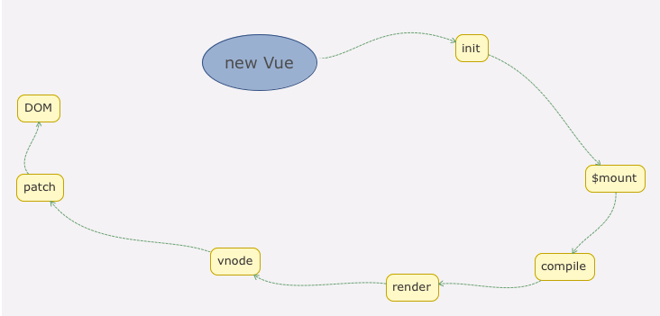

# js基础
1.let const var <br/>

2.箭头函数 <br/>

3.commonjs esmodule amd cmd umd  


4.深浅拷贝  


5.防抖节流

6.promise


7.闭包作用域 <br/>
8.手撕函数柯里化<br/>


9.继承


10.babel 语法兼容


11.polyfill 方法兼容

12.观察者


13.发布订阅

14.数组常见方法 

15.new


16.手撕call,apply,bind
17 generator iterator next 实现


18.随机数 范围 （star,end) => Math.random() * length + start;

19.类型判断


20.object

21.ajax
 
24.input 搜索如何防抖，如何处理中文输入


# 浏览器
1.js内存 <br/>


2.浏览器垃圾回收 <br/>


3.v8执行过程


4.event loop <br/>


5.安全 <br/>


7.缓存


8.url页面发生什么 


9.浏览器组成


# 网络
1.http https


证书如何签证的？


2.tcp三次握手 4次挥手


三次握手，为什么？<br/>


四次分手，为什么？<br/>

3.http1.0 http1.1 http2.0特性及区别


http/2 :<br/>


4.简单讲解一下http2的多路复用


5.A、B 机器正常连接后，B 机器突然重启，问 A 此时处于 TCP 什么状态


6.介绍下 HTTPS 中间人攻击


7.udp


8.tcp


# BOM
+ event
+ 浏览器可是区域
+ window
+ navigator
+ 存储

# DOM


# babel
+ babel包

# webpack
1.source-map
+ eval：使用eval包裹模块代码
+ source map：产生.map文件
+ cheap：不包含列信息
+ inline：将.map作为DataURI嵌入，不单独生成.map文件
+ module：包含loader的sourcemap

生产环境部署
+ Sentry ？ https://www.cnblogs.com/qiezuimh/p/11440506.html
+ hidden-source-map 源码不显示
+ SourceMapDevToolPlugin
```javascript
new webpack.SourceMapDevToolPlugin({
  filename: "sourcemaps/[file].map",
  publicPath: "https://example.com/project/",
  fileContext: "public"
})
//https://example.com/project/sourcemaps/bundle-[hash].js.map`
```
+ 插件
SourceMapDevToolPlugin这个插件可以修改map文件的引用地址，
同时借助filemanager-webpack-plugin将map文件移动到指定服务器，举个栗子是本地的话如下：
```javascript
const FileManagerPlugin = require('filemanager-webpack-plugin');
// ...
plugins: [
  new webpack.SourceMapDevToolPlugin({
      append: '\n//# sourceMappingURL=http://localhost:3000/sourceMap/[url]', //如果是保存到本地的话
      filename: '[file].map',
  }),
  new FileManagerPlugin({
     onEnd: {
          copy: [{ 
                 source: './dist/static/js/*.map', 
                 destination: 'D:/sourceMap', // 本地服务器的文件路径
           }],
           delete: ['./dist/static/js/*.map'],//删除map文件
           archive: [{ //压缩文件
                source: './dist',
                destination: './dist/static/dist.zip',
           }]
      }
 })
]

```

2.第三方包处理
+ dll
dllplugin dllreferenceplugin
+ commonsplugin
```javascript
const vue = require('vue')
{
  entry: {
   // bundle是我们要打包的项目文件的导出名字， app是入口js文件
   bundle: 'app',
   // vendor就是我们要打包的第三方库最终生成的文件名，数组里是要打包哪些第三方库, 如果不是在node——modules里面，可以填写库的具体地址
   vendor: ['vue'],
   jquery: ['jquery'],
  },
 output: {
     path: __dirname + '/bulid/',
	 // 文件名称
	filename: '[name].js'
 },
  plugins: {
    // 这里实例化webpack.optimize.CommonsChunkPlugin构造函数
    // 打包之后就生成vendor.js文件
    new webpack.optimize.CommonsChunkPlugin('vendor',  'vendor.js')
    new webpack.optimize.CommonsChunkPlugin('jquery',  'jquery.js')
  }
}
```

3.手撕代码

4.loader && plugin
+ babel-loader cacheDirectory:true
+ less-loader css-loader style-loader mini-css-extract-plugin(生产环境单独提出) optimize-css-assets-webpack-plugin(生产环境压缩)
+ html-loader
+ url-loader esmodule=fasle html-loader 解析
+ file-loader
+ html-webpack-plugin
+ dllplugin dllreferenceplugin
+ happypack
+ service work pwa workbox-webpack-plugin
```javascript
if ('serviceWorker' in navigator) {
  window.addEventListener('load', () => {
    navigator.serviceWorker
      .register('/service-worker.js')
      .then(() => {
        console.log('sw注册成功了~');
      })
      .catch(() => {
        console.log('sw注册失败了~');
      });
  });
}

//----
const WorkboxWebpackPlugin = require('workbox-webpack-plugin');

new WorkboxWebpackPlugin.GenerateSW({
  /*
    1. 帮助serviceworker快速启动
    2. 删除旧的 serviceworker

    生成一个 serviceworker 配置文件~
  */
  clientsClaim: true,
  skipWaiting: true
})
```

5.优化
代码优化
+ 路由懒加载
+ 图片资源懒加载
+ 组件懒加载
打包优化

+ eslint
fix

# vue
1.响应式


2.key https://github.com/Advanced-Frontend/Daily-Interview-Question/issues/1


3.观察者

4.vdom


5.diff


6.说说 Vue 的渲染过程<br/>


7.异步组件


8.watcher和immdiate


9.vue3

10.vue-router


11.在 Vue 中，子组件为何不可以修改父组件传递的 Prop，如果修改了，Vue 是如何监控到属性的修改并给出警告的<br/>


12.双向绑定和 vuex 是否冲突 <br/>
在严格模式中使用Vuex，当用户输入时，v-model会试图直接修改属性值，但这个修改不是在mutation中修改的，
所以会抛出一个错误。当需要在组件中使用vuex中的state时，


13.Vue 的父组件和子组件生命周期钩子执行顺序是什么<br/>


14.vue 如何优化首页的加载速度？vue 首页白屏是什么问题引起的？如何解决呢？


15.谈一谈 nextTick 的原理

16.异步更新队列<br/>


# css
1.居中
水平


垂直


水平垂直居中


2.多列等高


3.宽高比


4.flex


5.CSS中的三种布局模型<br/>


6.BFC https://blog.csdn.net/dff1993/article/details/80394150<br/>


7.适配


8.Doctype作用?严格模式与混杂模式如何区分？它们有何意义?<br/>


9.link标签和import标签的区别


10.CSS权重


11.页面加载触发的事件<br/>
+ document的readystatechange事件


+ document的DOMContentLoaded事件


+ window的load事件


12.css3<br/>
13.兼容性问题<br/>


# html5
+ 

# 优化


# 算法

# 项目问题
Q: geoserver 中文乱码最后解决办法 
A: 字体文件缺少

Q: webpack 配置 publicPath的理解
A: publicPath的使用说法适用于生产环境,
默认情况下，webpack-dev-server 会把打包后的文件放到项目的根目录下，文件名是在output配置中的filename. 
但是当有publicPath 配置的时候，就不一样了。
Webpack 会把所有的文件打包到publicPath指定的目录下，
就是相当于在项目根目录下创建了一个publicPath目录, 然后把打包成的文件放到了它里面，只不过我们看不到而已, 
文件名还是output配置中的filename。

Q: 打包之后文件过大
A: 后来采用的dllplugin

Q: source-map的配置与解决 生产环境
A:  nginx server allow

Q: 以前尝试过通过子组件修改父组件的数据，后来自己凌乱了，
A: 单向数据流

Q: 异步组件 加载失败 路径原因 webpack import 异步ajax请求
A: 不能动态解析加载

Q: slot传值


Q: 坐标系的理解，各个坐标系 之间的不同 
A:

Q: docker network
A: 


Q: Docker远程访问

Q: 前后端分离
rbac token 返回数据规范 请求封装 表单数据获取 分页

Q: 开发流程定制
gitlab 面板

Q: webpack
鸡肋 感觉 以后会有东西 替代它

Q: angular
模块分的很细 难以理解 有moudle  这个moudle需要配置吗？
注解 rsjx 很多东西 表面  只能用 如果看源码 可能还要付出更多的时间


