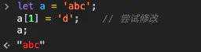
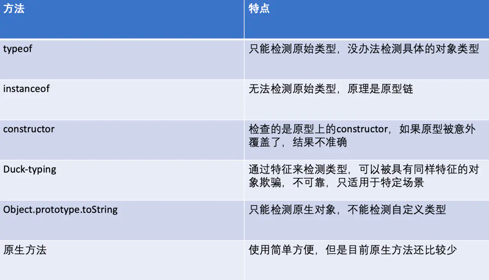
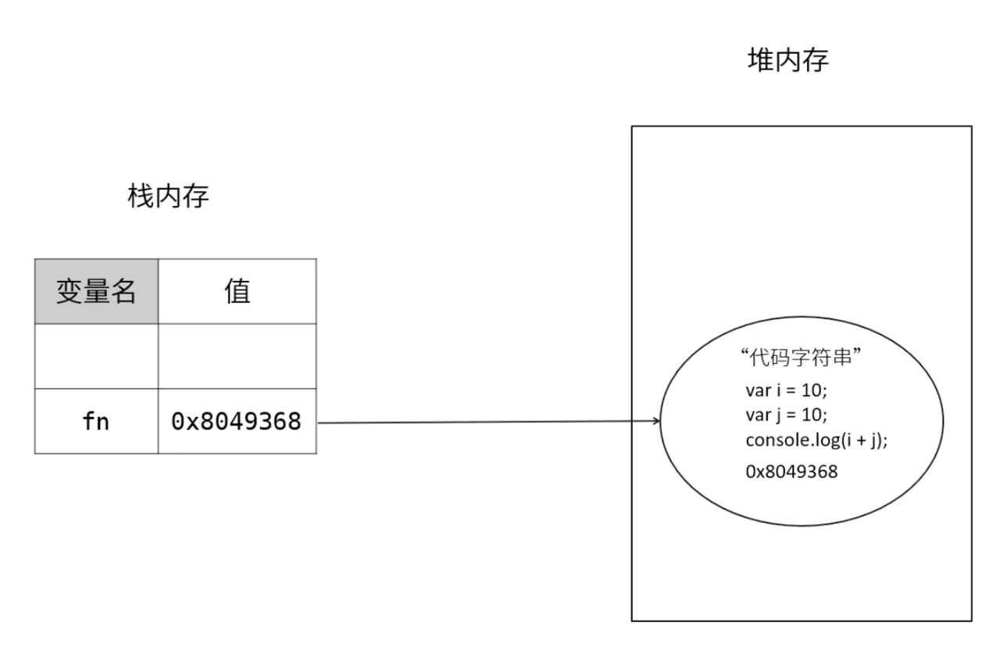
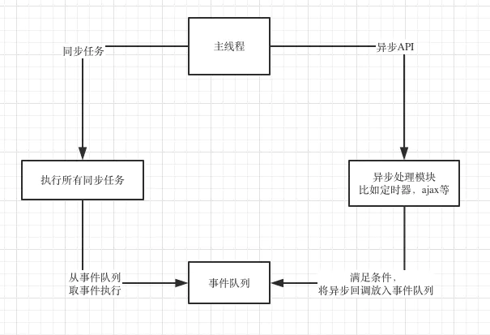
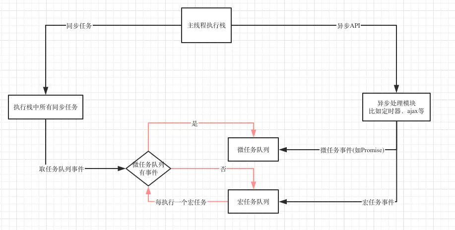

# js基础
1.let const var <br/>
+ let const 不存在变量提升
+ var声明的变量会挂到windows上，let const 不会
+ var是函数作用域，let const是代码块作用域
+ const 初始化的时候就要赋值，并且赋值之后不能被修改 对象 不能修改引用地址，引用属性可以修改

2.箭头函数 <br/>
+ 没有自己的this和arguments
+ 没有prototype
+ 不能被new,因为new之后 实例对象会有一个__proto__属性指向prototype 而箭头函数没有prototyoe
+ 不能作为构造函数

3.commonjs esmodule amd cmd umd  
+ commonjs 是nodejs加载模块使用的规范，浏览器不支持
+ esmodule是es6+ 模块机制 可以在浏览器端运行的
+ 浏览器端实现模块机制以前esmodule不兼容的时候出现过amd,cmd
+ cmd是阿里玉伯实现的seajs 现在用的很少了
+ amd是requirejs define(id?, dependencies?, factory)
+ AMD 推崇依赖前置、提前执行，CMD推崇依赖就近、延迟执行 define(function (require, exports, module){})
```javascript
// model1.js
define(function () {
    console.log('model1 entry');
    return {
        getHello: function () {
            return 'model1';
        }
    };
});

// model2.js
define(function () {
    console.log('model2 entry');
    return {
        getHello: function () {
            return 'model2';
        }
    };
});

// main.js
define(function (require) {
    var model1 = require('./model1');
    console.log(model1.getHello());
    var model2 = require('./model2');
    console.log(model2.getHello());
});


//AMD 运行结果 
// model1 entry
// model2 entry
// model1
// model2

// CMD运行结果
// 输出 
// model1 entry
// model1
// model2 entry
// model2
```
+ commonjs可动态导入，esmodule静态导入
+ commonjs导入的值是拷贝，如果原始值发生变化，需再次重新导入
+ esmodule导入的值是引用，原模块修改数据，导入的数据也会修改，导入之后只读，不能被修改


4.深浅拷贝  
+ 对象直接赋值属于浅拷贝 他是把对象的引用地址给copy了 但是2个变量指的还是内存中的通一个对象
```javascript
function deepClone(obj){
    let result = Array.isArray(obj) ? [] : {};
    for(let key in obj){
        if(typeof obj[key] === 'object'){
            result[key] = deepClone(obj[key])
        }else {
            result[key] = obj[key];
        }
    }
    return result;
}
```

5.防抖节流
```javascript
// 防抖
function debounces(func,delay) {
  let timer;
  return function() {
    let context = _this;
    let args = func.arguments;
    if(!timer){
        timer = setTimeout(func.call(_this,args),delay)
    }else{
        clearTimeout(timer);
        timer = null;
    }
  }
}


//节流
function throolte(func,delay) {
  let timer;
  let flag = false;
  return function() {
    let context = _this;
    let args = func.arguments;
    if(!flag){
        flag = true;
        timer = setTimeout(()=>{
            func.call(_this,args);
            flag = false;
        },delay);
    }
  }
}
```
6.promise
+ promise 有 3 种状态：pending、fulfilled 或 rejected。
状态改变只能是 pending->fulfilled 或者 pending->rejected，状态一旦改变则不能再变
+ Promise.then() 之后返回的是一个新的promise
+ 构造函数中的 resolve 或 reject 只有第一次执行有效，多次调用没有任何作用
+ .then 或者 .catch 的参数期望是函数，传入非函数则会发生值穿透。
```javascript
let p = new Promise((resolve,reject)=>{
    reslove();
})
function Promise(excute) {
    //PENDING REJECT FULFILLED
  this.state = 'PENDING';
  let _this = this;
  this.value = null;
  this.reason = null;
  this.fulfilled = [];
  this.rejected = [];
  function reslove() {
    this.value = arguments;
    if(_this.state == 'PENDING'){
        _this.state = 'FULFILLED';
       _this.fulfilled.forEach(item=>{
           item();
       })
    }
  }
  function reject() {
    this.reason = arguments
    _this.state = 'REJECT';
    if(_this.rejected.length > 0){
        _this.rejected.forEach(item=>{
            item();
        })
    }  
  }
    
  try{
    excute(reslove,reject);
  }catch (e) {
    reject(e)
  }

}

Promise.prototype.then = function(func,func2) {
  if(this.state == 'PENDING'){
    this.fulfilled.push(func);
    this.rejected.push(func2);
  }
  if(this.state == 'FULFILLED'){
    this.value = func(func.arguments);
  }
  
  if(this.state == 'REJECT'){
    this.value = func2(func.arguments);
  }

  
}
```

7.闭包作用域 <br/>
8.手撕函数柯里化<br/>
```javascript
let curry = (func,args=[]) => func.length === args.length ? func(args) : args => curry(func,[arguments,...args]); 
```

9.继承
+ extends super
+ prototype
+ call,apply

10.babel 语法兼容
+ babel core 转ast
+ babel-traverse 遍历
+ 生成新的Ast
+ 生成新的代码

11.polyfill 方法兼容
  babel-preset-env 
  babel-transform-runtime 按需加入

12.观察者
观察者模式指的是一个对象(Object a)维持一系列依赖(关注这个词感觉更好)它的对象（Object b,c,d） 当它的有关状态发生变化时Object a就要通知一系列Object b,c,d对象进行更新

“老王，等你结婚了，记得叫我来喝喜酒！”
于是有一天你真的要结婚了，且需要举办酒席，这时候你需要通知你的你的那些老友来喝喜酒。于是你拿起了手机给你的那些分布于世界各地的好朋友打起了电话，说了结婚酒席一事。
到了酒席那天，有的朋友来了，有的人没来礼却到了，有的呢只有简短的两句祝福，剩下的只有推脱。<br/>


在观察者模式中，目标与观察者相互独立，又相互联系：<br/>
+ 两者都是相互独立的对对象个体。
+ 观察者在目标对象中订阅事件，目标广播发布事件。

就像之前的例子一样：
+ 老王就是模式中所谓的目标。
+ 同学们在毕业前说的话就相当于在目标对象上订阅事件。
+ 老王打电话通知朋友就是发布事件。
+ 同学们各自作出了不同的行动回应。

首先我们需要定义两个对象：
+ 目标对象：Subject
+ 观察者对象：Observer

并且在目标对象中要存放观察者对象的引用，就像老王要存放同学的手机好一样，只有存了才能联系嘛。于是我们有了下面的代码：
```javascript
function Subject() {
  this.observers = new ObserverList();
}
function ObserverList() {
  this.observerList = [];
}
function Observer() {}


// 对于目标对象中的引用，我们必须可以动态的控制：
ObserverList.prototype.add = function(obj) {
  return this.observerList.push(obj);
};

ObserverList.prototype.count = function() {
  return this.observerList.length;
};

ObserverList.prototype.get = function(index) {
  if (index > -1 && index < this.observerList.length) {
    return this.observerList[index];
  }
};


// 这样我们就能对老王手机联系人进行增、删、查的操作了。
Subject.prototype.addObserver = function(observer) {
  this.observers.add(observer);
};

Subject.prototype.removeObserver = function(observer) {
  this.observers.removeAt(this.observers.indexOf(observer, 0));
};


//现在我们就要考虑发布消息的功能函数了。
// 首先必须明确一点：目标对象并不能指定观察者对象做出什么相应的变化。
// 目标对象只有通知的作用。就像老王只能告诉朋友他要办喜酒了，至于朋友接下来怎么办，则全是朋友自己决定的。
//所以我们得写一个目标广播消息的功能函数：

Subject.prototype.notify = function(context) {
  var observerCount = this.observers.count();
  for (var i = 0; i < observerCount; i++) {
    this.observers.get(i).update(context);
  }
};

// 我们将具体的观察者对象该作出的变化交给了观察者对象自己去处理。
// 这就要求观察者对象需要拥有自己的 update(context)方法来作出改变，同时该方法不应该写在原型链上，
// 因为每一个实例化后的 Observer 对象所做的响应都是不同的，需要独立存储 update(context)方法：
function Observer() {
  this.update = function() {
    // ...
  };
}


// 简单实现 
class Subject{
    constructor () {
      this.observers =[]
    }
    add (observer) {
      this.observers.push(observer)
    }
    remove (observer) {
      this.observers.map((item, index) => {
        if (item === observer) {
            this.observers.splice(index, 1)
        }
      })
    }
    notify () {
      this.observers.map((item, index) => {
          item.update()
      })
    }
}
class Observer {
    constructor (name) {
        this.name = name
    }
    update () {
        console.log("I`m " + this.name)
    }
}
var sub = new Subject()
var obs1 = new Observer("obs1")
var obs2  = new Observer("obs2")
sub.add(obs1)
sub.add(obs2)
sub.notify() // I`m obs1   I`m obs2
sub.remove(obs2)
sub.notify()  //I`m obs1

```


13.发布订阅
```javascript
var pubsub = {};

(function(myObject) {
  var topics = {};
  var subUid = -1;

  myObject.publish = function(topic, args) {
    if (!topics[topic]) {
      return false;
    }
    var subscribers = topics[topic],
      len = subscribers ? subscribers.length : 0;
    while (len--) {
      subscribers[len].func(args);
    }
    return this;
  };

  myObject.subscribe = function(topic, func) {
    if (!topics[topic]) {
      topics[topic] = [];
    }
    var token = (++subUid).toString();
    topics[topic].push({
      token: token,
      func: func
    });
    return token;
  };

  myObject.unsubscribe = function(token) {
    for (var m in topics) {
      if (topics[m]) {
        for (var i = 0, j = topics[m].length; i < j; i++) {
          if (topics[m][i].token === token) {
            topics[m].splice(i, 1);
            return token;
          }
        }
      }
    }
    return this;
  };
})(pubsub);


// 两者都是定义了一个一对多的依赖关系 当有关状态发生变化时执行相应的更新 本质上的思想都是一样的 而发布订阅可以看做是观察者的进阶版 设计模式是一种思想

// 观察者模式
// 目标直接将通知分发到观察者身上
// 发布订阅者模式
// 目标首先是将通知分发到事件调度中心，事件调度中心再通过订阅者具体订阅的类型分发到不同的订阅者身上
```

14.数组常见方法 
+ Array.from() Array.from方法用于将两类对象转为真正的数组
```javascript
let arrayLike = {
    '0': 'a',
    '1': 'b',
    '2': 'c',
    length: 3
};

// ES5的写法
var arr1 = [].slice.call(arrayLike); // ['a', 'b', 'c']

// ES6的写法
let arr2 = Array.from(arrayLike); // ['a', 'b', 'c']
```
+ Array.of() 方法用于将一组值，转换为数组 Array.of(3, 11, 8) // [3,11,8]
+ 数组实例的 find() 和 findIndex()
数组实例的find方法，用于找出第一个符合条件的数组成员。
它的参数是一个回调函数，所有数组成员依次执行该回调函数，直到找出第一个返回值为true的成员，然后返回该成员。
如果没有符合条件的成员，则返回undefined
+ 数组实例的 fill() 数组实例的 fill() ['a', 'b', 'c'].fill(7, 1, 2) // ['a', 7, 'c'] fill方法还可以接受第二个和第三个参数，用于指定填充的起始位置和结束位置
+ map
+ reduces
+ filter

15.new
+ 创建空对象{}
+ {}.prototype 指向构造函数的prototype
+ this={}
+ 执行构造函数


16.手撕call,apply,bind
```javascript
Function.prototype.call = function(context,...args) {
  context.fn = this;
  context.fn(...args);
  context.fn = null;
}
```
17 generator iterator next 实现
for of 内部实现了interator接口 <br/>
Array、Map、Set、NodeList、String以及函数的arguments对象 <br/>

实现Iterator接口就是在对象中增加方法名为Symbol类型Symbole.iterator的方法，
该方法返回一个对象，并且对象要有一个next方法，next方法又要返回一个包含value(任意类型)和done(布尔值)属性的对象。
```javascript
let object = {
    name: 'obj',
    array: ['a', 'b', 'c', 'd', 'e'],
    [Symbol.iterator]() {
        return {
            next: () => {
                return {
                    value: undefined,
                    done: true
                }
            }
        }
    }
}
```


18.随机数 范围 （star,end) => Math.random() * length + start;

19.类型判断
原始类型的值无法更改，要更改只能重新赋值。

原始类型的比较就是比较值，值相等，他们就相等

<br/>

+ typeof
+ instance
+ prototype
+ constructor

20.object

# 浏览器
1.js内存
栈内存 <br/>
栈是一种只能一端进出的数据结构，先进后出，后进先出。<br/>
<br/>
以var a = 10; 为例，我们先将10放入内存，然后申明一个变量a，这时候a的值是undefined，最后进行赋值，就是将a与10关联起来<br/>

堆内存
但是引用数据类型，比如Object, Array，他们的大小不是固定的，所以是存在堆内存的。<br/>
JS不允许直接操作堆内存，我们在操作对象时，操作的实际是对象的引用，而不是实际的对象。<br/>
可以理解为对象在栈里面存了一个内存地址，这个地址指向了堆里面实际的对象。所以引用类型的值是一个指向堆内存的引用地址<br/>


函数也是引用类型，当我们定义一个函数时，会在堆内存中开辟一块内存空间，将函数体代码以字符串的形式存进去。<br/>
然后将这块内存的地址赋值给函数名，函数名和引用地址会存在栈上<br/>

<br/>

v8内存管理
V8是有内存限制的，因为它最开始是为浏览器设计的，不太可能遇到大量内存的使用场景
因此V8限制了内存使用的大小，但是Node.js是可以通过配置修改的，更好的做法是使用Buffer对象，因为Buffer的内存是底层C++分配的，不占用JS内存，所以他也就不受V8限制。


2.浏览器垃圾回收
引用计数
它跟踪记录每个值被引用的次数，每次引用的时候加一，被释放时减一，如果一个值的引用次数变成0了，就可以将其内存空间回收。<br/>
其 BOM 和 DOM 中的对象就是使用 C++以 COM（Component Object Model，组件对象模型）对象的形式实现的，而 COM对象的垃圾 收集机制采用的就是引用计数策略。
循环引用
```javascript
var element = document.getElementById("some_element"); 
var myObject = new Object();
myObject.element = element; 
element.someObject = myObject;
```
标记-清除算法
标记-清除算法就是当变量进入环境是，这个变量标记位“进入环境”；而当变量离开环境时，标记为“离开环境”，当垃圾回收时销毁那些带标记的值并回收他们的内存空间。

可能造成内存泄露的情况
1. 对象之间的循环引用
2. 老版IE（IE8及以前）里面DOM与对象之间的循环引用

其他也可能造成循环引用的情况：

1. 全局变量会存在于整个应用生命周期，应用不退出不会回收，使用严格模式可以避免这种情况
2. 闭包因为自身特性，将函数内部变量暴露到了外部作用域，当其自身执行结束时，所暴露的变量并不会回收
3. 没有clear的定时器

新生代内存回收机制：
新生代内存容量小，64位系统下仅有32M。新生代内存分为From、To两部分，进行垃圾回收时，先扫描From，将非存活对象回收，将存活对象顺序复制到To中，之后调换From/To，等待下一次回收

老生代内存回收机制
晋升：如果新生代的变量经过多次回收依然存在，那么就会被放入老生代内存中
标记清除：老生代内存会先遍历所有对象并打上标记，然后对正在使用或被强引用的对象取消标记，回收被标记的对象
整理内存碎片：把对象挪到内存的一端


3.v8执行过程

初始化基础环境
解析源码生成ast和作用域
依据ast和作用域生成字节码
解释器解释执行字节码
监听热点代码
编译器优化热点代码为二进制的机器码
反优化二进制机器代码


预解析：检查语法错误但不生成AST
生成AST：经过词法/语法分析，生成抽象语法树
生成字节码：基线编译器(Ignition)将AST转换成字节码
生成机器码：优化编译器(Turbofan)将字节码转换成优化过的机器码，此外在逐行执行字节码的过程中，如果一段代码经常被执行，那么V8会将这段代码直接转换成机器码保存起来，下一次执行就不必经过字节码，优化了执行速度


4.event loop
JS异步是怎么实现的?
我们都知道JS是单线程的，那单线程是怎么实现异步的呢？
事实上所谓的"JS是单线程的"只是指JS的主运行线程只有一个，而不是整个运行环境都是单线程。
JS的运行环境主要是浏览器，以大家都很熟悉的Chrome的内核为例，他不仅是多线程的，而且是多进程的：


GUI线程
GUI线程就是渲染页面的，他解析HTML和CSS，然后将他们构建成DOM树和渲染树就是这个线程负责的。

JS引擎线程
这个线程就是负责执行JS的主线程，前面说的"JS是单线程的"就是指的这个线程。大名鼎鼎的Chrome V8引擎就是在这个线程运行的。
需要注意的是，这个线程跟GUI线程是互斥的。
互斥的原因是JS也可以操作DOM，如果JS线程和GUI线程同时操作DOM，结果就混乱了，不知道到底渲染哪个结果。
这带来的后果就是如果JS长时间运行，GUI线程就不能执行，整个页面就感觉卡死了。所以我们最开始例子的while(true)这样长时间的同步代码在真正开发时是绝对不允许的

定时器线程
前面异步例子的setTimeout其实就运行在这里，他跟JS主线程根本不在同一个地方，所以“单线程的JS”能够实现异步。JS的定时器方法还有setInterval，也是在这个线程。


事件触发线程
定时器线程其实只是一个计时的作用，他并不会真正执行时间到了的回调，真正执行这个回调的还是JS主线程。
所以当时间到了定时器线程会将这个回调事件给到事件触发线程，然后事件触发线程将它加到事件队列里面去。
最终JS主线程从事件队列取出这个回调执行。事件触发线程不仅会将定时器事件放入任务队列，其他满足条件的事件也是他负责放进任务队列。

异步HTTP请求线程
这个线程负责处理异步的ajax请求，当请求完成后，他也会通知事件触发线程，然后事件触发线程将这个事件放入事件队列给主线程执行。
所以JS异步的实现靠的就是浏览器的多线程，当他遇到异步API时，就将这个任务交给对应的线程，
当这个异步API满足回调条件时，对应的线程又通过事件触发线程将这个事件放入任务队列，然后主线程从任务队列取出事件继续执行

浏览器的Event Loop
事件循环就是一个循环，是各个异步线程用来通讯和协同执行的机制。
各个线程为了交换消息，还有一个公用的数据区，这就是事件队列。
各个异步线程执行完后，通过事件触发线程将回调事件放到事件队列，主线程每次干完手上的活儿就来看看这个队列有没有新活儿，有的话就取出来执行。
画成一个流程图就是这样：
<br/>
主线程每次执行时，先看看要执行的是同步任务，还是异步的API
同步任务就继续执行，一直执行完
遇到异步API就将它交给对应的异步线程，自己继续执行同步任务
异步线程执行异步API，执行完后，将异步回调事件放入事件队列上
主线程手上的同步任务干完后就来事件队列看看有没有任务
主线程发现事件队列有任务，就取出里面的任务执行
主线程不断循环上述流程

引入微任务
前面的流程图我为了便于理解，简化了事件队列，其实事件队列里面的事件还可以分两类：宏任务和微任务。
微任务拥有更高的优先级，当事件循环遍历队列时，先检查微任务队列，如果里面有任务，就全部拿来执行，执行完之后再执行一个宏任务。
执行每个宏任务之前都要检查下微任务队列是否有任务，如果有，优先执行微任务队列。
<br/>

一个Event Loop可以有一个或多个事件队列，但是只有一个微任务队列。
微任务队列全部执行完会重新渲染一次
每个宏任务执行完都会重新渲染一次
requestAnimationFrame处于渲染阶段，不在微任务队列，也不在宏任务队列

常见宏任务有：
script (可以理解为外层同步代码)
setTimeout/setInterval
setImmediate(Node.js)
I/O
UI事件
postMessage


常见微任务有：
Promise
process.nextTick(Node.js)
Object.observe
MutaionObserver

5.安全
跨站脚本攻击（XSS）
http://www.a.com/test.php?param=<srcipt src="xss.js"></script>

参数验证，不符合要求的数据不要存入数据库
对特殊字符转义，如"<"、">"、"/"、"&"等
避免使用eval、new Function动态执行字符串的方法
避免使用 innerHTML、document.write 直接将字符串输出到HTML
把一些敏感的 cookie 设置为 http only，避免前端访问 cookie

跨站请求伪造（CSRF）
F是网站A的用户，且已登录，网站A对用户F进行身份认证后下发了cookie，保存在F浏览器中。<br/>
F访问网站B，网站B存在引诱点击（往往是个链接，指向网站A的API接口，通常是GET类型），然后访问了A网站，浏览器会自动上传cookie。<br/>
网站A对传来的cookie进行确认，是合法用户，则执行接口的动作 <br/>


6.跨域
所谓的同源,指的是协议,域名,端口相同。
jsonp跨域
客户端引用服务端的一个请求，服务端返回一段js打代码
WebSocket协议跨域
nginx代理跨域
postMessage。HTML5 的 postMessage 方法可用于两个页面之间通信，而且不论这两个页面是否同源。


7.缓存

强缓存
Expires
Cache-Control 
协商缓存
协商缓存的更新策略是不再指定缓存的有效时间，而是浏览器直接发送请求到服务端进行确认缓存是否更新，如果请求响应返回的 HTTP 状态为 304，则表示缓存仍然有效。

Last-Modified 和 If-Modified-Since
Last-Modified 和 If-Modified-Since 对比资源最后修改时间来实现缓存。

浏览器第一次请求资源，服务端在返回资源的响应头上添加 Last-Modified 字段，值是资源在服务端的最后修改时间；
浏览器再次请求资源，在请求头上添加 If-Modified-Since，值是上次服务端返回的最后修改时间；
服务端收到请求，根据 If-Modified-Since 的值进行判断。若资源未修改过，则返回 304 状态码，并且不返回内容，浏览器使用缓存；否则返回资源内容，并更新 Last-Modified 的值；

ETag 和 If-None-Match
ETag 和 If-None-Match 对比资源哈希值，哈希值由资源内容计算得出，即依赖资源内容实现缓存。

浏览器第一次请求资源，服务端在返回资源的响应头上添加 ETag 字段，值是资源的哈希值
浏览器再次请求资源，在请求头上添加 If-None-Match，值是上次服务端返回的资源哈希值；
服务端收到请求，根据 If-None-Match 的值进行判断。若资源内容没有变化，则返回 304 状态码，并且不返回内容，浏览器使用缓存；否则返回资源内容，并计算哈希值放到 ETag；


+ url页面发生什么 https://blog.csdn.net/allenliu6/article/details/76609929  https://juejin.im/post/6844904083166347271
async是赋予脚本异步属性，其特性如下：

不等待其他脚本 js一旦下载好了就会执行
与文档同时呈现 不能按序进行
defer是赋予脚本延迟属性，其特性如下：

在文档完全呈现后执行 不会阻塞页面的渲染和资源的加载
自身按序进行 如果前后有依赖关系的js可以放心使用

先讲一下规范里经典script的处理方法，总共三种情况：

不使用async和defer，根据所在位置阻塞解析，被下载紧接着执行直到完成。

使用async，不阻塞解析并行下载脚本，当下载完成后阻塞解析立即执行，在解析完成前后都可能被执行。

使用defer，并行下载，并在页面完成解析时进行执行，不会阻塞解析

二者下载都不会阻塞DOM解析，这点还是很重要的，首屏时间就是一切

都是给外链脚本使用，不考虑请求数量而使用内联情况下等因素的首选方式

都可以使用onload事件进行一系列处理

// ----
+ 输入URL并敲下回车键
+ 浏览器查找当前URL是否存在缓存，并比较是否过期。
+ DNS解析域名
    + 浏览器缓存解析
    + 本地hosts文件解析
    + 操作系统解析
    + 路由器解析
    + 根域名服务器解析、顶级域名服务器解析、主域名服务器解析（IPV4\IPV6）
+ TCP链接建立（3次握手）
    + 客户端发送SYN包（SYN = 1, seq = x）至服务端，并处于SYN_SENT状态，等待服务器确认
    + 服务端解析SYN，并发送SYN + ACK（SYN = 1, ACK = x + 1, seq = y） 包至客户端，并处于SYN_RECV状态，允许建立链接（告知服务器已做好准备，可以发送数据）
    + 客户端获取SYN + ACK 并发送ACK（ACK = y + 1， seq = z）包至服务端，链接建立成功。（即将开始发送数据）
+ 客户端发起HTTP请求
    + 完整的HTTP请求包含请求起始行，请求头部，请求主体
    + 服务端收到浏览器的HTTP请求后，会将收到的HTTP报文封装成HTTP的Request对象，并通过不同的WEB服务器进行处理，处理完的结果以Response对象返回，主要包括状态码，响应头，响应报文三个部分
    + 综合起来，完整的HTTP报文包括了：通用头部，请求/响应 头部，请求/响应体
```
//General
Request Url: 服务器地址
Request Method: 请求方式（get, post, options, put, head, delete, connect, trace）
Status Code: 请求返回的状态码
Remote Address: 请求的远程服务器地址（IP）
Referrer Policy: （引用策略）用来监管哪些访问来源信息【not IE】

// Request Head
Accept: 接受类型，浏览器支持的MIME类型（对标服务端放回的Content-Type）
Accept-Encoding: 浏览器支持的压缩类型，如gzip等，超出类型不能接受
Content-Type: 客户端发送出去的实体内容的类型
Cache-Control: 指定请求和响应遵循的缓存机制，如no-cache,no-store
If-Modified-Since: 对应服务端你的Last-Modified, 用来匹配文件是否变动，只能精确到1s之内，http1.0中
Expires: 缓存到期时间，（服务端时间）http1.0中
Max-age: 代表资源在本地缓存多少秒， http 1.1中
If-None-Match: 对应的服务端的ETag，用来匹配文件内容是否改变（非常精确），http1.1中
Cookie: 有cookie并且同域访问会自动带上
Connection: 当浏览器与服务器通信时对于长链接如何进行处理，如keep-alive;
Host: 请求的服务器URL
Origin: 最初的请求是从哪里发起的（只会精确到端口）,origin比Referrer更尊重隐私
Referrer: 该页面的来源URL（适用于所有类型的请求，会精确到详细页面地址，CSRF拦截常用到这个字段）
User-Agent: 用户客户端的一些必要信息，如UA头部等;


// Response Head
Access-Control-Allow-Headers: 服务端允许的请求的headers
Access-Control-Allow-Methods: 服务端允许的请求方法
Access-Control-Allow-Origin: 服务端允许的Origin头部
Content-Type: 服务端返回的实体内容的类型
Date: 数据从服务端发送的时间
Cache-Control: 告诉浏览器或其他客户，什么环境可以安全的缓存文档
Last-Modified: 请求的资源最后修改时间
Expires: 文档什么时候过期，从而不再缓存
Max-age: 客户端的本地资源应该缓存多少秒，开启Cache-Control后有效
ETag: 请求变量的实体标签的当前值
Set-Cookie: 设置和页面关联的cookie,服务器通过这个头部把cookie传给客户端
keep-alive: 如果客户端有keep-alive, 服务端也会有相应（如timeout = 38）
Server: 服务器的一些相关信息
```
+ 浏览器解析渲染页面
解析HTML，构建DOM树（深度优先：即先构建当前节点的所有的子节点，再构建兄弟节点）；


若在此过程遇到script标签，则会暂停DOM树的构建。


解析CSS，生成CSS规则树；


解析CSS规则的过程时JS将暂停执行，直到CSS规则树构建完成。


合并DOM树和CSS规则，生成render树；


精简CSS可加快CSS树的构建，从而加快页面响应速度。


布局render树（layout/reflow【回流\重排】），负责各元素尺寸、位置计算；


回流：由于DOM属性的改变（节点尺寸发生了变化，浏览器中受影响的部分失效），导致重新构建render树的过程；（回流必定导致重绘。）
重绘：一个元素的外观发生改变，浏览器会根据元素的新属性重新绘制，使元素呈现新的外观（background, color, border-color ...）


绘制render树（paint），绘制页面像素信息；
浏览器将各层的信息发送给GPU，GPU将各层合成，显示在屏幕上；

+ TCP链接释放（4次挥手）
TCP向服务端发送带有FIN（FINISH）标记报文，客户端进入FIN_WAIT_1状态（通知服务器端准备关闭）
服务端接受通知，向客户端发送ACK报文，确认序号为收到的序号加1，和SYN一样，一个FIN报文将占用一个序号。（告诉浏览器，请求报文接受完毕。我准备关闭了，你也准备吧）服务器进入CLOSE_WAIT状态。
服务器端发送FIN，用来关闭服务器到客户端的数据传输，服务器进入LAST_ACK状态。（告诉浏览器，响应报文发送完毕。你准备关闭吧。）
客户端接受FIN报文，服务器进入TIME_WAIT状态，发送ACK包给服务器（ACK = b + 1, seq = a + 1）,服务器进入CLOSED状态。（告诉服务器响应报文接受完毕，准备关闭。）

+ 浏览器组成


+ 浏览器渲染引擎 javascript引擎
渲染 

# http https

+ tcp三次握手 4次挥手

+ udp
+ tcp

# BOM
+ event
+ 浏览器可是区域
+ window
+ navigator
+ 存储

# DOM


# babel
+ babel包

# webpack
+ source-map
+ 包处理
+ 手撕代码
+ loader
+ 优化
+ eslint

# vue
+ 响应式
在$mont()的时候，会创建Watcher实例的过程，把Dep.target设置为当前Watcher，
然后会开始render，render的时候就会读取到响应数据，从而触发get，只有被观察的数据才配置了get，get执行过程中会创建一个Dep实例，
此时有了Watcher和Dep，他们会建立关系。他们建立关系之后，当一旦被观察的数据发生改变，就会触发set，set调用dep.notify(),
dep则会让跟他有关系的Watcher进行更新。
被观察的数据更改会导致组件进行更新从而影响到dom的改变。这个被观察的数据就是响应数据，而这个get的过程我们叫做依赖收集。

+ key
key会用在虚拟DOM算法（diff算法）中，用来辨别新旧节点。
不带key的时候会最大限度减少元素的变动，尽可能用相同元素。（就地复用）
带key的时候，会基于相同的key来进行排列。（相同的复用）
带key还能触发过渡效果，以及触发组件的生命周期


+ 观察者
+ vdom


+ diff
https://juejin.im/post/6844903938102149134

+ vue3

+ vue-router
window.addEventListener('hashchange'，e=>{}）
window.addEventListener('popstate',e=>{})

# css
+ 居中
水平
```css
.parent4 {
  /* 父级设置relative好让子级absolute相对于父级定位 */
    position: relative;
}

.child4 {
    position: absolute;
  /* left 50%会让子级在正中稍微靠右一点 */
    left: 50%;
  /* translateX百分比相对的是自身，因为前面靠右了，往左挪一点 */
  /* 挪的位置刚好是自身宽的一半*/
    transform: translateX(-50%);
}


.parent5 {
    display: flex;
    justify-content: center;
}

.child5 {
}
```

垂直
```css
.parent7 {
    position: relative;
}

.child7 {
    position: absolute;
    top: 50%;
  /* translateY百分比也是相对于元素自身计算的 */
    transform: translateY(-50%);
}
```

水平垂直居中
```css
.parent9 {
    text-align: center;
    display: table-cell;
    vertical-align: middle;
}

.child9 {
    display: inline-block;
}


.parent10 {
    position: relative;
}

.child10 {
    position: absolute;
    top: 50%;
    left: 50%;
    transform: translate(-50%, -50%);
}


.parent11 {
    display: flex;
    justify-content: center;
    align-items: center;
}

.child11 {
}
```


+ flex
<br/>
flex-direction
flex-wrap
flex-flow
justify-content
align-items
align-content


+ BFC https://blog.csdn.net/dff1993/article/details/80394150
+ 适配
rem
+ css3
+ 兼容性问题

+ 优先级


+ 固定宽高比


# html5
+ 

# 优化


# 算法

# 项目问题
Q: geoserver 中文乱码最后解决办法 
A: 字体文件缺少

Q: webpack 配置 publicPath的理解
A: publicPath的使用说法适用于生产环境,
默认情况下，webpack-dev-server 会把打包后的文件放到项目的根目录下，文件名是在output配置中的filename. 
但是当有publicPath 配置的时候，就不一样了。
Webpack 会把所有的文件打包到publicPath指定的目录下，
就是相当于在项目根目录下创建了一个publicPath目录, 然后把打包成的文件放到了它里面，只不过我们看不到而已, 
文件名还是output配置中的filename。

Q: 坐标系的理解，各个坐标系 之间的不同 
A:

Q: docker network
A: 


Q: Docker远程访问


