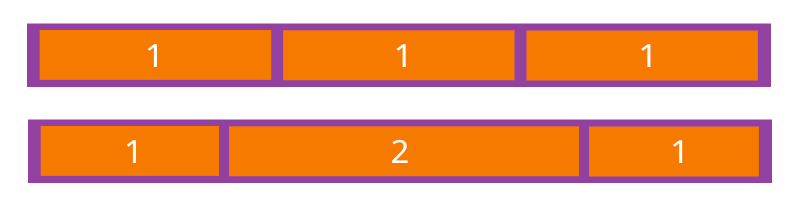

# 属性选择器
+ [attribute]	用于选取带有指定属性的元素。
+ [attribute=value]	用于选取带有指定属性和值的元素。
+ [attribute~=value]	用于选取属性值中包含指定词汇的元素。
+ [attribute|=value]	用于选取带有以指定值开头的属性值的元素，该值必须是整个单词。
+ [attribute^=value]	匹配属性值以指定值开头的每个元素。
+ [attribute$=value]	匹配属性值以指定值结尾的每个元素。
+ [attribute*=value]	匹配属性值中包含指定值的每个元素。

# css轮廓
+ outline	在一个声明中设置所有的轮廓属性。	2
+ outline-color	设置轮廓的颜色。	2
+ outline-style	设置轮廓的样式。	2
+ outline-width	设置轮廓的宽度。	2
```css
p 
{
border:red solid thin;
outline:#00ff00 dotted thick;
}
```


# css框模型


## 内边距
内边距的百分比数值 <br/>
前面提到过，可以为元素的内边距设置百分数值。
百分数值是相对于其父元素的 width 计算的，这一点与外边距一样。
所以，如果父元素的 width 改变，它们也会改变。

## 外边距
设置一个百分比数值：<br/>
百分数是相对于父元素的 width 计算的。

## 外边距合并
简单地说，外边距合并指的是，当两个垂直外边距相遇时，它们将形成一个外边距。
合并后的外边距的高度等于两个发生合并的外边距的高度中的较大者。

 <br/>

当一个元素包含在另一个元素中时（假设没有内边距或边框把外边距分隔开），它们的上和/或下外边距也会发生合并。


# 定位
CSS 有三种基本的定位机制：普通流、浮动和绝对定位。除非专门指定，否则所有框都在普通流中定位。<br/>

## CSS 相对定位
设置为相对定位的元素框会偏移某个距离。元素仍然保持其未定位前的形状，它原本所占的空间仍保留。
```css
#box_relative {
  position: relative;
  left: 30px;
  top: 20px;
}
```


## CSS 绝对定位
设置为绝对定位的元素框从文档流完全删除，并相对于其包含块定位，包含块可能是文档中的另一个元素或者是初始包含块。
元素原先在正常文档流中所占的空间会关闭，就好像该元素原来不存在一样。
元素定位后生成一个块级框，而不论原来它在正常流中生成何种类型的框。


因为绝对定位的框与文档流无关，所以它们可以覆盖页面上的其它元素。
可以通过设置 z-index 属性来控制这些框的堆放次序。

## CSS 浮动
浮动的框可以向左或向右移动，直到它的外边缘碰到包含框或另一个浮动框的边框为止。<br/>
由于浮动框不在文档的普通流中，所以文档的普通流中的块框表现得就像浮动框不存在一样。<br/>

当把框 1 向右浮动时，它脱离文档流并且向右移动，直到它的右边缘碰到包含框的右边缘：<br/>
 <br/><br/>


当框 1 向左浮动时，它脱离文档流并且向左移动，直到它的左边缘碰到包含框的左边缘。
因为它不再处于文档流中，所以它不占据空间，实际上覆盖住了框 2，使框 2 从视图中消失。<br/>
如果把所有三个框都向左移动，那么框 1 向左浮动直到碰到包含框，另外两个框向左浮动直到碰到前一个浮动框。 <br/>
<br/> <br/>

如果包含框太窄，无法容纳水平排列的三个浮动元素，那么其它浮动块向下移动，直到有足够的空间。如果浮动元素的高度不同，那么当它们向下移动时可能被其它浮动元素“卡住”：


# css 伪类
+ :active	向被激活的元素添加样式。	
+ :focus	向拥有键盘输入焦点的元素添加样式。	
+ :hover	当鼠标悬浮在元素上方时，向元素添加样式。	
+ :link	向未被访问的链接添加样式。	
+ :visited	向已被访问的链接添加样式。	
+ :first-child	向元素的第一个子元素添加样式。	
+ :lang	向带有指定 lang 属性的元素添加样式。	

# 伪元素
+ :first-letter	向文本的第一个字母添加特殊样式。	
+ :first-line	向文本的首行添加特殊样式。	
+ :before	在元素之前添加内容。	
+ :after	在元素之后添加内容。

# css3 边框
+ border-radius
+ box-shadow
+ border-image

# css3 背景 
+ background-size
+ background-origin

# css3 文本
+ text-shadow
```css
/**
 水平阴影、垂直阴影、模糊距离，以及阴影的颜色：
*/
h1
{
text-shadow: 5px 5px 5px #FF0000;
}

```
+ word-wrap  允许文本强制文本进行换行 

# CSS3 转换
+ translate()
+ rotate()
+ scale()
+ skew()
+ matrix()

# CSS3 过渡
+ transition	简写属性，用于在一个属性中设置四个过渡属性。	
+ transition-property	规定应用过渡的 CSS 属性的名称。	
+ transition-duration	定义过渡效果花费的时间。默认是 0。	
+ transition-timing-function	规定过渡效果的时间曲线。默认是 "ease"。	
+ transition-delay	规定过渡效果何时开始。默认是 0。	
```css
div
{
transition: width 1s linear 2s;
/* Firefox 4 */
-moz-transition:width 1s linear 2s;
/* Safari and Chrome */
-webkit-transition:width 1s linear 2s;
/* Opera */
-o-transition:width 1s linear 2s;
}
```

# CSS3 动画
+ animation	所有动画属性的简写属性，除了 animation-play-state 属性。	
+ animation-name	规定 @keyframes 动画的名称。	
+ animation-duration	规定动画完成一个周期所花费的秒或毫秒。默认是 0。
+ animation-timing-function	规定动画的速度曲线。默认是 "ease"。	
+ animation-delay	规定动画何时开始。默认是 0。	
+ animation-iteration-count	规定动画被播放的次数。默认是 1。	
+ animation-direction	规定动画是否在下一周期逆向地播放。默认是 "normal"。	
+ animation-play-state	规定动画是否正在运行或暂停。默认是 "running"。	
+ animation-fill-mode	规定对象动画时间之外的状态。	
```css
div
{
animation: myfirst 5s linear 2s infinite alternate;
/* Firefox: */
-moz-animation: myfirst 5s linear 2s infinite alternate;
/* Safari 和 Chrome: */
-webkit-animation: myfirst 5s linear 2s infinite alternate;
/* Opera: */
-o-animation: myfirst 5s linear 2s infinite alternate;
}
```

# CSS3 渐变（Gradients）
+ 线性渐变（Linear Gradients）- 向下/向上/向左/向右/对角方向 <br/>
background-image: linear-gradient(direction, color-stop1, color-stop2, ...);
```css
/**
线性渐变 - 从上到下（默认情况下）
*/
#grad {
    background-image: linear-gradient(#e66465, #9198e5);
}


/**
线性渐变 - 从左到右
*/
#grad {
  height: 200px;
  background-image: linear-gradient(to right, red , yellow);
}

/**
线性渐变 - 对角
*/
#grad {
  height: 200px;
  background-image: linear-gradient(to bottom right, red, yellow);
}

/**
使用角度
*/
#grad {
  background-image: linear-gradient(-90deg, red, yellow);
}
```


+ 径向渐变（Radial Gradients）- 由它们的中心定义
```css
#grad {
  background-image: radial-gradient(red 5%, yellow 15%, green 60%);
}
```

# CSS3 多列
可以将文本内容设计成像报纸一样的多列布局
+ column-count
+ column-gap
+ column-rule
```html
<style>
.newspaper
{
	-moz-column-count:3; /* Firefox */
	-webkit-column-count:3; /* Safari and Chrome */
	column-count:3;
}
</style>

<div class="newspaper">
“当我年轻的时候，我梦想改变这个世界；当我成熟以后，我发现我不能够改变这个世界，我将目光缩短了些，决定只改变我的国家；当我进入暮年以后，我发现我不能够改变我们的国家，我的最后愿望仅仅是改变一下我的家庭，但是，这也不可能。当我现在躺在床上，行将就木时，我突然意识到：如果一开始我仅仅去改变我自己，然后，我可能改变我的家庭；在家人的帮助和鼓励下，我可能为国家做一些事情；然后，谁知道呢?我甚至可能改变这个世界。”
</div>
```


# CSS3 用户界面
+ resize
+ box-sizing
+ outline-offset

# css3 flex布局
采用 Flex 布局的元素，称为 Flex 容器（flex container），简称"容器"。
它的所有子元素自动成为容器成员，称为 Flex 项目（flex item），简称"项目"。

## 容器的属性
+ flex-direction 项目的排列方向
```
.box {
  flex-direction: row | row-reverse | column | column-reverse;
}
```


+ flex-wrap 默认情况下，项目都排在一条线 flex-wrap属性定义，如果一条轴线排不下，如何换行
```
.box{
  flex-wrap: nowrap | wrap | wrap-reverse;
}

nowrap（默认）：不换行。
wrap：换行，第一行在上方。
wrap-reverse：换行，第一行在下方。
```

+ flex-flow 是flex-direction属性和flex-wrap属性的简写形式，默认值为row nowrap。
+ justify-content 属性定义了项目在主轴上的对齐方式
```
.box {
  justify-content: flex-start | flex-end | center | space-between | space-around;
}
```


+ align-items 在交叉轴上如何对齐。
```
.box {
  align-items: flex-start | flex-end | center | baseline | stretch;
}
```


+ align-content

## 项目的属性
+ order 属性定义项目的排列顺序。数值越小，排列越靠前，默认为0。
```
.item {
  order: <integer>;
}
```


+ flex-grow 定义项目的放大比例，默认为0，即如果存在剩余空间，也不放大。
```
.item {
  flex-grow: <number>; /* default 0 */
}
```

如果所有项目的flex-grow属性都为1，则它们将等分剩余空间（如果有的话）。
如果一个项目的flex-grow属性为2，其他项目都为1，则前者占据的剩余空间将比其他项多一倍。

+ flex-shrink 定义了项目的缩小比例，默认为1，即如果空间不足，该项目将缩小
+ flex-basis
+ flex
+ align-self

