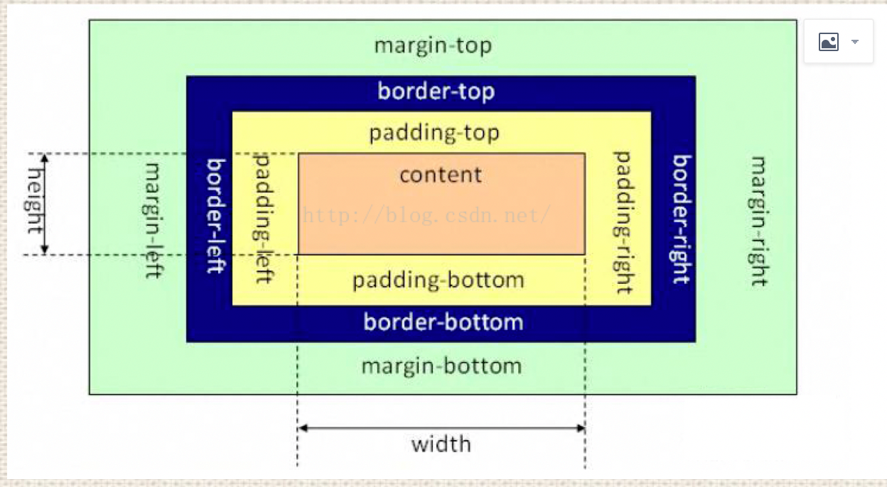
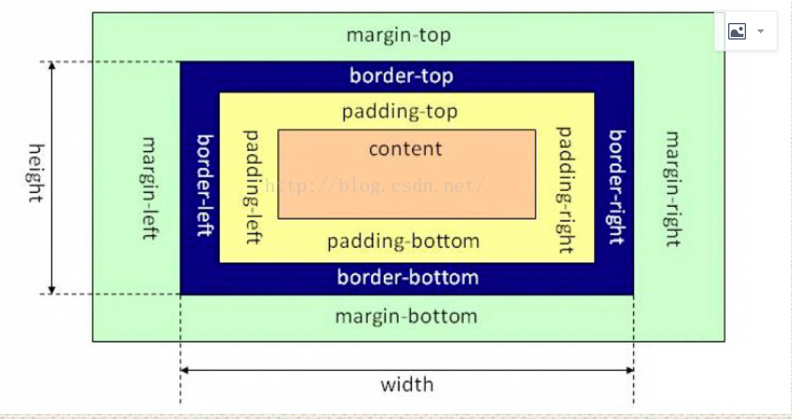

# 说一下css盒模型
标准盒子模型：<br/>
<br/>

IE盒子模型：<br/>
 <br/>

在CSS3中引入了box-sizing属性，
box-sizing:content-box;表示标准的盒子模型，
box-sizing:border-box表示的是IE盒子模型

# 画一条0.5px的线
1.采用meta viewport的方式<br/>
```html
<meta name="viewport" content="width=device-width, initial-scale=0.5, minimum-scale=0.5, maximum-scale=0.5"/>
```
这样子就能缩放到原来的0.5倍，如果是1px那么就会变成0.5px 
要记得viewport只针对于移动端，只在移动端上才能看到效果<br/>

2.采用transform: scale()的方式<br/>
`transform: scale(0.5,0.5);` <br/>

# link标签和import标签的区别
link属于html标签，而@import是css提供的<br/>
页面被加载时，link会同时被加载，而@import引用的css会等到页面加载结束后加载。<br/>
link是html标签，因此没有兼容性，而@import只有IE5以上才能识别。<br/>
link方式样式的权重高于@import的。<br/>

# transition和animation的区别
Animation和transition大部分属性是相同的，
他们都是随时间改变元素的属性值，
他们的主要区别是transition需要触发一个事件才能改变属性，
而animation不需要触发任何事件的情况下才会随时间改变属性值，
并且transition为2帧，从from .... to，而animation可以一帧一帧的。

# Flex布局

# BFC（块级格式化上下文，用于清楚浮动，防止margin重叠等）


