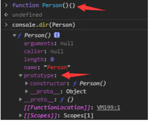
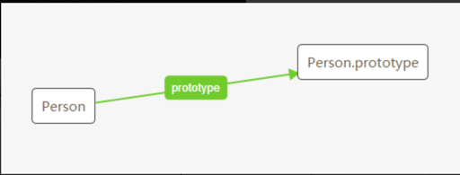
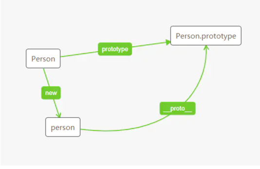
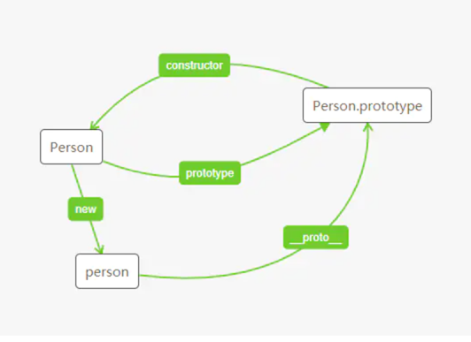
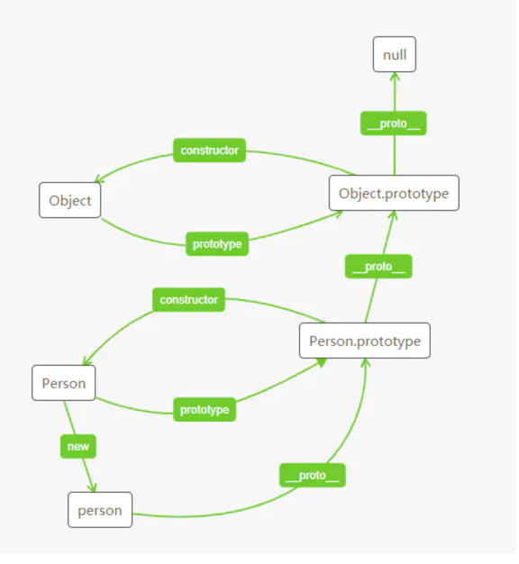

# 什么是javascript
JavaScript 的核心语法部分相当精简，只包括两个部分：
基本的语法构造（比如操作符、控制结构、语句）和
标准库（就是一系列具有各种功能的对象比如Array、Date、Math等）。
除此之外，各种宿主环境提供额外的 API（即只能在该环境使用的接口），以便 JavaScript 调用。
以浏览器为例，它提供的额外 API 可以分成三大类。
+ 浏览器控制类：操作浏览器
+ DOM 类：操作网页的各种元素
+ Web 类：实现互联网的各种功能

# 变量提升
JavaScript 引擎的工作方式是，先解析代码，获取所有被声明的变量，然后再一行一行地运行。
这造成的结果，就是所有的变量的声明语句，都会被提升到代码的头部，这就叫做变量提升（hoisting）。
```javascript
console.log(a);
var a = 1;


//--------

var a;
console.log(a); // undefined
a = 1;
```
# 标识符
标识符命名规则如下。
+ 第一个字符，可以是任意 Unicode 字母（包括英文字母和其他语言的字母），以及美元符号（$）和下划线（_）。
+ 第二个字符及后面的字符，除了 Unicode 字母、美元符号和下划线，还可以用数字0-9。

# switch 结构
switch语句后面的表达式，与case语句后面的表示式比较运行结果时，采用的是严格相等运算符（===），而不是相等运算符（==），
这意味着比较时不会发生类型转换。

# 数据类型
+ 数值（number）：整数和小数（比如1和3.14）
+ 字符串（string）：文本（比如Hello World）。
+ 布尔值（boolean）：表示真伪的两个特殊值，即true（真）和false（假）
+ undefined：表示“未定义”或不存在，即由于目前没有定义，所以此处暂时没有任何值
+ null：表示空值，即此处的值为空。
+ 对象（object）：各种值组成的集合。

# 数据类型的转换
## 强制转换
强制转换主要指使用Number()、String()和Boolean()三个函数，手动将各种类型的值，分别转换成数字、字符串或者布尔值<br/>
简单的规则是，Number方法的参数是对象时，将返回NaN，除非是包含单个数值的数组。
```javascript
Number({a: 1}) // NaN
Number([1, 2, 3]) // NaN
Number([5]) // 5
```
Number背后的转换规则比较复杂。
+ 第一步，调用对象自身的valueOf方法。如果返回原始类型的值，则直接对该值使用Number函数，不再进行后续步骤。
+ 第二步，如果valueOf方法返回的还是对象，则改为调用对象自身的toString方法。如果toString方法返回原始类型的值，则对该值使用Number函数，不再进行后续步骤。
+ 第三步，如果toString方法返回的是对象，就报错

String方法背后的转换规则，与Number方法基本相同，只是互换了valueOf方法和toString方法的执行顺序。
+ 先调用对象自身的toString方法。如果返回原始类型的值，则对该值使用String函数，不再进行以下步骤。
+ 如果toString方法返回的是对象，再调用原对象的valueOf方法。如果valueOf方法返回原始类型的值，则对该值使用String函数，不再进行以下步骤。
+ 如果valueOf方法返回的是对象，就报错

Boolean它的转换规则相对简单：除了以下五个值的转换结果为false，其他的值全部为true。
+ undefined
+ null
+ 0（包含-0和+0）
+ NaN
+ ''（空字符串）

# Error
## 原生
+ SyntaxError 
+ ReferenceError
+ RangeError
+ TypeError
+ URIError
+ EvalError

## 自定义错误
```javascript
function UserError(message) {
  this.message = message || '默认信息';
  this.name = 'UserError';
}

UserError.prototype = new Error();
UserError.prototype.constructor = UserError;
```

## try...catch 结构
catch代码块捕获错误之后，程序不会中断，会按照正常流程继续执行下去。

## finally 代码块
+ try...catch结构允许在最后添加一个finally代码块，表示不管是否出现错误，都必需在最后运行的语句。
+ 没有catch语句块，一旦发生错误，代码就会中断执行。中断执行之前，会先执行finally代码块，然后再向用户提示报错信息。
+ try代码块没有发生错误，而且里面还包括return语句，但是finally代码块依然会执行。而且，这个函数的返回值还是result
+ return语句的执行是排在finally代码之前，只是等finally代码执行完毕后才返回。

# object
Object对象的原生方法分成两类：Object本身的方法与Object的实例方法

## Object本身的方法
所谓“本身的方法”就是直接定义在Object对象的方法。
```javascript
Object.print = function (o) { console.log(o) };
```

## Object的实例方法
所谓实例方法就是定义在Object原型对象Object.prototype上的方法。它可以被Object实例直接使用。
```javascript
Object.prototype.print = function () {
  console.log(this);
};

var obj = new Object();
obj.print() // Object
```
## Object 的静态方法
所谓“静态方法”，是指部署在Object对象自身的方法

### Object.keys()，Object.getOwnPropertyNames() 
Object.keys方法和Object.getOwnPropertyNames方法都用来遍历对象的属性。<br/>

Object.keys方法的参数是一个对象，返回一个数组。该数组的成员都是该对象自身的（而不是继承的）所有属性名。
```javascript
var obj = {
  p1: 123,
  p2: 456
};

Object.keys(obj) // ["p1", "p2"]


var obj = {
  p1: 123,
  p2: 456
};

Object.getOwnPropertyNames(obj) // ["p1", "p2"]
```

对于一般的对象来说，Object.keys()和Object.getOwnPropertyNames()返回的结果是一样的。
只有涉及不可枚举属性时，才会有不一样的结果。
Object.keys方法只返回可枚举的属性，
Object.getOwnPropertyNames方法还返回不可枚举的属性名。

## Object 的实例方法
Object实例对象的方法，主要有以下六个。
+ Object.prototype.valueOf()：返回当前对象对应的值。
```javascript
//valueOf方法的作用是返回一个对象的“值”，默认情况下返回对象本身。
var obj = new Object();
obj.valueOf() === obj // true
```
+ Object.prototype.toString()：返回当前对象对应的字符串形式。
```javascript
var o1 = new Object();
o1.toString() // "[object Object]"

var o2 = {a:1};
o2.toString() // "[object Object]"
```
+ Object.prototype.toLocaleString()：返回当前对象对应的本地字符串形式。
+ Object.prototype.hasOwnProperty()：判断某个属性是否为当前对象自身的属性，还是继承自原型对象的属性。
+ Object.prototype.isPrototypeOf()：判断当前对象是否为另一个对象的原型。
+ Object.prototype.propertyIsEnumerable()：判断某个属性是否可枚举。

# 属性描述对象
JavaScript 提供了一个内部数据结构，用来描述对象的属性，控制它的行为，比如该属性是否可写、可遍历等等。
```javascript
{
  value: 123, //value是该属性的属性值，默认为undefined。
  writable: false, //writable是一个布尔值，表示属性值（value）是否可改变（即是否可写），默认为true
  enumerable: true, //enumerable是一个布尔值，表示该属性是否可遍历，默认为true。如果设为false，会使得某些操作（比如for...in循环、Object.keys()）跳过该属性。
  configurable: false, //configurable是一个布尔值，表示可配置性，默认为true。如果设为false，将阻止某些操作改写该属性，比如无法删除该属性，也不得改变该属性的属性描述对象（value属性除外）。也就是说，configurable属性控制了属性描述对象的可写性。
  get: undefined, //get是一个函数，表示该属性的取值函数（getter），默认为undefined。
  set: undefined //set是一个函数，表示该属性的存值函数（setter），默认为undefined。
}
```
## Object.getOwnPropertyDescriptor() 
```javascript
var obj = { p: 'a' };

Object.getOwnPropertyDescriptor(obj, 'p')
// Object { value: "a",
//   writable: true,
//   enumerable: true,
//   configurable: true
// }
```

## Object.defineProperty()
Object.defineProperty方法接受三个参数，依次如下。
+ object：属性所在的对象
+ propertyName：字符串，表示属性名
+ attributesObject：属性描述对象
```javascript
var obj = Object.defineProperty({}, 'p', {
  value: 123,
  writable: false,
  enumerable: true,
  configurable: false
});
```
# Math
##  Math.random()
Math.random()返回0到1之间的一个伪随机数，可能等于0，但是一定小于1。
```javascript
//任意范围的随机数生成函数如下
function getRandomArbitrary(min, max) {
  return Math.random() * (max - min) + min;
}

getRandomArbitrary(1.5, 6.5)

//任意范围的随机整数生成函数如下。

function getRandomInt(min, max) {
  return Math.floor(Math.random() * (max - min + 1)) + min;
}

getRandomInt(1, 6) // 5
```

# RegExp
## 实例属性
+ RegExp.prototype.ignoreCase：返回一个布尔值，表示是否设置了i修饰符。
+ RegExp.prototype.global：返回一个布尔值，表示是否设置了g修饰符。
+ RegExp.prototype.multiline：返回一个布尔值，表示是否设置了m修饰符。
+ RegExp.prototype.flags：返回一个字符串，包含了已经设置的所有修饰符，按字母排序。
上面四个属性都是只读的。
```javascript
var r = /abc/igm;

r.ignoreCase // true
r.global // true
r.multiline // true
r.flags // 'gim'
```
+ RegExp.prototype.lastIndex：返回一个整数，表示下一次开始搜索的位置。该属性可读写，但是只在进行连续搜索时有意义，详细介绍请看后文。
+ RegExp.prototype.source：返回正则表达式的字符串形式（不包括反斜杠），该属性只读。
```javascript
var r = /abc/igm;

r.lastIndex // 0
r.source // "abc"
```

## 实例方法
### RegExp.prototype.test()
正则实例对象的test方法返回一个布尔值，表示当前模式是否能匹配参数字符串。<br/>

```javascript
/cat/.test('cats and dogs') // true
```
上面代码验证参数字符串之中是否包含cat，结果返回true。<br/>
如果正则表达式带有g修饰符，则每一次test方法都从上一次结束的位置开始向后匹配。
```javascript
var r = /x/g;
var s = '_x_x';

r.lastIndex // 0
r.test(s) // true

r.lastIndex // 2
r.test(s) // true

r.lastIndex // 4
r.test(s) // false
```

### RegExp.prototype.exec() 
正则实例对象的exec()方法，用来返回匹配结果。如果发现匹配，就返回一个数组，成员是匹配成功的子字符串，否则返回null。
```javascript
var s = '_x_x';
var r1 = /x/;
var r2 = /y/;

r1.exec(s) // ["x"]
r2.exec(s) // null
```

如果正则表示式包含圆括号（即含有“组匹配”），则返回的数组会包括多个成员。
第一个成员是整个匹配成功的结果，后面的成员就是圆括号对应的匹配成功的组。
也就是说，第二个成员对应第一个括号，第三个成员对应第二个括号，以此类推。
整个数组的length属性等于组匹配的数量再加1。
```javascript
var s = '_x_x';
var r = /_(x)/;

r.exec(s) // ["_x", "x"]
```

exec()方法的返回数组还包含以下两个属性：
+ input：整个原字符串。
+ index：模式匹配成功的开始位置（从0开始计数）。

如果正则表达式加上g修饰符，则可以使用多次exec()方法，下一次搜索的位置从上一次匹配成功结束的位置开始。
```javascript
var reg = /a/g;
var str = 'abc_abc_abc'

var r1 = reg.exec(str);
r1 // ["a"]
r1.index // 0
reg.lastIndex // 1

var r2 = reg.exec(str);
r2 // ["a"]
r2.index // 4
reg.lastIndex // 5

var r3 = reg.exec(str);
r3 // ["a"]
r3.index // 8
reg.lastIndex // 9

var r4 = reg.exec(str);
r4 // null
reg.lastIndex // 0
```

### 字符串的实例方法 
字符串的实例方法之中，有4种与正则表达式有关。
+ String.prototype.match()：返回一个数组，成员是所有匹配的子字符串。
+ String.prototype.search()：按照给定的正则表达式进行搜索，返回一个整数，表示匹配开始的位置。
+ String.prototype.replace()：按照给定的正则表达式进行替换，返回替换后的字符串。
    + replace方法的第二个参数可以使用美元符号$，用来指代所替换的内容。
    + $&：匹配的子字符串。
    + $`：匹配结果前面的文本。
    + $'：匹配结果后面的文本。
    + $n：匹配成功的第n组内容，n是从1开始的自然数。
    + $$：指代美元符号$。
+ String.prototype.split()：按照给定规则进行字符串分割，返回一个数组，包含分割后的各个成员。
```javascript
var s = '_x_x';
var r1 = /x/;
var r2 = /y/;

s.match(r1) // ["x"]
s.match(r2) // null

//---- 
// 如果正则表达式带有g修饰符，则该方法与正则对象的exec方法行为不同，会一次性返回所有匹配成功的结果。
var s = 'abba';
var r = /a/g;

s.match(r) // ["a", "a"]
r.exec(s) // ["a"]


'hello world'.replace(/(\w+)\s(\w+)/, '$2 $1')
// "world hello"

'abc'.replace('b', '[$`-$&-$\']')
```

## 匹配规则
### 位置字符
位置字符用来提示字符所处的位置，主要有两个字符。
+ ^ 表示字符串的开始位置
+ $ 表示字符串的结束位置 

### 选择符（|）
竖线符号（|）在正则表达式中表示“或关系”（OR），即cat|dog表示匹配cat或dog。

### 字符类
字符类（class）表示有一系列字符可供选择，只要匹配其中一个就可以了。
所有可供选择的字符都放在方括号内，比如[xyz] 表示x、y、z之中任选一个匹配。

### 脱字符（^）
如果方括号内的第一个字符是[^]，则表示除了字符类之中的字符，其他字符都可以匹配。
比如，[^xyz]表示除了x、y、z之外都可以匹配。

### 预定义模式 
预定义模式指的是某些常见模式的简写方式。
+ \d 匹配0-9之间的任一数字，相当于[0-9]。
+ \D 匹配所有0-9以外的字符，相当于[^0-9]。
+ \w 匹配任意的字母、数字和下划线，相当于[A-Za-z0-9_]。
+ \W 除所有字母、数字和下划线以外的字符，相当于[^A-Za-z0-9_]。
+ \s 匹配空格（包括换行符、制表符、空格符等），相等于[ \t\r\n\v\f]。
+ \S 匹配非空格的字符，相当于[^ \t\r\n\v\f]。
+ \b 匹配词的边界。
+ \B 匹配非词边界，即在词的内部。

### 组匹配
正则表达式的括号表示分组匹配，括号中的模式可以用来匹配分组的内容。
```javascript
/fred+/.test('fredd'); // true
/(fred)+/.test('fredfred'); // true
```
### 非捕获组
(?:x)称为非捕获组（Non-capturing group），表示不返回该组匹配的内容，即匹配的结果中不计入这个括号。

非捕获组的作用请考虑这样一个场景，假定需要匹配foo或者foofoo，正则表达式就应该写成/(foo){1, 2}/，
但是这样会占用一个组匹配。这时，就可以使用非捕获组，将正则表达式改为/(?:foo){1, 2}/，
它的作用与前一个正则是一样的，但是不会单独输出括号内部的内容。
```javascript
var m = 'abc'.match(/(?:.)b(.)/);
m // ["abc", "c"]
```
### 先行断言
x(?=y)称为先行断言（Positive look-ahead），x只有在y前面才匹配，y不会被计入返回结果。
比如，要匹配后面跟着百分号的数字，可以写成/\d+(?=%)/。
“先行断言”中，括号里的部分是不会返回的。
```javascript
var m = 'abc'.match(/b(?=c)/);
m // ["b"]
```
### 先行否定断言
x(?!y)称为先行否定断言（Negative look-ahead），x只有不在y前面才匹配，y不会被计入返回结果。
比如，要匹配后面跟的不是百分号的数字，就要写成/\d+(?!%)/。
```javascript
/\d+(?!\.)/.exec('3.14')
// ["14"]
```

# new
## new 命令的原理
使用new命令时，它后面的函数依次执行下面的步骤。
+ 创建一个空对象，作为将要返回的对象实例。
+ 将这个空对象的原型，指向构造函数的prototype属性。
+ 将这个空对象赋值给函数内部的this关键字。
+ 开始执行构造函数内部的代码。

# this
绑定 this 的方法 <br/>
this的动态切换，固然为 JavaScript 创造了巨大的灵活性，但也使得编程变得困难和模糊。
有时，需要把this固定下来，避免出现意想不到的情况。
JavaScript 提供了call、apply、bind这三个方法，来切换/固定this的指向。
```javascript
var obj = {};

var f = function () {
  return this;
};

f() === window // true
f.call(obj) === obj // true

//
function f(x, y){
  console.log(x + y);
}

f.call(null, 1, 1) // 2
f.apply(null, [1, 1]) // 2

//
var counter = {
  count: 0,
  inc: function () {
    this.count++;
  }
};

var obj = {
  count: 100
};
var func = counter.inc.bind(obj);
func();
obj.count // 101
```

## bind()方法有一些使用注意点。
每一次返回一个新函数 <br/>
bind()方法每运行一次，就返回一个新函数，这会产生一些问题。比如，监听事件的时候，不能写成下面这样。<br/>
```javascript
element.addEventListener('click', o.m.bind(o));
```
上面代码中，click事件绑定bind()方法生成的一个匿名函数。这样会导致无法取消绑定，所以下面的代码是无效的。

```javascript
element.removeEventListener('click', o.m.bind(o));
```

正确的方法是写成下面这样：
```javascript
var listener = o.m.bind(o);
element.addEventListener('click', listener);
//  ...
element.removeEventListener('click', listener);
```

# 继承
JavaScript 继承机制的设计思想就是，原型对象的所有属性和方法，都能被实例对象共享 <br/>
JavaScript 规定，每个函数都有一个prototype属性，指向一个对象。
对于普通函数来说，该属性基本无用。但是，对于构造函数来说，生成实例的时候，该属性会自动成为实例对象的原型。

## 原型链
JavaScript 规定，所有对象都有自己的原型对象（prototype）
一方面，任何一个对象，都可以充当其他对象的原型；
另一方面，由于原型对象也是对象，所以它也有自己的原型。
因此，就会形成一个“原型链”（prototype chain）：对象到原型，再到原型的原型……
```javascript
var MyArray = function () {};

MyArray.prototype = new Array();
MyArray.prototype.constructor = MyArray;

var mine = new MyArray();
mine.push(1, 2, 3);
mine.length // 3
mine instanceof Array // true
```
### constructor 属性
prototype对象有一个constructor属性，默认指向prototype对象所在的构造函数。

## 构造函数的继承
```javascript
function Sub(value) {
  Super.call(this);
  this.prop = value;
}
```

# 原型
[https://juejin.im/post/6844903797039300615#comment](https://juejin.im/post/6844903797039300615#comment)
## Constructor 构造函数
构造函数 Person，构造函数一般为了区别普通函数要求首字母大写:
```javascript
function Person(){}
```

## prototype 原型
原型指的就是一个对象，实例“继承”那个对象的属性。
在原型上定义的属性，通过“继承”，实例也拥有了这个属性。“继承”这个行为是在 new 操作符内部实现的。<br/>
先不说实例，原型与构造函数的关系就是，构造函数内部有一个名为 prototype 的属性，通过这个属性就能访问到原型：<br/>
 <br/>

Person 就是构造函数，Person.prototype 就是原型 <br/>

 <br/>

## proto 隐式原型
实例通过 __proto__ 访问到原型，所以如果是实例，那么就可以通过这个属性直接访问到原型 <br/>
 <br/>

 <br/>

 <br/>

# object
## Object.getPrototypeOf() 
Object.getPrototypeOf方法返回参数对象的原型。这是获取原型对象的标准方法。
```javascript
var F = function () {};
var f = new F();
Object.getPrototypeOf(f) === F.prototype // true
```

## Object.setPrototypeOf() 
Object.setPrototypeOf方法为参数对象设置原型，返回该参数对象。它接受两个参数，第一个是现有对象，第二个是原型对象。
```javascript
var a = {};
var b = {x: 1};
Object.setPrototypeOf(a, b);

Object.getPrototypeOf(a) === b // true
a.x // 1
```

## Object.create()
生成实例对象的常用方法是，使用new命令让构造函数返回一个实例。
但是很多时候，只能拿到一个实例对象，它可能根本不是由构建函数生成的，
那么能不能从一个实例对象，生成另一个实例对象呢？
<br/>
JavaScript 提供了Object.create方法，用来满足这种需求。 
该方法接受一个对象作为参数，然后以它为原型，返回一个实例对象。
该实例完全继承原型对象的属性。
```javascript
// 原型对象
var A = {
  print: function () {
    console.log('hello');
  }
};

// 实例对象
var B = Object.create(A);

Object.getPrototypeOf(B) === A // true
B.print() // hello
B.print === A.print // true
```
## Object.prototype.isPrototypeOf()
实例对象的isPrototypeOf方法，用来判断该对象是否为参数对象的原型。
```javascript
var o1 = {};
var o2 = Object.create(o1);
var o3 = Object.create(o2);

o2.isPrototypeOf(o3) // true
o1.isPrototypeOf(o3) // true
```

## Object.prototype.__proto__
实例对象的__proto__属性（前后各两个下划线），返回该对象的原型。该属性可读写。
```javascript
var obj = {};
var p = {};

obj.__proto__ = p;
Object.getPrototypeOf(obj) === p // true
```

# 严格模式
+ 显式报错
    + 只读属性不可写
    + 只设置了取值器的属性不可写
    + 禁止扩展的对象不可扩展
    + eval、arguments 不可用作标识名
    + 函数不能有重名的参数
    + 禁止八进制的前缀0表示法
+ 增强的安全措施
    + 全局变量显式声明
    + 禁止 this 关键字指向全局对象
    + 禁止使用 fn.callee、fn.caller
    + 禁止使用 arguments.callee、arguments.caller
    + 禁止删除变量
静态绑定
    + 禁止使用 with 语句
    + 创设 eval 作用域
    + arguments 不再追踪参数的变化
+ 向下一个版本的 JavaScript 过渡
    + 非函数代码块不得声明函数
    + 保留字
    
# 发布/订阅
事件完全可以理解成“信号”，如果存在一个“信号中心”，某个任务执行完成，就向信号中心“发布”（publish）一个信号，
其他任务可以向信号中心“订阅”（subscribe）这个信号，从而知道什么时候自己可以开始执行。
这就叫做”发布/订阅模式”（publish-subscribe pattern），又称“观察者模式”（observer pattern）。<br/>

首先，f2向信号中心jQuery订阅done信号。
```javascript
jQuery.subscribe('done', f2); 

//然后，f1进行如下改写。

function f1() {
  setTimeout(function () {
    // ...
    jQuery.publish('done');
  }, 1000);
}
```
# debounce 防抖

# DOM
## 节点
节点的类型有七种。
+ Document：整个文档树的顶层节点
+ DocumentType：doctype标签（比如<!DOCTYPE html>）
+ Element：网页的各种HTML标签（比如<body>、<a>等）
+ Attr：网页元素的属性（比如class="right"）
+ Text：标签之间或标签包含的文本
+ Comment：注释
+ DocumentFragment：文档的片段

除了根节点，其他节点都有三种层级关系。

+ 父节点关系（parentNode）：直接的那个上级节点
+ 子节点关系（childNodes）：直接的下级节点
+ 同级节点关系（sibling）：拥有同一个父节点的节点

DOM 提供操作接口，用来获取这三种关系的节点。
比如，子节点接口包括firstChild（第一个子节点）和lastChild（最后一个子节点）等属性，
同级节点接口包括nextSibling（紧邻在后的那个同级节点）和previousSibling（紧邻在前的那个同级节点）属性

## Node属性
### Node.prototype.nodeType
不同节点的nodeType属性值和对应的常量如下。

+ 文档节点（document）：9，对应常量Node.DOCUMENT_NODE
+ 元素节点（element）：1，对应常量Node.ELEMENT_NODE
+ 属性节点（attr）：2，对应常量Node.ATTRIBUTE_NODE
+ 文本节点（text）：3，对应常量Node.TEXT_NODE
+ 文档片断节点（DocumentFragment）：11，对应常量Node.DOCUMENT_FRAGMENT_NODE
+ 文档类型节点（DocumentType）：10，对应常量Node.DOCUMENT_TYPE_NODE
+ 注释节点（Comment）：8，对应常量Node.COMMENT_NODE

### Node.prototype.nodeName
nodeName属性返回节点的名称。
```javascript
// HTML 代码如下
// <div id="d1">hello world</div>
var div = document.getElementById('d1');
div.nodeName // "DIV"
```

不同节点的nodeName属性值如下。
+ 文档节点（document）：#document
+ 元素节点（element）：大写的标签名
+ 属性节点（attr）：属性的名称
+ 文本节点（text）：#text
+ 文档片断节点（DocumentFragment）：#document-fragment
+ 文档类型节点（DocumentType）：文档的类型
+ 注释节点（Comment）：#comment

### Node.prototype.nodeValue
nodeValue属性返回一个字符串，表示当前节点本身的文本值，该属性可读写
只有文本节点（text）、注释节点（comment）和属性节点（attr）有文本值，
因此这三类节点的nodeValue可以返回结果，其他类型的节点一律返回null。
同样的，也只有这三类节点可以设置nodeValue属性的值，其他类型的节点设置无效。

```javascript
// HTML 代码如下
// <div id="d1">hello world</div>
var div = document.getElementById('d1');
div.nodeValue // null
div.firstChild.nodeValue // "hello world"
```

### Node.prototype.textContent
textContent属性返回当前节点和它的所有后代节点的文本内容
```javascript
// HTML 代码为
// <div id="divA">This is <span>some</span> text</div>

document.getElementById('divA').textContent
// This is some text
```

### Node.prototype.ownerDocument 
Node.ownerDocument属性返回当前节点所在的顶层文档对象，即document对象。
```javascript
var d = p.ownerDocument;
d === document // true
```

### Node.prototype.nextSibling 
Node.nextSibling属性返回紧跟在当前节点后面的第一个同级节点。
如果当前节点后面没有同级节点，则返回null。
```javascript
// HTML 代码如下
// <div id="d1">hello</div><div id="d2">world</div>
var d1 = document.getElementById('d1');
var d2 = document.getElementById('d2');

d1.nextSibling === d2 // true
```

### Node.prototype.previousSibling
previousSibling属性返回当前节点前面的、距离最近的一个同级节点。
如果当前节点前面没有同级节点，则返回null。
```javascript
// HTML 代码如下
// <div id="d1">hello</div><div id="d2">world</div>
var d1 = document.getElementById('d1');
var d2 = document.getElementById('d2');

d2.previousSibling === d1 // true
```

### Node.prototype.parentNode 
parentNode属性返回当前节点的父节点。
对于一个节点来说，它的父节点只可能是三种类型：
元素节点（element）、文档节点（document）和文档片段节点（documentfragment）。


### Node.prototype.firstChild，Node.prototype.lastChild
firstChild属性返回当前节点的第一个子节点，如果当前节点没有子节点，则返回null。 <br/>
lastChild属性返回当前节点的最后一个子节点，如果当前节点没有子节点，则返回null。用法与firstChild属性相同。

### Node.prototype.childNodes
childNodes属性返回一个类似数组的对象（NodeList集合），成员包括当前节点的所有子节点。
```javascript
var children = document.querySelector('ul').childNodes;
```

### Node.prototype.appendChild() 
appendChild()方法接受一个节点对象作为参数，将其作为最后一个子节点，插入当前节点。
该方法的返回值就是插入文档的子节点。<br/>
如果参数节点是 DOM 已经存在的节点，appendChild()方法会将其从原来的位置，移动到新位置。
```javascript
var p = document.createElement('p');
document.body.appendChild(p);


var div = document.getElementById('myDiv');
document.body.appendChild(div);
```

### Node.prototype.hasChildNodes()
hasChildNodes方法返回一个布尔值，表示当前节点是否有子节点。

### Node.prototype.cloneNode()
cloneNode方法用于克隆一个节点。它接受一个布尔值作为参数，表示是否同时克隆子节点。
它的返回值是一个克隆出来的新节点。<br/>

该方法有一些使用注意点。<br/>
（1）克隆一个节点，会拷贝该节点的所有属性，
但是会丧失addEventListener方法和on-属性（即node.onclick = fn），
添加在这个节点上的事件回调函数。<br/>
（2）该方法返回的节点不在文档之中，即没有任何父节点，必须使用诸如Node.appendChild这样的方法添加到文档之中。<br/>
（3）克隆一个节点之后，DOM 有可能出现两个有相同id属性（即id="xxx"）的网页元素，这时应该修改其中一个元素的id属性。如果原节点有name属性，可能也需要修改。

### Node.prototype.insertBefore()
insertBefore方法用于将某个节点插入父节点内部的指定位置。

### Node.prototype.removeChild()
removeChild方法接受一个子节点作为参数，用于从当前节点移除该子节点。返回值是移除的子节点。

# 事件
DOM 的事件操作（监听和触发），都定义在EventTarget接口。
所有节点对象都部署了这个接口，其他一些需要事件通信的浏览器内置对象 <br/>

该接口主要提供三个实例方法。
+ addEventListener：绑定事件的监听函数
+ removeEventListener：移除事件的监听函数
+ dispatchEvent：触发事件

## EventTarget

### EventTarget.addEventListener()
```javascript
target.addEventListener(type, listener[, useCapture]);
```

该方法接受三个参数。<br/>
+ type：事件名称，大小写敏感。
+ listener：监听函数。事件发生时，会调用该监听函数。
+ useCapture：布尔值，表示监听函数是否在捕获阶段（capture）触发，默认为false（监听函数只在冒泡阶段被触发）。该参数可选。

其次，第三个参数除了布尔值useCapture，还可以是一个属性配置对象。该对象有以下属性。
+ capture：布尔值，表示该事件是否在捕获阶段触发监听函数。
+ once：布尔值，表示监听函数是否只触发一次，然后就自动移除。
+ passive：布尔值，表示监听函数不会调用事件的preventDefault方法。
如果监听函数调用了，浏览器将忽略这个要求，并在监控台输出一行警告。
```javascript
element.addEventListener('click', function (event) {
  // 只执行一次的代码
}, {once: true});
```

### EventTarget.removeEventListener()
EventTarget.removeEventListener方法用来移除addEventListener方法添加的事件监听函数。该方法没有返回值。
```javascript
div.addEventListener('click', listener, false);
div.removeEventListener('click', listener, false);
```

### EventTarget.dispatchEvent()
EventTarget.dispatchEvent方法在当前节点上触发指定事件，从而触发监听函数的执行。
该方法返回一个布尔值，只要有一个监听函数调用了
```javascript
para.addEventListener('click', hello, false);
var event = new Event('click');
para.dispatchEvent(event);
```


## 事件的传播
一个事件发生后，会在子元素和父元素之间传播（propagation）。这种传播分成三个阶段。
+ 第一阶段：从window对象传导到目标节点（上层传到底层），称为“捕获阶段”（capture phase）。
+ 第二阶段：在目标节点上触发，称为“目标阶段”（target phase）。
+ 第三阶段：从目标节点传导回window对象（从底层传回上层），称为“冒泡阶段”（bubbling phase）。

## 事件的代理
由于事件会在冒泡阶段向上传播到父节点，因此可以把子节点的监听函数定义在父节点上，
由父节点的监听函数统一处理多个子元素的事件。
这种方法叫做事件的代理（delegation）。<br/>

如果希望事件到某个节点为止，不再传播，可以使用事件对象的stopPropagation方法。
```javascript
// 事件传播到 p 元素后，就不再向下传播了
p.addEventListener('click', function (event) {
  event.stopPropagation();
}, true);

// 事件冒泡到 p 元素后，就不再向上冒泡了
p.addEventListener('click', function (event) {
  event.stopPropagation();
}, false);
```

# Event
事件发生以后，会产生一个事件对象，作为参数传给监听函数。
浏览器原生提供一个Event对象，所有的事件都是这个对象的实例，或者说继承了Event.prototype对象。
```javascript
event = new Event(type, options);
```

Event构造函数接受两个参数。
第一个参数type是字符串，表示事件的名称；
第二个参数options是一个对象，表示事件对象的配置。该对象主要有下面两个属性。<br/>
+ bubbles：布尔值，可选，默认为false，表示事件对象是否冒泡。
+ cancelable：布尔值，可选，默认为false，表示事件是否可以被取消，即能否用Event.preventDefault()取消这个事件。
一旦事件被取消，就好像从来没有发生过，不会触发浏览器对该事件的默认行为。
```javascript
var ev = new Event(
  'look',
  {
    'bubbles': true,
    'cancelable': false
  }
);
document.dispatchEvent(ev);
```
## Event.bubbles，Event.eventPhase
Event.bubbles属性返回一个布尔值，表示当前事件是否会冒泡。
该属性为只读属性，一般用来了解 Event 实例是否可以冒泡。
除非显式声明，Event构造函数生成的事件，默认是不冒泡的。<br/>

Event.eventPhase属性返回一个整数常量，表示事件目前所处的阶段。该属性只读。
Event.eventPhase的返回值有四种可能。
+ 0，事件目前没有发生。
+ 1，事件目前处于捕获阶段，即处于从祖先节点向目标节点的传播过程中。
+ 2，事件到达目标节点，即Event.target属性指向的那个节点。
+ 3，事件处于冒泡阶段，即处于从目标节点向祖先节点的反向传播过程中。

## Event.cancelable，Event.cancelBubble，event.defaultPrevented 
Event.cancelable属性返回一个布尔值，表示事件是否可以取消。
该属性为只读属性，一般用来了解 Event 实例的特性。<br/>

当Event.cancelable属性为true时，调用Event.preventDefault()就可以取消这个事件，
阻止浏览器对该事件的默认行为。<br/>

Event.cancelBubble属性是一个布尔值，如果设为true，
相当于执行Event.stopPropagation()，可以阻止事件的传播。<br/>

Event.defaultPrevented属性返回一个布尔值，表示该事件是否调用过Event.preventDefault方法。
该属性只读。<br/>

## Event.type
Event.type属性返回一个字符串，表示事件类型。事件的类型是在生成事件的时候指定的。该属性只读

## Event.detail 
Event.detail属性只有浏览器的 UI （用户界面）事件才具有。
该属性返回一个数值，表示事件的某种信息。具体含义与事件类型相关。
比如，对于click和dblclick事件，Event.detail是鼠标按下的次数（1表示单击，2表示双击，3表示三击）；
对于鼠标滚轮事件，Event.detail是滚轮正向滚动的距离，负值就是负向滚动的距离，返回值总是3的倍数。

## Event.preventDefault()
Event.preventDefault方法取消浏览器对当前事件的默认行为。
比如点击链接后，浏览器默认会跳转到另一个页面，使用这个方法以后，就不会跳转了；
再比如，按一下空格键，页面向下滚动一段距离，使用这个方法以后也不会滚动了。
该方法生效的前提是，事件对象的cancelable属性为true，如果为false，调用该方法没有任何效果。

## Event.stopPropagation()
stopPropagation方法阻止事件在 DOM 中继续传播，防止再触发定义在别的节点上的监听函数，
但是不包括在当前节点上其他的事件监听函数。

## 鼠标事件
MouseEvent构造函数接受两个参数。
第一个参数是字符串，表示事件名称；
第二个参数是一个事件配置对象，该参数可选。
除了Event接口的实例配置属性，该对象可以配置以下属性，所有属性都是可选的。

+ screenX：数值，鼠标相对于屏幕的水平位置（单位像素），默认值为0，设置该属性不会移动鼠标。
+ screenY：数值，鼠标相对于屏幕的垂直位置（单位像素），其他与screenX相同。
+ clientX：数值，鼠标相对于程序窗口的水平位置（单位像素），默认值为0，设置该属性不会移动鼠标。
+ clientY：数值，鼠标相对于程序窗口的垂直位置（单位像素），其他与clientX相同。
+ ctrlKey：布尔值，是否同时按下了 Ctrl 键，默认值为false。
+ shiftKey：布尔值，是否同时按下了 Shift 键，默认值为false。
+ altKey：布尔值，是否同时按下 Alt 键，默认值为false。
+ metaKey：布尔值，是否同时按下 Meta 键，默认值为false。
+ button：数值，表示按下了哪一个鼠标按键，默认值为0，表示按下主键（通常是鼠标的左键）或者当前事件没有定义这个属性；1表示按下辅助键（通常是鼠标的中间键），2表示按下次要键（通常是鼠标的右键）。
+ buttons：数值，表示按下了鼠标的哪些键，是一个三个比特位的二进制值，默认为0（没有按下任何键）。1（二进制001）表示按下主键（通常是左键），2（二进制010）表示按下次要键（通常是右键），4（二进制100）表示按下辅助键（通常是中间键）。因此，如果返回3（二进制011）就表示同时按下了左键和右键。
+ relatedTarget：节点对象，表示事件的相关节点，默认为null。mouseenter和mouseover事件时，表示鼠标刚刚离开的那个元素节点；mouseout和mouseleave事件时，表示鼠标正在进入的那个元素节点。

## WheelEvent
WheelEvent()构造函数可以接受两个参数，
第一个是字符串，表示事件类型，对于滚轮事件来说，
这个值目前只能是wheel。第二个参数是事件的配置对象。
该对象的属性除了Event、UIEvent的配置属性以外，还可以接受以下几个属性，所有属性都是可选的。

+ deltaX：数值，表示滚轮的水平滚动量，默认值是 0.0。
+ deltaY：数值，表示滚轮的垂直滚动量，默认值是 0.0。
+ deltaZ：数值，表示滚轮的 Z 轴滚动量，默认值是 0.0。
+ deltaMode：数值，表示相关的滚动事件的单位，适用于上面三个属性。0表示滚动单位为像素，1表示单位为行，2表示单位为页，默认为0。

## KeyboardEvent
以下属性都是只读属性，返回一个布尔值，表示是否按下对应的键。
+ KeyboardEvent.altKey：是否按下 Alt 键
+ KeyboardEvent.ctrlKey：是否按下 Ctrl 键
+ KeyboardEvent.metaKey：是否按下 meta 键（Mac 系统是一个四瓣的小花，Windows 系统是 windows 键）
+ KeyboardEvent.shiftKey：是否按下 Shift 键

## KeyboardEvent.code
下面是一些常用键的字符串形式，其他键请查文档。
+ 数字键0 - 9：返回digital0 - digital9
+ 字母键A - z：返回KeyA - KeyZ
+ 功能键F1 - F12：返回 F1 - F12
+ 方向键：返回ArrowDown、ArrowUp、ArrowLeft、ArrowRight
+ Alt 键：返回AltLeft或AltRight
+ Shift 键：返回ShiftLeft或ShiftRight
+ Ctrl 键：返回ControlLeft或ControlRight

# 进度事件的种类
进度事件用来描述资源加载的进度，
主要由 AJAX 请求、、<audio>、<video>、<style>、<link>等外部资源的加载触发，
继承了ProgressEvent接口。它主要包含以下几种事件。
+ abort：外部资源中止加载时（比如用户取消）触发。如果发生错误导致中止，不会触发该事件。
+ error：由于错误导致外部资源无法加载时触发。
+ load：外部资源加载成功时触发。
+ loadstart：外部资源开始加载时触发。
+ loadend：外部资源停止加载时触发，发生顺序排在error、abort、load等事件的后面。
+ progress：外部资源加载过程中不断触发。
+ timeout：加载超时时触发。

# BOM
## defer 属性
为了解决脚本文件下载阻塞网页渲染的问题，一个方法是对<script>元素加入defer属性。
它的作用是延迟脚本的执行，等到 DOM 加载生成后，再执行脚本

## async 属性 
async属性的作用是，使用另一个进程下载脚本，下载时不会阻塞渲染。

defer属性和async属性到底应该使用哪一个？

一般来说，如果脚本之间没有依赖关系，就使用async属性，
如果脚本之间有依赖关系，就使用defer属性。
如果同时使用async和defer属性，后者不起作用，浏览器行为由async属性决定。

## 重流和重绘
渲染树转换为网页布局，称为“布局流”（flow）；
布局显示到页面的这个过程，称为“绘制”（paint）。
它们都具有阻塞效应，并且会耗费很多时间和计算资源。<br/>

页面生成以后，脚本操作和样式表操作，都会触发“重流”（reflow）和“重绘”（repaint）。
用户的互动也会触发重流和重绘，
比如设置了鼠标悬停（a:hover）效果、页面滚动、在输入框中输入文本、改变窗口大小等等。<br/>

重流和重绘并不一定一起发生，重流必然导致重绘，重绘不一定需要重流。
比如改变元素颜色，只会导致重绘，而不会导致重流；
改变元素的布局，则会导致重绘和重流。

## 渲染引擎
不同的浏览器有不同的渲染引擎。
+ Firefox：Gecko 引擎
+ Safari：WebKit 引擎
+ Chrome：Blink 引擎
+ IE: Trident 引擎
+ Edge: EdgeHTML 引擎

## JavaScript 引擎
+ Chakra (Microsoft Internet Explorer)
+ Nitro/JavaScript Core (Safari)
+ Carakan (Opera)
+ SpiderMonkey (Firefox)
+ V8 (Chrome, Chromium)

# worker


