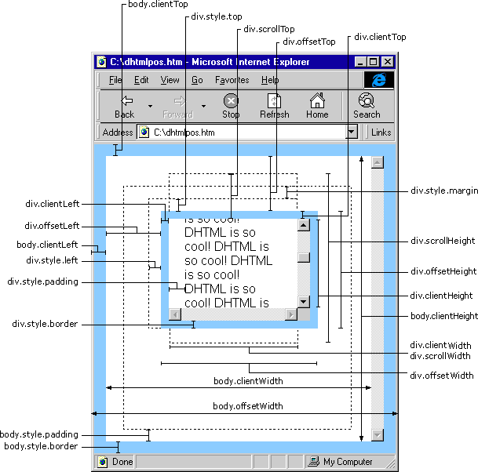

# mouseover和mouseenter的区别?
+ mouseover：当鼠标移入元素或其子元素都会触发事件，所以有一个重复触发，冒泡的过程。
对应的移除事件是mouseout
+ mouseenter：当鼠标移除元素本身（不包含元素的子元素）会触发事件，也就是不会冒泡，
对应的移除事件是mouseleave

# js的new操作符做了哪些事情?
+ 创建一个空对象，作为将要返回的对象实例。
+ 将这个空对象的原型，指向构造函数的prototype属性。
+ 将这个空对象赋值给函数内部的this关键字。
+ 开始执行构造函数内部的代码。

# 改变函数内部this指针的指向函数（bind，apply，call的区别）?
通过apply和call改变函数的this指向，
他们两个函数的第一个参数都是一样的表示要改变指向的那个对象，
第二个参数，apply是数组，而call则是arg1,arg2...这种形式。
通过bind改变this作用域会返回一个新的函数，这个函数不会马上执行。

# js的各种位置，比如clientHeight,scrollHeight,offsetHeight ,以及scrollTop, offsetTop,clientTop的区别？
+ clientHeight：表示的是可视区域的高度，不包含border和滚动条
+ offsetHeight：表示可视区域的高度，包含了border和滚动条
+ scrollHeight：表示了所有区域的高度，包含了因为滚动被隐藏的部分。
+ clientTop：表示边框border的厚度，在未指定的情况下一般为
+ scrollTop：滚动后被隐藏的高度，获取对象相对于由offsetParent属性指定的父坐标(css定位的元素或body元素)距离顶端的高度。


# 对象深度克隆的简单实现
```javascript
function deepClone(obj){
    var newObj= obj instanceof Array ? []:{};
    for(var item in obj){
        var temple= typeof obj[item] == 'object' ? deepClone(obj[item]):obj[item];
        newObj[item] = temple;
    }
    return newObj;
}
```

# 实现一个once函数，传入函数参数只执行一次
```javascript
function ones(func){
    var tag=true;
    return function(){
        if(tag==true){
            func.apply(null,arguments);
            tag=false;
        }
        return undefined
    }
}
```

#  js监听对象属性的改变
我们假设这里有一个user对象,<br/>
(1)在ES5中可以通过Object.defineProperty来实现已有属性的监听
```javascript
Object.defineProperty(user,'name',{
    set: function(key,value){
    }
})
```
缺点：如果id不在user对象中，则不能监听id的变化<br/>

(2)在ES6中可以通过Proxy来实现
```javascript
var  user = new Proxy({},{
    set:function(target,key,value,receiver){
    }
})
```

# 实现一个两列等高布局，讲讲思路
为了实现两列等高，可以给每列加上 padding-bottom:9999px; <br/>
margin-bottom:-9999px;同时父元素设置overflow:hidden;

# 实现固定宽高比(width:height => 4:3)
```html
<div class="wrapper">
    <div class="intrinsic-aspect-ratio">
    <div class="content"></div>
</div>
</div>
<style>
.wrapper {
  width: 40vw;
}
.intrinsic-aspect-ratio {
  position: relative;
  width: 100%;
  height: 0;
  padding: 0;
  padding-bottom: 75%;
  margin: 50px;
  background-color: lightsalmon;
}
.content {
  position: absolute;
  top: 0;
  right: 0;
  bottom: 0;
  left: 0;
}
</style>
```


# 代码的执行顺序 
script(主程序代码)—>process.nextTick—>Promises...——>setTimeout——>setInterval——>setImmediate——> I/O——>UI rendering
```javascript
setTimeout(function(){console.log(1)},0);
new Promise(function(resolve,reject){
    console.log(2);
    resolve();
}).then(function(){console.log(3)
}).then(function(){console.log(4)});
process.nextTick(function(){console.log(5)});
console.log(6);
////输出2,6,5,3,4,1
```

#  如何实现sleep的效果（es5或者es6）
```javascript
//(1)while循环的方式
function sleep(ms){
    var start=Date.now(),expire=start+ms;
    while(Date.now()<expire);
        console.log('1111');
    return;
}

//(2)通过promise来实现
function sleep(ms){
    var temple=new Promise((resolve)=>{
        console.log(111);
        setTimeout(resolve,ms)
    });
    return temple
}
sleep(500).then(function(){
//console.log(222)
})


// (3)通过async封装
function sleep(ms){
    return new Promise((resolve)=>setTimeout(resolve,ms));
}
async function test(){
    var temple=await sleep(1000);
    console.log(1111)
    return temple
}
test();
```

# 简单实现Node的Events模块
```javascript
function Events(){
    this.on=function(eventName,callBack){
        if(!this.handles){
            this.handles={};
        }
        if(!this.handles[eventName]){
            this.handles[eventName]=[];
        }
        this.handles[eventName].push(callBack);
    }
    this.emit=function(eventName,obj){
        if(this.handles[eventName]){
            for(var i=0;o<this.handles[eventName].length;i++){
                this.handles[eventName][i](obj);
            }
        }
    }
    return this;
}
```

# 重排和重绘，讲讲看
重绘（repaint或redraw）：当盒子的位置、大小以及其他属性，例如颜色、字体大小等都确定下来之后，浏览器便把这些原色都按照各自的特性绘制一遍，将内容呈现在页面上。重绘是指一个元素外观的改变所触发的浏览器行为，浏览器会根据元素的新属性重新绘制，使元素呈现新的外观。
触发重绘的条件：改变元素外观属性。如：color，background-color等。

注意：table及其内部元素可能需要多次计算才能确定好其在渲染树中节点的属性值，比同等元素要多花两倍时间，这就是我们尽量避免使用table布局页面的原因之一。

重排（重构/回流/reflow）：当渲染树中的一部分(或全部)因为元素的规模尺寸，布局，隐藏等改变而需要重新构建, 这就称为回流(reflow)。每个页面至少需要一次回流，就是在页面第一次加载的时候。

重绘和重排的关系：在回流的时候，浏览器会使渲染树中受到影响的部分失效，并重新构造这部分渲染树，完成回流后，浏览器会重新绘制受影响的部分到屏幕中，该过程称为重绘。所以，重排必定会引发重绘，但重绘不一定会引发重排。

# 说一下什么是virtual dom
用JavaScript 对象结构表示 DOM 树的结构；然后用这个树构建一个真正的 DOM 树，插到文档当中 当状态变更的时候，重新构造一棵新的对象树。然后用新的树和旧的树进行比较，记录两棵树差异 把所记录的差异应用到所构建的真正的DOM树上，视图就更新了。
Virtual DOM 本质上就是在 JS 和 DOM 之间做了一个缓存。