+ [javascript](./javascript/readme.md)
+ typescript
+ [css](./css/readme.md)
+ bootstrap
+ http,html,浏览器
<hr/>

+ [流行框架](./vue/readme.md)
+ jquery

<hr/>

+ [webpack](./工程化/webpack.md)
+ gulp
+ [rollup](./工程化/rollup.md)
+ [module](./工程化/module.md)
+ [性能优化](./性能优化/readme.md)

<hr/>

+ [设计模式](./设计模式/readme.md)
+ 网络
+ 数据结构与算法

<hr/>

+ 安全
+ Node

<hr/>

+ 项目业务
+ 自我介绍

<hr/>

+ 手撕代码


路由实现
babel实现 
webpack实现  配置 loader plugin 优化
文件监听工作原理


vue原理 实现 
vuex


rollup 
webpack 之间选择


css 浏览器的一些宽高可是区域 滚动区域

docker原理
kubernetes

messos

geoserver 

浏览器原理 
浏览器缓存机制
缓存

http
https

项目优化
为什么要使用单页面应用


基础  实战经验欠缺
刷题

# js基础
1.let const var <br/>
+ let const 不存在变量提升
+ var声明的变量会挂到windows上，let const 不会
+ var是函数作用域，let const是代码块作用域
+ const 初始化的时候就要赋值，并且赋值之后不能被修改 对象 不能修改引用地址，引用属性可以修改

2.箭头函数 <br/>
+ 没有自己的this和arguments
+ 没有prototype
+ 不能被new,因为new之后 实例对象会有一个__proto__属性指向prototype 而箭头函数没有prototyoe
+ 不能作为构造函数

3.commonjs esmodule amd cmd umd  
+ commonjs 是nodejs加载模块使用的规范，浏览器不支持
+ esmodule是es6+ 模块机制 可以在浏览器端运行的
+ 浏览器端实现模块机制以前esmodule不兼容的时候出现过amd,cmd
+ cmd是阿里玉伯实现的seajs 现在用的很少了
+ amd是requirejs define(id?, dependencies?, factory)
+ AMD 推崇依赖前置、提前执行，CMD推崇依赖就近、延迟执行 define(function (require, exports, module){})
```javascript
// model1.js
define(function () {
    console.log('model1 entry');
    return {
        getHello: function () {
            return 'model1';
        }
    };
});

// model2.js
define(function () {
    console.log('model2 entry');
    return {
        getHello: function () {
            return 'model2';
        }
    };
});

// main.js
define(function (require) {
    var model1 = require('./model1');
    console.log(model1.getHello());
    var model2 = require('./model2');
    console.log(model2.getHello());
});


//AMD 运行结果 
// model1 entry
// model2 entry
// model1
// model2

// CMD运行结果
// 输出 
// model1 entry
// model1
// model2 entry
// model2
```
+ commonjs可动态导入，esmodule静态导入
+ commonjs导入的值是拷贝，如果原始值发生变化，需再次重新导入
+ esmodule导入的值是引用，原模块修改数据，导入的数据也会修改，导入之后只读，不能被修改


4.深浅拷贝  
+ 对象直接赋值属于浅拷贝 他是把对象的引用地址给copy了 但是2个变量指的还是内存中的通一个对象
```javascript
function deepClone(obj){
    let result = Array.isArray(obj) ? [] : {};
    for(let key in obj){
        if(typeof obj[key] === 'object'){
            result[key] = deepClone(obj[key])
        }else {
            result[key] = obj[key];
        }
    }
    return result;
}
```

5.防抖节流
```javascript
// 防抖
function debounces(func,delay) {
  let timer;
  return function() {
    let context = _this;
    let args = func.arguments;
    if(!timer){
        timer = setTimeout(func.call(_this,args),delay)
    }else{
        clearTimeout(timer);
        timer = null;
    }
  }
}


//节流
function throolte(func,delay) {
  let timer;
  let flag = false;
  return function() {
    let context = _this;
    let args = func.arguments;
    if(!flag){
        flag = true;
        timer = setTimeout(()=>{
            func.call(_this,args);
            flag = false;
        },delay);
    }
  }
}
```
6.promise https://juejin.im/post/6844903815682998286#heading-18<br/>
+ promise 有 3 种状态：pending、fulfilled 或 rejected。
状态改变只能是 pending->fulfilled 或者 pending->rejected，状态一旦改变则不能再变
+ Promise.then() 之后返回的是一个新的promise
+ 构造函数中的 resolve 或 reject 只有第一次执行有效，多次调用没有任何作用
+ .then 或者 .catch 的参数期望是函数，传入非函数则会发生值穿透。
```javascript
let p = new Promise((resolve,reject)=>{
    reslove();
})
function Promise(excute) {
    //PENDING REJECT FULFILLED
  this.state = 'PENDING';
  let _this = this;
  this.value = null;
  this.reason = null;
  this.fulfilled = [];
  this.rejected = [];
  function reslove() {
    this.value = arguments;
    if(_this.state == 'PENDING'){
        _this.state = 'FULFILLED';
       _this.fulfilled.forEach(item=>{
           item();
       })
    }
  }
  function reject() {
    this.reason = arguments
    _this.state = 'REJECT';
    if(_this.rejected.length > 0){
        _this.rejected.forEach(item=>{
            item();
        })
    }  
  }
    
  try{
    excute(reslove,reject);
  }catch (e) {
    reject(e)
  }

}

Promise.prototype.then = function(func,func2) {
  if(this.state == 'PENDING'){
    this.fulfilled.push(func);
    this.rejected.push(func2);
  }
  if(this.state == 'FULFILLED'){
    this.value = func(func.arguments);
  }
  
  if(this.state == 'REJECT'){
    this.value = func2(func.arguments);
  }

  
}
```

7.闭包作用域 <br/>
8.手撕函数柯里化<br/>
```javascript
let curry = (func,args=[]) => func.length === args.length ? func(args) : args => curry(func,[arguments,...args]); 
```

9.继承
+ extends super
+ prototype
+ call,apply

10.babel 语法兼容
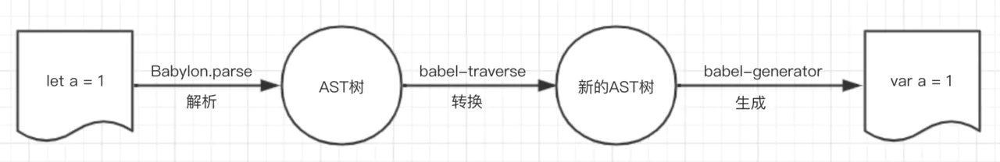
+ babel core 转ast
+ babel-traverse 遍历
+ 生成新的Ast
+ 生成新的代码

11.polyfill 方法兼容
  babel-preset-env 
  babel-transform-runtime 按需加入

12.观察者
观察者模式指的是一个对象(Object a)维持一系列依赖(关注这个词感觉更好)它的对象（Object b,c,d） 
当它的有关状态发生变化时Object a就要通知一系列Object b,c,d对象进行更新<br/>

“老王，等你结婚了，记得叫我来喝喜酒！”<br/>
于是有一天你真的要结婚了，且需要举办酒席，这时候你需要通知你的你的那些老友来喝喜酒。
于是你拿起了手机给你的那些分布于世界各地的好朋友打起了电话，说了结婚酒席一事。
到了酒席那天，有的朋友来了，有的人没来礼却到了，有的呢只有简短的两句祝福，剩下的只有推脱。<br/>

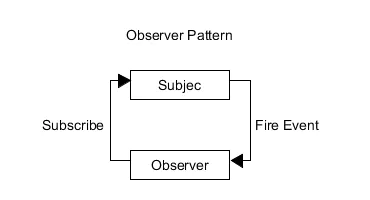

在观察者模式中，目标与观察者相互独立，又相互联系：<br/>
+ 两者都是相互独立的对对象个体。
+ 观察者在目标对象中订阅事件，目标广播发布事件。

就像之前的例子一样：<br/>
+ 老王就是模式中所谓的目标。
+ 同学们在毕业前说的话就相当于在目标对象上订阅事件。
+ 老王打电话通知朋友就是发布事件。
+ 同学们各自作出了不同的行动回应。

首先我们需要定义两个对象：
+ 目标对象：Subject
+ 观察者对象：Observer

并且在目标对象中要存放观察者对象的引用，就像老王要存放同学的手机好一样，只有存了才能联系嘛。于是我们有了下面的代码：
```javascript
function Subject() {
  this.observers = new ObserverList();
}
function ObserverList() {
  this.observerList = [];
}
function Observer() {}


// 对于目标对象中的引用，我们必须可以动态的控制：
ObserverList.prototype.add = function(obj) {
  return this.observerList.push(obj);
};

ObserverList.prototype.count = function() {
  return this.observerList.length;
};

ObserverList.prototype.get = function(index) {
  if (index > -1 && index < this.observerList.length) {
    return this.observerList[index];
  }
};


// 这样我们就能对老王手机联系人进行增、删、查的操作了。
Subject.prototype.addObserver = function(observer) {
  this.observers.add(observer);
};

Subject.prototype.removeObserver = function(observer) {
  this.observers.removeAt(this.observers.indexOf(observer, 0));
};


//现在我们就要考虑发布消息的功能函数了。
// 首先必须明确一点：目标对象并不能指定观察者对象做出什么相应的变化。
// 目标对象只有通知的作用。就像老王只能告诉朋友他要办喜酒了，至于朋友接下来怎么办，则全是朋友自己决定的。
//所以我们得写一个目标广播消息的功能函数：

Subject.prototype.notify = function(context) {
  var observerCount = this.observers.count();
  for (var i = 0; i < observerCount; i++) {
    this.observers.get(i).update(context);
  }
};

// 我们将具体的观察者对象该作出的变化交给了观察者对象自己去处理。
// 这就要求观察者对象需要拥有自己的 update(context)方法来作出改变，同时该方法不应该写在原型链上，
// 因为每一个实例化后的 Observer 对象所做的响应都是不同的，需要独立存储 update(context)方法：
function Observer() {
  this.update = function() {
    // ...
  };
}


// 简单实现 
class Subject{
    constructor () {
      this.observers =[]
    }
    add (observer) {
      this.observers.push(observer)
    }
    remove (observer) {
      this.observers.map((item, index) => {
        if (item === observer) {
            this.observers.splice(index, 1)
        }
      })
    }
    notify () {
      this.observers.map((item, index) => {
          item.update()
      })
    }
}
class Observer {
    constructor (name) {
        this.name = name
    }
    update () {
        console.log("I`m " + this.name)
    }
}
var sub = new Subject()
var obs1 = new Observer("obs1")
var obs2  = new Observer("obs2")
sub.add(obs1)
sub.add(obs2)
sub.notify() // I`m obs1   I`m obs2
sub.remove(obs2)
sub.notify()  //I`m obs1
```


13.发布订阅
```javascript
var pubsub = {};

(function(myObject) {
  var topics = {};
  var subUid = -1;

  myObject.publish = function(topic, args) {
    if (!topics[topic]) {
      return false;
    }
    var subscribers = topics[topic],
      len = subscribers ? subscribers.length : 0;
    while (len--) {
      subscribers[len].func(args);
    }
    return this;
  };

  myObject.subscribe = function(topic, func) {
    if (!topics[topic]) {
      topics[topic] = [];
    }
    var token = (++subUid).toString();
    topics[topic].push({
      token: token,
      func: func
    });
    return token;
  };

  myObject.unsubscribe = function(token) {
    for (var m in topics) {
      if (topics[m]) {
        for (var i = 0, j = topics[m].length; i < j; i++) {
          if (topics[m][i].token === token) {
            topics[m].splice(i, 1);
            return token;
          }
        }
      }
    }
    return this;
  };
})(pubsub);


// 两者都是定义了一个一对多的依赖关系 当有关状态发生变化时执行相应的更新 本质上的思想都是一样的 而发布订阅可以看做是观察者的进阶版 设计模式是一种思想

// 观察者模式
// 目标直接将通知分发到观察者身上
// 发布订阅者模式
// 目标首先是将通知分发到事件调度中心，事件调度中心再通过订阅者具体订阅的类型分发到不同的订阅者身上
```

14.数组常见方法 
+ Array.from() Array.from方法用于将两类对象转为真正的数组
```javascript
let arrayLike = {
    '0': 'a',
    '1': 'b',
    '2': 'c',
    length: 3
};

// ES5的写法
var arr1 = [].slice.call(arrayLike); // ['a', 'b', 'c']

// ES6的写法
let arr2 = Array.from(arrayLike); // ['a', 'b', 'c']
```
+ Array.of() 方法用于将一组值，转换为数组 Array.of(3, 11, 8) // [3,11,8]
+ 数组实例的 find() 和 findIndex()
数组实例的find方法，用于找出第一个符合条件的数组成员。
它的参数是一个回调函数，所有数组成员依次执行该回调函数，直到找出第一个返回值为true的成员，然后返回该成员。
如果没有符合条件的成员，则返回undefined
+ 数组实例的 fill() 数组实例的 fill() ['a', 'b', 'c'].fill(7, 1, 2) // ['a', 7, 'c'] fill方法还可以接受第二个和第三个参数，用于指定填充的起始位置和结束位置
+ map
+ reduces
+ filter

15.new
+ 创建空对象{}
+ {}.prototype 指向构造函数的prototype
+ this={}
+ 执行构造函数


16.手撕call,apply,bind
```javascript
Function.prototype.call = function(context,...args) {
  context.fn = this;
  context.fn(...args);
  context.fn = null;
}
```
17 generator iterator next 实现
for of 内部实现了interator接口 <br/>
Array、Map、Set、NodeList、String以及函数的arguments对象 <br/>

实现Iterator接口就是在对象中增加方法名为Symbol类型Symbole.iterator的方法，
该方法返回一个对象，并且对象要有一个next方法，next方法又要返回一个包含value(任意类型)和done(布尔值)属性的对象。
```javascript
let object = {
    name: 'obj',
    array: ['a', 'b', 'c', 'd', 'e'],
    [Symbol.iterator]() {
        return {
            next: () => {
                return {
                    value: undefined,
                    done: true
                }
            }
        }
    }
}
```


18.随机数 范围 （star,end) => Math.random() * length + start;

19.类型判断
原始类型的值无法更改，要更改只能重新赋值。<br/>
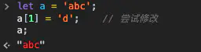<br/>

原始类型的比较就是比较值，值相等，他们就相等<br/>
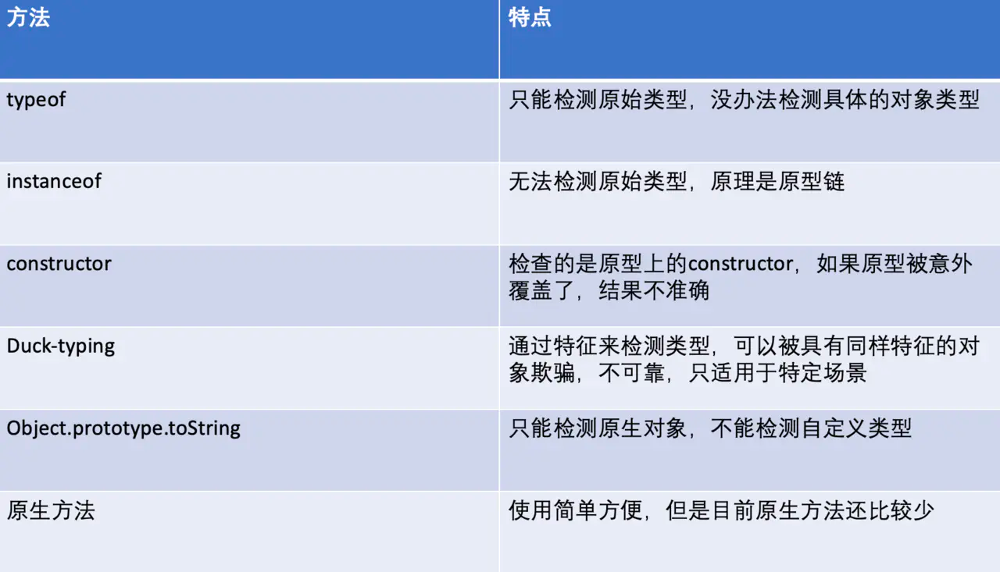<br/>

+ typeof
+ instance 原型链
+ prototype 
+ constructor

20.object

21.ajax
```javascript
function ajax(method, url, data,fn) { //封装为方法
　　let htp = null; //定义个变量
　　//判断兼容低版本ie
　　try {
　　　　htp = new XMLHttpRequest()
　　}
　　catch (err) {
　　　　htp = new ActiveXObject("Microsoft.XMLHTTP")
　　}
　　//判断使用get方法传输还是用posh方法传输
　　if (method == "get") {
　　　　htp.open(method, url +"?"+ data);
　　　　htp.send()
　　} else {
　　　　htp.open(method, url);
　　　　htp.setRequestHeader('content-type', 'application/x-www-form-urlencoded');
　　　　htp.send(data)
　　　　}
　　//监听交互事件
　　htp.onreadystatechange = function () {
　　//判断传输是否成功
　　　　if (htp.readyState == 4 && htp.status == 200) {
　　　　　　fn(htp.responseText)
　　　　}
　　}
}

postData('http://example.com/answer', {answer: 42})
  .then(data => console.log(data)) // JSON from `response.json()` call
  .catch(error => console.error(error))

function postData(url, data) {
  // Default options are marked with *
  return fetch(url, {
    body: JSON.stringify(data), // must match 'Content-Type' header
    cache: 'no-cache', // *default, no-cache, reload, force-cache, only-if-cached
    credentials: 'same-origin', // include, same-origin, *omit
    headers: {
      'user-agent': 'Mozilla/4.0 MDN Example',
      'content-type': 'application/json'
    },
    method: 'POST', // *GET, POST, PUT, DELETE, etc.
    mode: 'cors', // no-cors, cors, *same-origin
    redirect: 'follow', // manual, *follow, error
    referrer: 'no-referrer', // *client, no-referrer
  })
  .then(response => response.json()) // parses response to JSON
}
```

22.下面的代码打印什么内容，为什么？
```javascript
var b = 10;
(function b(){
    b = 20;
    console.log(b); 
})();

// -----------

var b = 10;
(function b() {
   // 内部作用域，会先去查找是有已有变量b的声明，有就直接赋值20，确实有了呀。发现了具名函数 function b(){}，拿此b做赋值；
   // IIFE的函数无法进行赋值（内部机制，类似const定义的常量），所以无效。
  // （这里说的“内部机制”，想搞清楚，需要去查阅一些资料，弄明白IIFE在JS引擎的工作方式，堆栈存储IIFE的方式等）
    b = 20;
    console.log(b); // [Function b]
    console.log(window.b); // 10，不是20
})();


//所以严格模式下能看到错误：Uncaught TypeError: Assignment to constant variable
var b = 10;
(function b() {
  'use strict'
  b = 20;
  console.log(b)
})() // "Uncaught TypeError: Assignment to constant variable."


//其他情况例子：
//有window：

var b = 10;
(function b() {
    window.b = 20; 
    console.log(b); // [Function b]
    console.log(window.b); // 20是必然的
})();

//有var:
var b = 10;
(function b() {
    var b = 20; // IIFE内部变量
    console.log(b); // 20
   console.log(window.b); // 10 
})();
```


23.输出以下代码运行结果
+ 对象的键名只能是字符串和 Symbol 类型。
+ 其他类型的键名会被转换成字符串类型。
+ 对象转字符串默认会调用 toString 方法。
```javascript

// example 1
var a={}, b='123', c=123;  
a[b]='b';
a[c]='c';  
console.log(a[b]);


// example 2
var a={}, b=Symbol('123'), c=Symbol('123');  
a[b]='b';
a[c]='c';  
console.log(a[b]);


// example 3
var a={}, b={key:'123'}, c={key:'456'};  
a[b]='b';
a[c]='c';  
console.log(a[b]);
```
 
24.input 搜索如何防抖，如何处理中文输入
onCompositionStart
onCompositionStart


# 浏览器
1.js内存 <br/>
栈内存 <br/>
栈是一种只能一端进出的数据结构，先进后出，后进先出。<br/>
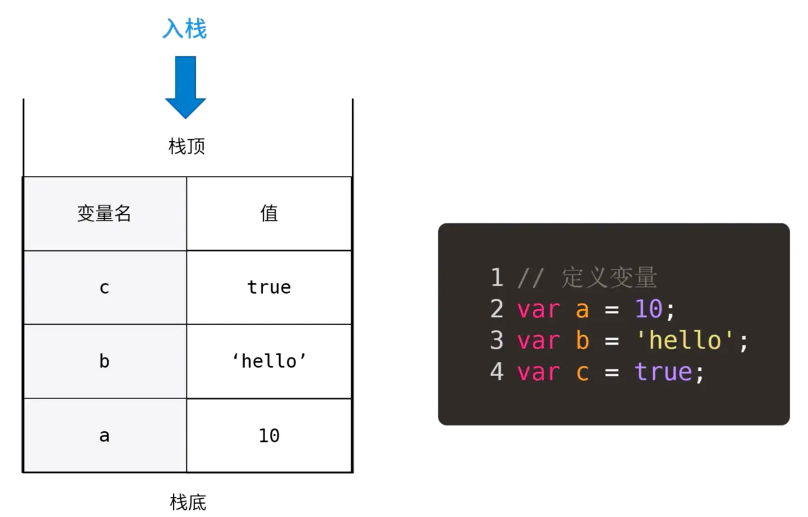<br/>

以var a = 10; 为例，我们先将10放入内存，然后申明一个变量a，
这时候a的值是undefined，最后进行赋值，就是将a与10关联起来<br/>

堆内存<br/>
但是引用数据类型，比如Object, Array，他们的大小不是固定的，所以是存在堆内存的。<br/>

JS不允许直接操作堆内存，我们在操作对象时，操作的实际是对象的引用，而不是实际的对象。<br/>

可以理解为对象在栈里面存了一个内存地址，这个地址指向了堆里面实际的对象。
所以引用类型的值是一个指向堆内存的引用地址<br/>
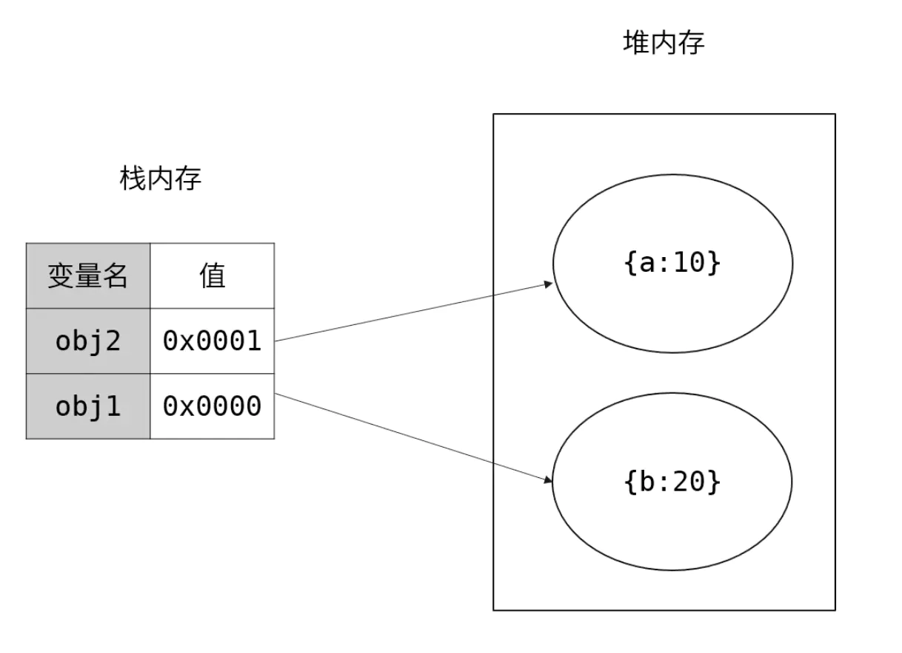

函数也是引用类型，当我们定义一个函数时，会在堆内存中开辟一块内存空间，将函数体代码以字符串的形式存进去。<br/>
然后将这块内存的地址赋值给函数名，函数名和引用地址会存在栈上<br/>
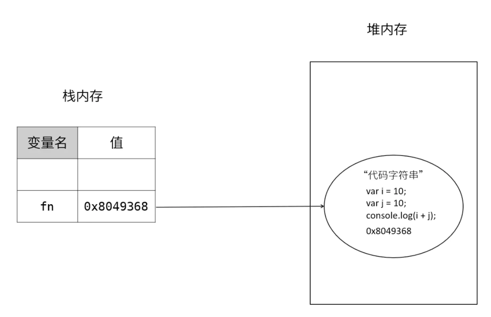<br/>

v8内存管理 <br/>
V8是有内存限制的，因为它最开始是为浏览器设计的，不太可能遇到大量内存的使用场景
因此V8限制了内存使用的大小，但是Node.js是可以通过配置修改的，
更好的做法是使用Buffer对象，因为Buffer的内存是底层C++分配的，
不占用JS内存，所以他也就不受V8限制。


2.浏览器垃圾回收 <br/>
引用计数 <br/>
它跟踪记录每个值被引用的次数，每次引用的时候加一，被释放时减一，
如果一个值的引用次数变成0了，就可以将其内存空间回收。<br/>
其 BOM 和 DOM 中的对象就是使用 C++以 COM（Component Object Model，组件对象模型）
对象的形式实现的，而 COM对象的垃圾 收集机制采用的就是引用计数策略。<br/>

循环引用<br/>
```javascript
var element = document.getElementById("some_element"); 
var myObject = new Object();
myObject.element = element; 
element.someObject = myObject;
```
标记-清除算法 <br/>
标记-清除算法就是当变量进入环境是，这个变量标记位“进入环境”；<br/>
而当变量离开环境时，标记为“离开环境”，当垃圾回收时销毁那些带标记的值并回收他们的内存空间。<br/>

可能造成内存泄露的情况 <br/>
+ 对象之间的循环引用
+ 老版IE（IE8及以前）里面DOM与对象之间的循环引用

其他也可能造成循环引用的情况：<br/>
+ 全局变量会存在于整个应用生命周期，应用不退出不会回收，使用严格模式可以避免这种情况
+ 闭包因为自身特性，将函数内部变量暴露到了外部作用域，当其自身执行结束时，所暴露的变量并不会回收
+ 没有clear的定时器

V8采用了分代回收的策略，将内存分为两个生代：新生代和老生代 <br/>

新生代内存回收机制：<br/>
新生代内存容量小，64位系统下仅有32M。<br/>
新生代内存分为From、To两部分，<br/>
进行垃圾回收时，先扫描From，将非存活对象回收， <br/>
将存活对象顺序复制到To中，<br/>
之后调换From/To，等待下一次回收 <br/>

老生代内存回收机制 <br/>
晋升：如果新生代的变量经过多次回收依然存在，那么就会被放入老生代内存中 <br/>
标记清除：老生代内存会先遍历所有对象并打上标记，然后对正在使用或被强引用的对象取消标记，回收被标记的对象
整理内存碎片：把对象挪到内存的一端

3.v8执行过程
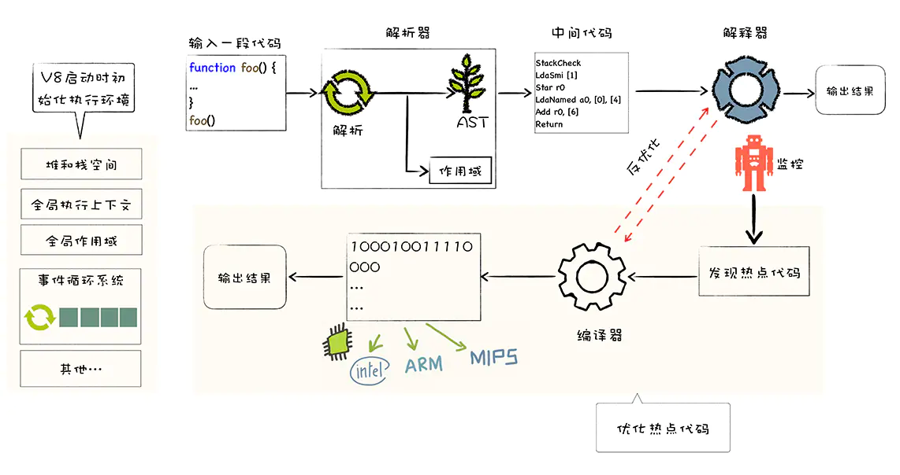
+ 初始化基础环境 
+ 解析源码生成ast和作用域
+ 依据ast和作用域生成字节码
+ 解释器解释执行字节码
+ 监听热点代码
+ 编译器优化热点代码为二进制的机器码
+ 反优化二进制机器代码

<br/>
<br/>

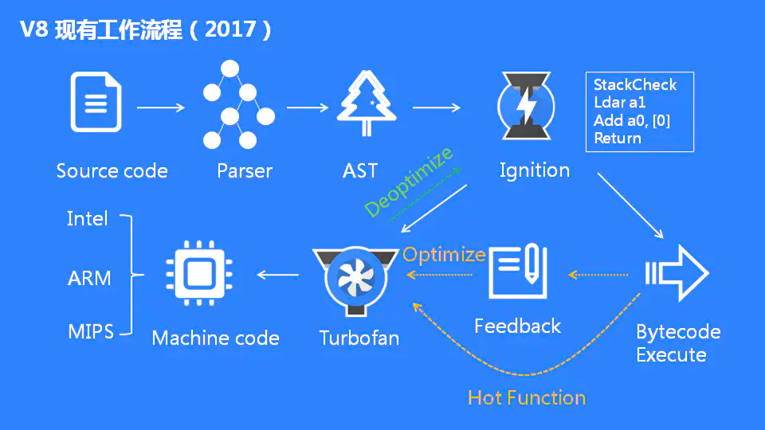 
+ 预解析：检查语法错误但不生成AST
+ 生成AST：经过词法/语法分析，生成抽象语法树
+ 生成字节码：基线编译器(Ignition)将AST转换成字节码
+ 生成机器码：优化编译器(Turbofan)将字节码转换成优化过的机器码，此外在逐行执行字节码的过程中，如果一段代码经常被执行，那么V8会将这段代码直接转换成机器码保存起来，下一次执行就不必经过字节码，优化了执行速度


4.event loop <br/>
JS异步是怎么实现的? <br/>
我们都知道JS是单线程的，那单线程是怎么实现异步的呢？ <br/>

事实上所谓的"JS是单线程的"只是指JS的主运行线程只有一个，而不是整个运行环境都是单线程。 <br/>

JS的运行环境主要是浏览器，以大家都很熟悉的Chrome的内核为例，他不仅是多线程的，而且是多进程的：
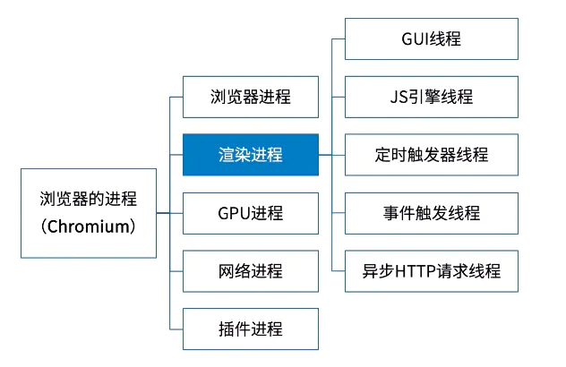

GUI线程 <br/>
GUI线程就是渲染页面的，他解析HTML和CSS，然后将他们构建成DOM树和渲染树就是这个线程负责的。

JS引擎线程 <br/>
这个线程就是负责执行JS的主线程，前面说的"JS是单线程的"就是指的这个线程。大名鼎鼎的Chrome V8引擎就是在这个线程运行的。
需要注意的是，这个线程跟GUI线程是互斥的。<br/>

互斥的原因是JS也可以操作DOM，如果JS线程和GUI线程同时操作DOM，结果就混乱了，不知道到底渲染哪个结果。<br/>
这带来的后果就是如果JS长时间运行，GUI线程就不能执行，整个页面就感觉卡死了。
所以我们最开始例子的while(true)这样长时间的同步代码在真正开发时是绝对不允许的<br/>

定时器线程<br/>
前面异步例子的setTimeout其实就运行在这里，他跟JS主线程根本不在同一个地方，
所以“单线程的JS”能够实现异步。JS的定时器方法还有setInterval，也是在这个线程。


事件触发线程 <br/>
定时器线程其实只是一个计时的作用，他并不会真正执行时间到了的回调，真正执行这个回调的还是JS主线程。<br/>
所以当时间到了定时器线程会将这个回调事件给到事件触发线程，然后事件触发线程将它加到事件队列里面去。<br/>
最终JS主线程从事件队列取出这个回调执行。事件触发线程不仅会将定时器事件放入任务队列，其他满足条件的事件也是他负责放进任务队列。<br/>

异步HTTP请求线程 <br/>
这个线程负责处理异步的ajax请求，当请求完成后，他也会通知事件触发线程，
然后事件触发线程将这个事件放入事件队列给主线程执行。<br/>
所以JS异步的实现靠的就是浏览器的多线程，当他遇到异步API时，就将这个任务交给对应的线程，
当这个异步API满足回调条件时，对应的线程又通过事件触发线程将这个事件放入任务队列，然后主线程从任务队列取出事件继续执行 <br/>

浏览器的Event Loop <br/>
事件循环就是一个循环，是各个异步线程用来通讯和协同执行的机制。<br/>
各个线程为了交换消息，还有一个公用的数据区，这就是事件队列。<br/>
各个异步线程执行完后，通过事件触发线程将回调事件放到事件队列，主线程每次干完手上的活儿就来看看这个队列有没有新活儿，有的话就取出来执行。
画成一个流程图就是这样：
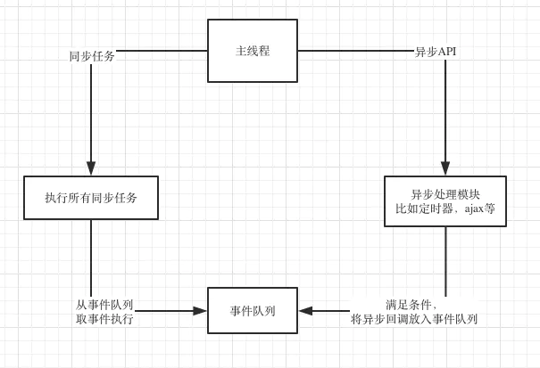<br/>
+ 主线程每次执行时，先看看要执行的是同步任务，还是异步的API
+ 同步任务就继续执行，一直执行完
+ 遇到异步API就将它交给对应的异步线程，自己继续执行同步任务
+ 异步线程执行异步API，执行完后，将异步回调事件放入事件队列上
+ 主线程手上的同步任务干完后就来事件队列看看有没有任务
+ 主线程发现事件队列有任务，就取出里面的任务执行
+ 主线程不断循环上述流程

引入微任务
前面的流程图我为了便于理解，简化了事件队列，其实事件队列里面的事件还可以分两类：宏任务和微任务。<br/>
微任务拥有更高的优先级，当事件循环遍历队列时，先检查微任务队列，如果里面有任务，就全部拿来执行，执行完之后再执行一个宏任务。<br/>
执行每个宏任务之前都要检查下微任务队列是否有任务，如果有，优先执行微任务队列。<br/>
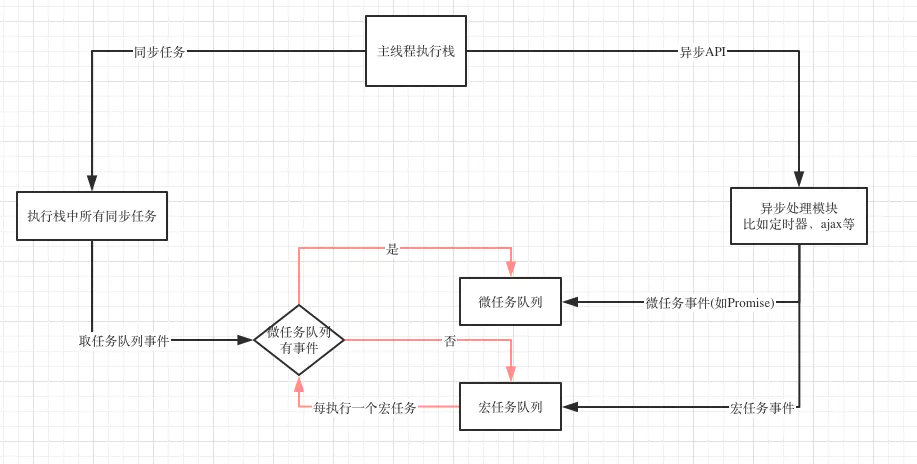<br/>

一个Event Loop可以有一个或多个事件队列，但是只有一个微任务队列。 <br/>
微任务队列全部执行完会重新渲染一次 <br/>
每个宏任务执行完都会重新渲染一次 <br/>
requestAnimationFrame处于渲染阶段，不在微任务队列，也不在宏任务队列 <br/>

常见宏任务有：
+ script (可以理解为外层同步代码)
+ setTimeout/setInterval
+ setImmediate(Node.js)
+ I/O
+ UI事件
+ postMessage


常见微任务有：
+ Promise
+ process.nextTick(Node.js)
+ Object.observe
+ MutaionObserver

5.安全 <br/>
浏览器沙箱
Google Chrome 是第一个采取多进程架构的浏览器，
其主要进程分为：浏览器进程、渲染进程、插件进程、扩展进程。		
插件进程如flash、java、pdf 等与浏览器进程严格隔离，互不影响。		
渲染引擎由 Sandbox 隔离，网页代码要与浏览器内核进程通信、与操作系统通信都需要通过 IPC channel，
在其中会进行一些安全检查。		
Sandbox 目的：让不可信任的代码运行在一定的环境中，限制其访问隔离区外的资源，
如果一定要跨域边界产生数据交换，则只能通过指定的数据通道，
比如经过封装的 API 来完成，在这些 API 中会严格检查请求的合法性。


跨站脚本攻击（XSS）<br/>
http://www.a.com/test.php?param=<srcipt src="xss.js"></script>

+ 反射型XSS(非持久型XSS)。
XSS代码出现在URL中，攻击者需要将带有攻击脚本的URL发送给目标用户。
用户点击访问后，在本地的浏览器解析执行了攻击代码。
+ 存储型XSS(持久型XSS)。
存储型的XSS代码，会被存储在服务器端。当用户访问网页的时候，从服务器拿到攻击代码并执行。

xss防御
+ 参数验证，不符合要求的数据不要存入数据库
+ 对特殊字符转义，如"<"、">"、"/"、"&"等
+ 避免使用eval、new Function动态执行字符串的方法
+ 避免使用 innerHTML、document.write 直接将字符串输出到HTML
+ 把一些敏感的 cookie 设置为 http only，避免前端访问 cookie

跨站请求伪造（CSRF）<br/>
F是网站A的用户，且已登录，网站A对用户F进行身份认证后下发了cookie，保存在F浏览器中。<br/>
F访问网站B，网站B存在引诱点击（往往是个链接，指向网站A的API接口，通常是GET类型），然后访问了A网站，浏览器会自动上传cookie。<br/>
网站A对传来的cookie进行确认，是合法用户，则执行接口的动作 <br/>

+ 通过设置sameSite-Strict属性，禁止第三方网站携带cookie。
+ 在正规网站的页面提交内容，可以设置验证码，或者是token。
+ 虽然第三方网站的跨站请求信息几乎和正规网站是一样的，但是还是有所不同。这个不同就是请求信息中的Referer字段，这个字段描述了请求的来源。


6.跨域
所谓的同源,指的是协议,域名,端口相同。
jsonp跨域
客户端引用服务端的一个请求，服务端返回一段js打代码
WebSocket协议跨域
nginx代理跨域
postMessage。HTML5 的 postMessage 方法可用于两个页面之间通信，而且不论这两个页面是否同源。


7.缓存
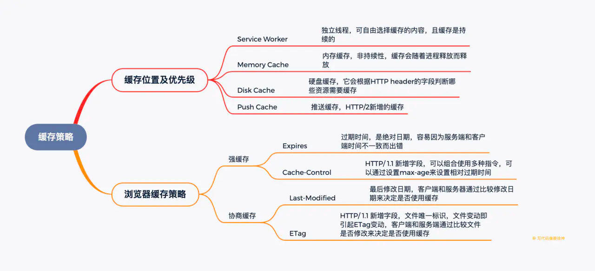 <br/>
强缓存 <br/>  
+ Expires
+ Cache-Control 

协商缓存  <br/>
协商缓存的更新策略是不再指定缓存的有效时间，而是浏览器直接发送请求到服务端进行确认缓存是否更新，
如果请求响应返回的 HTTP 状态为 304，则表示缓存仍然有效。<br/>

Last-Modified 和 If-Modified-Since 对比资源最后修改时间来实现缓存。<br/>
浏览器第一次请求资源，服务端在返回资源的响应头上添加 Last-Modified 字段，
值是资源在服务端的最后修改时间；<br/>
浏览器再次请求资源，在请求头上添加 If-Modified-Since，值是上次服务端返回的最后修改时间；<br/>
服务端收到请求，根据 If-Modified-Since 的值进行判断。
若资源未修改过，则返回 304 状态码，并且不返回内容，浏览器使用缓存；<br/>
否则返回资源内容，并更新 Last-Modified 的值；<br/>


ETag 和 If-None-Match 对比资源哈希值，哈希值由资源内容计算得出，即依赖资源内容实现缓存。<br/>
浏览器第一次请求资源，服务端在返回资源的响应头上添加 ETag 字段，值是资源的哈希值 <br/>
浏览器再次请求资源，在请求头上添加 If-None-Match，值是上次服务端返回的资源哈希值；<br/>
服务端收到请求，根据 If-None-Match 的值进行判断。<br/>
若资源内容没有变化，则返回 304 状态码，并且不返回内容，浏览器使用缓存；<br/>
否则返回资源内容，并计算哈希值放到 ETag；<br/>


8.url页面发生什么 
https://blog.csdn.net/allenliu6/article/details/76609929  
https://juejin.im/post/6844904083166347271
使用async，文档的解析不会停止，其他线程将下载脚本，脚本下载完成后开始执行脚本，脚本执行的过程中文档将停止解析，直到脚本执行完毕。
使用defer，文档的解析不会停止，其他线程将下载脚本，待到文档解析完成，脚本才会执行。

// ----
+ 输入URL并敲下回车键
+ 浏览器查找当前URL是否存在缓存，并比较是否过期。
+ DNS解析域名
    + 浏览器缓存解析
    + 本地hosts文件解析
    + 操作系统解析
    + 路由器解析
    + 根域名服务器解析、顶级域名服务器解析、主域名服务器解析（IPV4\IPV6）
+ TCP链接建立（3次握手）
    + 客户端发送SYN包（SYN = 1, seq = x）至服务端，并处于SYN_SENT状态，等待服务器确认
    + 服务端解析SYN，并发送SYN + ACK（SYN = 1, ACK = x + 1, seq = y） 包至客户端，并处于SYN_RECV状态，允许建立链接（告知服务器已做好准备，可以发送数据）
    + 客户端获取SYN + ACK 并发送ACK（ACK = y + 1， seq = z）包至服务端，链接建立成功。（即将开始发送数据）
+ 客户端发起HTTP请求
    + 完整的HTTP请求包含请求起始行，请求头部，请求主体
    + 服务端收到浏览器的HTTP请求后，会将收到的HTTP报文封装成HTTP的Request对象，并通过不同的WEB服务器进行处理，处理完的结果以Response对象返回，主要包括状态码，响应头，响应报文三个部分
    + 综合起来，完整的HTTP报文包括了：通用头部，请求/响应 头部，请求/响应体
```
//General
Request Url: 服务器地址
Request Method: 请求方式（get, post, options, put, head, delete, connect, trace）
Status Code: 请求返回的状态码
Remote Address: 请求的远程服务器地址（IP）
Referrer Policy: （引用策略）用来监管哪些访问来源信息【not IE】

// Request Head
Accept: 接受类型，浏览器支持的MIME类型（对标服务端放回的Content-Type）
Accept-Encoding: 浏览器支持的压缩类型，如gzip等，超出类型不能接受
Content-Type: 客户端发送出去的实体内容的类型
Cache-Control: 指定请求和响应遵循的缓存机制，如no-cache,no-store
If-Modified-Since: 对应服务端你的Last-Modified, 用来匹配文件是否变动，只能精确到1s之内，http1.0中
Expires: 缓存到期时间，（服务端时间）http1.0中
Max-age: 代表资源在本地缓存多少秒， http 1.1中
If-None-Match: 对应的服务端的ETag，用来匹配文件内容是否改变（非常精确），http1.1中
Cookie: 有cookie并且同域访问会自动带上
Connection: 当浏览器与服务器通信时对于长链接如何进行处理，如keep-alive;
Host: 请求的服务器URL
Origin: 最初的请求是从哪里发起的（只会精确到端口）,origin比Referrer更尊重隐私
Referrer: 该页面的来源URL（适用于所有类型的请求，会精确到详细页面地址，CSRF拦截常用到这个字段）
User-Agent: 用户客户端的一些必要信息，如UA头部等;


// Response Head
Access-Control-Allow-Headers: 服务端允许的请求的headers
Access-Control-Allow-Methods: 服务端允许的请求方法
Access-Control-Allow-Origin: 服务端允许的Origin头部
Content-Type: 服务端返回的实体内容的类型
Date: 数据从服务端发送的时间
Cache-Control: 告诉浏览器或其他客户，什么环境可以安全的缓存文档
Last-Modified: 请求的资源最后修改时间
Expires: 文档什么时候过期，从而不再缓存
Max-age: 客户端的本地资源应该缓存多少秒，开启Cache-Control后有效
ETag: 请求变量的实体标签的当前值
Set-Cookie: 设置和页面关联的cookie,服务器通过这个头部把cookie传给客户端
keep-alive: 如果客户端有keep-alive, 服务端也会有相应（如timeout = 38）
Server: 服务器的一些相关信息
```
+ 浏览器解析渲染页面
    + 解析HTML，构建DOM树（深度优先：即先构建当前节点的所有的子节点，再构建兄弟节点）；
    + 若在此过程遇到script标签，则会暂停DOM树的构建。
    + 解析CSS，生成CSS规则树；
    + 解析CSS规则的过程时JS将暂停执行，直到CSS规则树构建完成。
    + 合并DOM树和CSS规则，生成render树；
    + 精简CSS可加快CSS树的构建，从而加快页面响应速度。
    + 布局render树（layout/reflow【回流\重排】），负责各元素尺寸、位置计算；
    + 绘制render树（paint），绘制页面像素信息；
    + 浏览器将各层的信息发送给GPU，GPU将各层合成，显示在屏幕上；

+ TCP链接释放（4次挥手）
    + TCP向服务端发送带有FIN（FINISH）标记报文，客户端进入FIN_WAIT_1状态（通知服务器端准备关闭）
    + 服务端接受通知，向客户端发送ACK报文，确认序号为收到的序号加1，和SYN一样，一个FIN报文将占用一个序号。（告诉浏览器，请求报文接受完毕。我准备关闭了，你也准备吧）服务器进入CLOSE_WAIT状态。
    + 服务器端发送FIN，用来关闭服务器到客户端的数据传输，服务器进入LAST_ACK状态。（告诉浏览器，响应报文发送完毕。你准备关闭吧。）
    + 客户端接受FIN报文，服务器进入TIME_WAIT状态，发送ACK包给服务器（ACK = b + 1, seq = a + 1）,服务器进入CLOSED状态。（告诉服务器响应报文接受完毕，准备关闭。）

9.浏览器组成


# 网络
1.http https
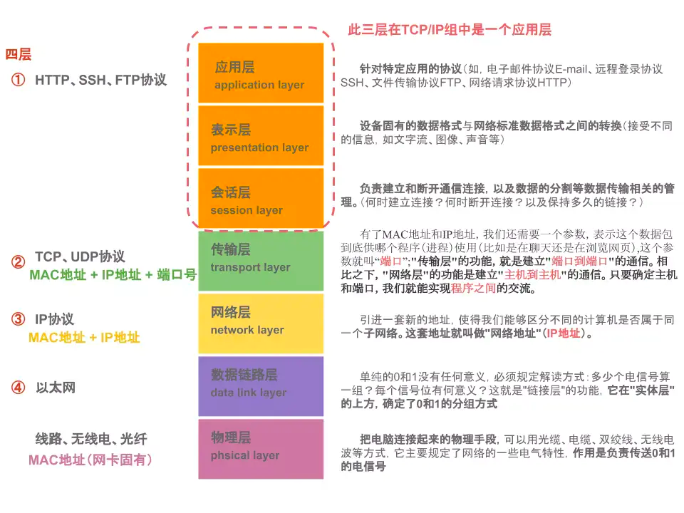 <br/>
非对称加密的特点<br/>
+ 任何经过A的公钥进行过加密的信息，只有A的私钥才能解密 <br/>
+ 任何有公钥的人可以确认对方发送的信息是被私钥加密过的

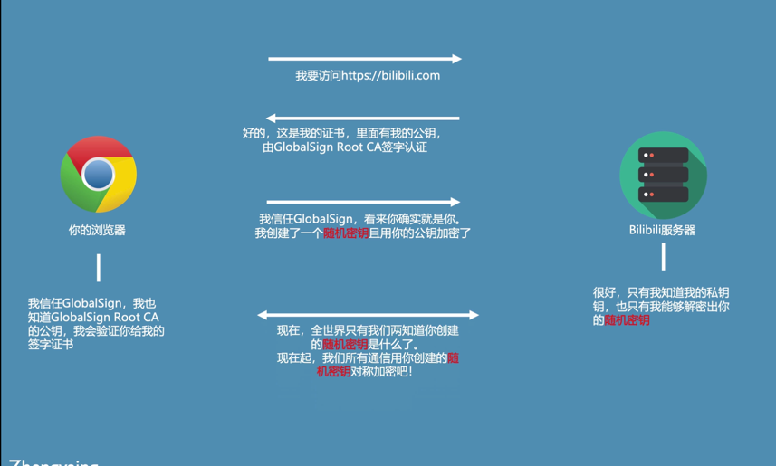<br/>
+ 客户端 采用https协议 去访问服务端
+ 服务端 返回证书给客户端，证书里面有公钥 证书被Global Root CA签字认证过 ，
+ 客户端 拥有Global Root CA的公钥，会验证签字的证书
+ 客户端创建了一个随机密钥 用服务端发送的公钥进行加密了  发送给服务端 服务端可以利用自己的私钥去解密随机密钥
+ 现在 只有这个客户端和服务器端知道这个随机密钥了
+ 后续的通讯就是用这个生成的随机密钥进行对称加密

证书如何签证的？
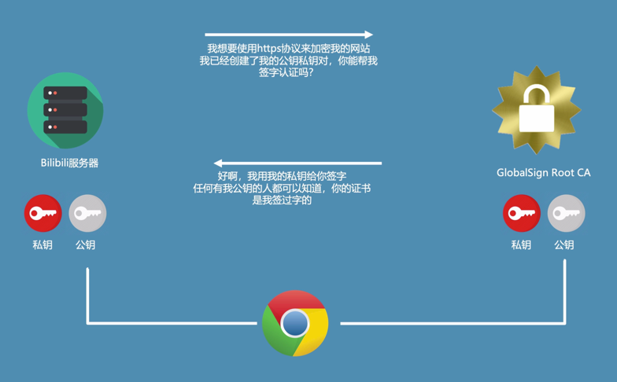 <br/>
+ 服务器端 生成了公钥和密钥
+ CA 用私钥给 服务器端证书进行签证，任何拥有CA公钥的人就可以知道你的证书是被CA签证过的

2.tcp三次握手 4次挥手
+ seq（消息序号）：第一次请求时，随机生成一个值,而后每次+1
+ ack（确认序号，注意是小写）：接收上一条信息的seq+1
+ ACK：确认序号有效。
+ SYN：发起一个新连接。
+ FIN：释放一个连接。

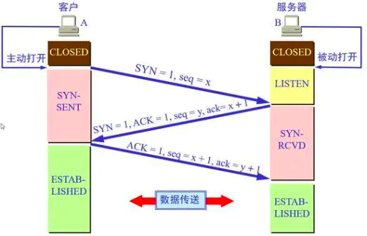<br/>

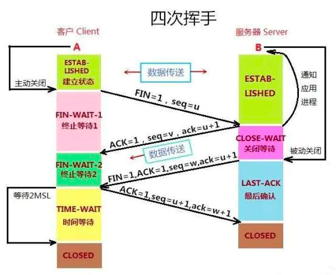<br/>

三次握手，为什么？<br/>
为了防止已失效的连接请求报文段突然又传送到了服务端，因而产生错误。
client发出的第一个连接请求报文段并没有丢失，而是在某个网络结点长时间的滞留了，以致延误到连接释放以后的某个时间才到达server。
本来这是一个早已失效的报文段。但server收到此失效的连接请求报文段后，就误认为是client再次发出的一个新的连接请求。
于是就向client发出确认报文段，同意建立连接。
假设不采用“三次握手”，那么只要server发出确认，新的连接就建立了。
由于现在client并没有发出建立连接的请求，因此不会理睬server的确认，也不会向server发送数据。
但server却以为新的连接已经建立，并一直等待client发来数据。
这样，server的很多资源就白白浪费掉了。
采用“三次握手”的办法可以防止上述现象发生<br/>

四次分手，为什么？<br/>
当A发出FIN报文时，只是表示A已经没有数据要发送了，并不意味着B不需要发送数据给Ａ了，这个时候A还是可以接收来自B的数据；
当B返回ACK报文时，表示它已经知道A没有数据发送了，但是B还是可以发送数据到A的。
所以2次分手是不可以的。当B不再需要向A发送数据时，向Ａ发送FIN报文，告诉A，我也没有数据要发送了，之后彼此就会中断这次TCP连接。

3.http1.0 http1.1 http2.0特性及区别

http/1 :<br/>
HTTP 1.0规定浏览器与服务器只保持短暂的连接，浏览器的每次请求都需要与服务器建立一个TCP连接，服务器完成请求处理后立即断开TCP连接，
服务器不跟踪每个客户也不记录过去的请求。<br/>
一般PC端浏览器会针对单个域名的server同时建立6～8个连接，手机端的连接数则一般控制在4～6个<br/>

http 1.1 :<br/>
HTTP 1.1支持持久连接<br/>
在一个TCP连接上可以传送多个HTTP请求和响应，减少了建立和关闭连接的消耗和延迟。<br/>
HTTP 1.1还允许客户端不用等待上一次请求结果返回，就可以发出下一次请求，
但服务器端必须按照接收到客户端请求的先后顺序依次回送响应结果，<br/>
在http1.1，request和reponse头中都有可能出现一个connection的头，此header的含义是当client和server通信时对于长链接如何进行处理。<br/>

HTTP 1.1状态代码及其含义<br/>
+ 1xx：指示信息--表示请求已接收，继续处理
+ 2xx：成功--表示请求已被成功接收、理解、接受
+ 3xx：重定向--要完成请求必须进行更进一步的操作
+ 4xx：客户端错误--请求有语法错误或请求无法实现
+ 5xx：服务器端错误--服务器未能实现合法的请求


http/2 :<br/>
+ 多路复用，一个Tcp中多个http请求是并行的
+ 二进制格式编码传输
+ header压缩
+ 服务端推送

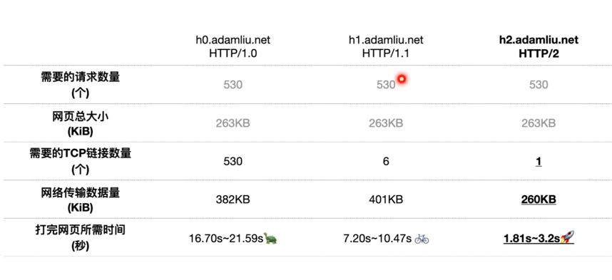

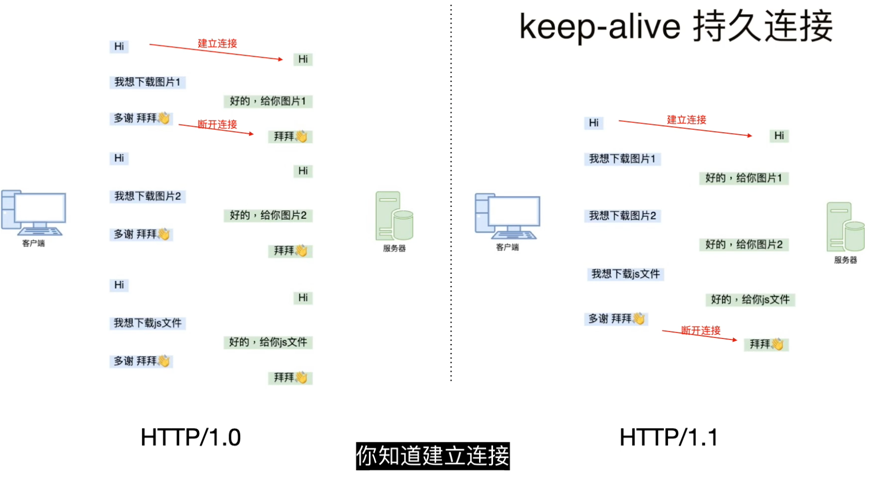


4.简单讲解一下http2的多路复用
简单来说， 就是在同一个TCP连接，同一时刻可以传输多个HTTP请求。
之前是同一个连接只能用一次， 如果开启了keep-alive，虽然可以用多次，但是同一时刻只能有一个HTTP请求

5.A、B 机器正常连接后，B 机器突然重启，问 A 此时处于 TCP 什么状态
A侧的TCP链路状态在未发送任何数据的情况下与等待的时间相关，如果在多个超时值范围以内那么状态为<established>;
如果触发了某一个超时的情况那么视情况的不同会有不同的改变。

一般情况下不管是KeepAlive超时还是内核超时，只要出现超时，那么必然会抛出异常，只是这个异常截获的时机会因编码方式的差异而有所不同。
（同步异步IO，以及有无使用select、poll、epoll等IO多路复用机制）

6.介绍下 HTTPS 中间人攻击
+ 服务器向客户端发送公钥。
+ 攻击者截获公钥，保留在自己手上。
+ 然后攻击者自己生成一个【伪造的】公钥，发给客户端。
+ 客户端收到伪造的公钥后，生成加密hash值发给服务器。
+ 攻击者获得加密hash值，用自己的私钥解密获得真秘钥。
+ 同时生成假的加密hash值，发给服务器。
+ 服务器用私钥解密获得假秘钥。
+ 服务器用加秘钥加密传输信息

防范方法：服务端在发送浏览器的公钥中加入CA证书，浏览器可以验证CA证书的有效性

7.udp
+ 面向无连接
+ 有单播，多播，广播的功能
+ 不可靠性

8.tcp
+ 面向连接
+ 仅支持单播传输
+ 面向字节流
+ 可靠传输

# BOM
+ event
+ 浏览器可是区域
+ window
+ navigator
+ 存储

# DOM


# babel
+ babel包

# webpack
1.source-map
+ eval：使用eval包裹模块代码
+ source map：产生.map文件
+ cheap：不包含列信息
+ inline：将.map作为DataURI嵌入，不单独生成.map文件
+ module：包含loader的sourcemap

生产环境部署
+ Sentry ？ https://www.cnblogs.com/qiezuimh/p/11440506.html
+ hidden-source-map 源码不显示
+ SourceMapDevToolPlugin
```javascript
new webpack.SourceMapDevToolPlugin({
  filename: "sourcemaps/[file].map",
  publicPath: "https://example.com/project/",
  fileContext: "public"
})
//https://example.com/project/sourcemaps/bundle-[hash].js.map`
```
+ 插件
SourceMapDevToolPlugin这个插件可以修改map文件的引用地址，
同时借助filemanager-webpack-plugin将map文件移动到指定服务器，举个栗子是本地的话如下：
```javascript
const FileManagerPlugin = require('filemanager-webpack-plugin');
// ...
plugins: [
  new webpack.SourceMapDevToolPlugin({
      append: '\n//# sourceMappingURL=http://localhost:3000/sourceMap/[url]', //如果是保存到本地的话
      filename: '[file].map',
  }),
  new FileManagerPlugin({
     onEnd: {
          copy: [{ 
                 source: './dist/static/js/*.map', 
                 destination: 'D:/sourceMap', // 本地服务器的文件路径
           }],
           delete: ['./dist/static/js/*.map'],//删除map文件
           archive: [{ //压缩文件
                source: './dist',
                destination: './dist/static/dist.zip',
           }]
      }
 })
]

```

2.第三方包处理
+ dll
dllplugin dllreferenceplugin
+ commonsplugin
```javascript
const vue = require('vue')
{
  entry: {
   // bundle是我们要打包的项目文件的导出名字， app是入口js文件
   bundle: 'app',
   // vendor就是我们要打包的第三方库最终生成的文件名，数组里是要打包哪些第三方库, 如果不是在node——modules里面，可以填写库的具体地址
   vendor: ['vue'],
   jquery: ['jquery'],
  },
 output: {
     path: __dirname + '/bulid/',
	 // 文件名称
	filename: '[name].js'
 },
  plugins: {
    // 这里实例化webpack.optimize.CommonsChunkPlugin构造函数
    // 打包之后就生成vendor.js文件
    new webpack.optimize.CommonsChunkPlugin('vendor',  'vendor.js')
    new webpack.optimize.CommonsChunkPlugin('jquery',  'jquery.js')
  }
}
```

3.手撕代码
```javascript
const fs = require("fs");
const path = require("path");
const babylon = require("@babel/parser");
const traverse = require("@babel/traverse").default;
const babel = require("@babel/core");


let ID = 0;
//读取文件信息，并获得当前js文件的依赖关系
function createAsset(filename) {
    //获取文件，返回值是字符串
    const content = fs.readFileSync(filename, "utf-8");

    //讲字符串为ast（抽象语法树， 这个是编译原理的知识，说得简单一点就是，可以把js文件里的代码抽象成一个对象，代码的信息会存在对象中）
    //babylon 这个工具是是负责解析字符串并生产ast。
    const ast = babylon.parse(content, {
        sourceType: "module"
    });

    //用来存储 文件所依赖的模块，简单来说就是，当前js文件 import 了哪些文件，都会保存在这个数组里
    const dependencies = [];

    //遍历当前ast（抽象语法树）
    traverse(ast, {
        //找到有 import语法 的对应节点
        ImportDeclaration: ({ node }) => {
            //把当前依赖的模块加入到数组中，其实这存的是字符串，
            //例如 如果当前js文件 有一句 import message from './message.js'，
            //'./message.js' === node.source.value
            dependencies.push(node.source.value);
        }
    });

    //模块的id 从0开始， 相当一个js文件 可以看成一个模块
    const id = ID++;

    //这边主要把ES6 的代码转成 ES5
    const { code } = babel.transformFromAstSync(ast, null, {
        presets: ["@babel/preset-env"]
    });

    return {
        id,
        filename,
        dependencies,
        code
    };
}

//从入口开始分析所有依赖项，形成依赖图，采用广度遍历
function createGraph(entry) {
    const mainAsset = createAsset(entry);

    //既然要广度遍历肯定要有一个队列，第一个元素肯定是 从 "./example/entry.js" 返回的信息
    const queue = [mainAsset];


    for (const asset of queue) {
        const dirname = path.dirname(asset.filename);

        //新增一个属性来保存子依赖项的数据
        //保存类似 这样的数据结构 --->  {"./message.js" : 1}
        asset.mapping = {};

        asset.dependencies.forEach(relativePath => {
            const absolutePath = path.join(dirname, relativePath);

            //获得子依赖（子模块）的依赖项、代码、模块id，文件名
            const child = createAsset(absolutePath);

            //给子依赖项赋值，
            asset.mapping[relativePath] = child.id;

            //将子依赖也加入队列中，广度遍历
            queue.push(child);
        });
    }
    return queue;
}

//根据生成的依赖关系图，生成对应环境能执行的代码，目前是生产浏览器可以执行的
function bundle(graph) {
    let modules = "";

    //循环依赖关系，并把每个模块中的代码存在function作用域里
    graph.forEach(mod => {
        modules += `${mod.id}:[
      function (require, module, exports){
        ${mod.code}
      },
      ${JSON.stringify(mod.mapping)},
    ],`;
    });

    //require, module, exports 是 cjs的标准不能再浏览器中直接使用，所以这里模拟cjs模块加载，执行，导出操作。
    const result = `
    (function(modules){
      //创建require函数， 它接受一个模块ID（这个模块id是数字0，1，2） ，它会在我们上面定义 modules 中找到对应是模块.
      function require(id){
        const [fn, mapping] = modules[id];
        function localRequire(relativePath){
          //根据模块的路径在mapping中找到对应的模块id
          return require(mapping[relativePath]);
        }
        const module = {exports:{}};
        //执行每个模块的代码。
        fn(localRequire,module,module.exports);
        return module.exports;
      }
      //执行入口文件，
      require(0);
    })({${modules}})
  `;

    return result;
}

const graph = createGraph("./example/entry.js");
const ret = bundle(graph);

// 打包生成文件
fs.writeFileSync("./bundle.js", ret);
```
4.loader && plugin
+ babel-loader cacheDirectory:true
+ less-loader css-loader style-loader mini-css-extract-plugin(生产环境单独提出) optimize-css-assets-webpack-plugin(生产环境压缩)
+ html-loader
+ url-loader esmodule=fasle html-loader 解析
+ file-loader
+ html-webpack-plugin
+ dllplugin dllreferenceplugin
+ happypack
+ service work pwa workbox-webpack-plugin
```javascript
if ('serviceWorker' in navigator) {
  window.addEventListener('load', () => {
    navigator.serviceWorker
      .register('/service-worker.js')
      .then(() => {
        console.log('sw注册成功了~');
      })
      .catch(() => {
        console.log('sw注册失败了~');
      });
  });
}

//----
const WorkboxWebpackPlugin = require('workbox-webpack-plugin');

new WorkboxWebpackPlugin.GenerateSW({
  /*
    1. 帮助serviceworker快速启动
    2. 删除旧的 serviceworker

    生成一个 serviceworker 配置文件~
  */
  clientsClaim: true,
  skipWaiting: true
})
```

5.优化
代码优化
+ 路由懒加载
+ 图片资源懒加载
+ 组件懒加载
打包优化

+ eslint
fix

# vue
1.响应式
在$mont()的时候，会创建Watcher实例的过程，把Dep.target设置为当前Watcher，
然后会开始render，render的时候就会读取到响应数据，从而触发get，只有被观察的数据才配置了get，get执行过程中会创建一个Dep实例，
此时有了Watcher和Dep，他们会建立关系。他们建立关系之后，当一旦被观察的数据发生改变，就会触发set，set调用dep.notify(),
dep则会让跟他有关系的Watcher进行更新。
被观察的数据更改会导致组件进行更新从而影响到dom的改变。这个被观察的数据就是响应数据，而这个get的过程我们叫做依赖收集。

2.key https://github.com/Advanced-Frontend/Daily-Interview-Question/issues/1
key会用在虚拟DOM算法（diff算法）中，用来辨别新旧节点。
不带key的时候会最大限度减少元素的变动，尽可能用相同元素。（就地复用）
带key的时候，会基于相同的key来进行排列。（相同的复用）
带key还能触发过渡效果，以及触发组件的生命周期

从以上来看，不带有key，并且使用简单的模板，基于这个前提下，可以更有效的复用节点，diff速度来看也是不带key更加快速的，因为带key在增删节点上有耗时。
这就是vue文档所说的默认模式。但是这个并不是key作用，而是没有key的情况下可以对节点就地复用，提高性能。
这种模式会带来一些隐藏的副作用，比如可能不会产生过渡效果，或者在某些节点有绑定数据（表单）状态，会出现状态错位。
VUE文档也说明了 这个默认的模式是高效的，但是只适用于不依赖子组件状态或临时 DOM 状态 (例如：表单输入值) 的列表渲染输出


3.观察者

4.vdom


5.diff
Diff 的比较逻辑<br/>
+ 能不移动，尽量不移动
+ 没得办法，只好移动
+ 实在不行，新建或删除  <br/>
https://juejin.im/post/6844903938102149134

6.说说 Vue 的渲染过程<br/>
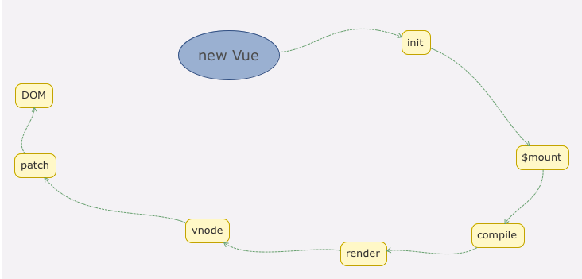

7.异步组件
注册异步组件，和注册普通组件差不太多。既可以全局注册，也可以局部注册。不过不同的是异步组件需要通过webpack的import函数来引入<br/>


8.watcher和immdiate
watch默认绑定，页面首次加载时，是不会执行的。只有值发生改变才会执行<br/>
如果想立即执行怎么办？<br/>
如果是监听的是对象类型，当手动修改对象的某个属性时，发现是无效的。这时候就需要deep属性。<br/>
deep为true，就可以监测到对象中每个属性的变化<br/>
它会一层层遍历，给这个对象的所有属性都加上这个监听器。但是这样性能开销会比较大，修改任何一个属性，都会出发这个监听器里的handler.<br/>
可以使用字符串形式监听<br/>
```javascript
data={
    obj:{
      a:1
    }
};
watch:{
    //obj
    'obj.a':{
      handler(newName,oldName){
          //执行代码
      },
      deep:true //为true，表示深度监听，这时候就能监测到a值变化
    }
}
```

9.vue3

10.vue-router
window.addEventListener('hashchange'，e=>{}）
window.addEventListener('popstate',e=>{})

11.在 Vue 中，子组件为何不可以修改父组件传递的 Prop，如果修改了，Vue 是如何监控到属性的修改并给出警告的<br/>
为何不能修改：为了保证数据的单向流动，便于对数据进行追踪，避免数据混乱<br/>
所有的 prop 都使得其父子 prop 之间形成了一个单向下行绑定：
父级 prop 的更新会向下流动到子组件中，但是反过来则不行。
这样会防止从子组件意外改变父级组件的状态，从而导致你的应用的数据流向难以理解。<br/>

在组件 initProps 方法的时候，会对props进行defineReactive操作，传入的第四个参数是自定义的set函数，该函数会在触发props的set方法时执行，
当props修改了，就会运行这里传入的第四个参数，然后进行判断，如果不是root根组件，并且不是更新子组件，那么说明更新的是props，所以会警告<br/>


12.双向绑定和 vuex 是否冲突 <br/>
在严格模式中使用Vuex，当用户输入时，v-model会试图直接修改属性值，但这个修改不是在mutation中修改的，
所以会抛出一个错误。当需要在组件中使用vuex中的state时，
```
<input v-model="message">
// ...
computed: {
  message: {
    get () {
      return this.$store.state.obj.message
    },
    set (value) {
      this.$store.commit('updateMessage', value)
    }
  }
}

//...
mutations: {
  updateMessage (state, message) {
    state.obj.message = message
  }
}
```

13.Vue 的父组件和子组件生命周期钩子执行顺序是什么<br/>
+ 父组建： beforeCreate -> created -> beforeMount
+ 子组件： -> beforeCreate -> created -> beforeMount -> mounted
+ 父组件： -> mounted
+ 总结：从外到内，再从内到外

//

+ 加载渲染过程  
父beforeCreate->父created->父beforeMount->子beforeCreate->子created->子beforeMount->子mounted->父mounted
+ 子组件更新过程  
父beforeUpdate->子beforeUpdate->子updated->父updated
+ 父组件更新过程  
父beforeUpdate->父updated
+ 销毁过程  
父beforeDestroy->子beforeDestroy->子destroyed->父destroyed

14.vue 如何优化首页的加载速度？vue 首页白屏是什么问题引起的？如何解决呢？
首页白屏的原因：<br/>
单页面应用的 html 是靠 js 生成，因为首屏需要加载很大的js文件(app.js vendor.js)，所以当网速差的时候会产生一定程度的白屏<br/>

解决办法：<br/>
+ 优化 webpack 减少模块打包体积，code-split 按需加载
+ 服务端渲染，在服务端事先拼装好首页所需的 html
+ 首页加 loading 或 骨架屏 （仅仅是优化体验）

15.谈一谈 nextTick 的原理
```
<template>
  <div>
    <div>{{number}}</div>
    <div @click="handleClick">click</div>
  </div>
</template>
export default {
    data () {
        return {
            number: 0
        };
    },
    methods: {
        handleClick () {
            for(let i = 0; i < 1000; i++) {
                this.number++;
            }
        }
    }
}
```

16.异步更新队列<br/>
Vue 在更新 DOM 时是异步执行的。
只要侦听到数据变化，Vue 将开启一个队列，并缓冲在同一事件循环中发生的所有数据变更。
如果同一个 watcher 被多次触发，只会被推入到队列中一次。
这种在缓冲时去除重复数据对于避免不必要的计算和 DOM 操作是非常重要的。
然后，在下一个的事件循环“tick”中，Vue 刷新队列并执行实际 (已去重的) 工作。
Vue 在内部对异步队列尝试使用原生的 Promise.then、MutationObserver 和 setImmediate，
如果执行环境不支持，则会采用 setTimeout(fn, 0) 代替。

17.vue源码图


18.Vue2与Vue3的对比
对TypeScript支持不友好（所有属性都放在了this对象上，难以推倒组件的数据类型）
大量的API挂载在Vue对象的原型上，难以实现TreeShaking。
架构层面对跨平台dom渲染开发支持不友好
CompositionAPI。受ReactHook启发
对虚拟DOM进行了重写、对模板的编译进行了优化操作...


# css
1.居中
水平
```css
.parent4 {
  /* 父级设置relative好让子级absolute相对于父级定位 */
    position: relative;
}

.child4 {
    position: absolute;
  /* left 50%会让子级在正中稍微靠右一点 */
    left: 50%;
  /* translateX百分比相对的是自身，因为前面靠右了，往左挪一点 */
  /* 挪的位置刚好是自身宽的一半*/
    transform: translateX(-50%);
}


.parent5 {
    display: flex;
    justify-content: center;
}

.child5 {
}
```

垂直
```css
.parent7 {
    position: relative;
}

.child7 {
    position: absolute;
    top: 50%;
  /* translateY百分比也是相对于元素自身计算的 */
    transform: translateY(-50%);
}
```

水平垂直居中
```css
.parent9 {
    text-align: center;
    display: table-cell;
    vertical-align: middle;
}

.child9 {
    display: inline-block;
}


.parent10 {
    position: relative;
}

.child10 {
    position: absolute;
    top: 50%;
    left: 50%;
    transform: translate(-50%, -50%);
}


.parent11 {
    display: flex;
    justify-content: center;
    align-items: center;
}

.child11 {
}
```

2.多列等高
```html
 <ul class="Article">
    <li class="js-article-item">
      <p>
      一家将客户利益置于首位的经纪商，
      为客户提供专业的交易工具一家将客户利益置于首位的经纪商，
      为客户提供专业的交易工具一家将客户利益置于首位的经纪商，
      为客户提供专业的交易工具一家将客户利益置于首位的经纪商，为客户提供专业的交易工具
      </p>
    </li>
    <li class="js-article-item">
      <p>一家将客户利益置于首位的经纪商，为客户提供专业的交易工具
      一家将客户利益置于首位的经纪商，为客户提供专业的交易工具</p>
    </li>
    <li class="js-article-item">
      <p>一家将客户利益置于首位的经纪商</p>
    </li>
  </ul>


//-----

.Article {
  overflow: hidden;
}

.Article>li {
  float: left;
  margin: 0 10px -9999px 0;
  padding-bottom: 9999px;
  background: #4577dc;
  width: 200px;
  color: #fff;
}

.Article>li>p {
  padding: 10px;
}

// -----
.Article {
  display: table;
  width: 100%;
  table-layout: fixed;
}

.Article>li {
  display: table-cell;
  width: 200px;
  border-left: solid 5px currentColor;
  border-right: solid 5px currentColor;
  color: #fff;
  background: #4577dc;
}

.Article>li>p {
  padding: 10px;
}


//----
.Article {
  display: flex;
}

.Article>li {
  flex: 1;
  border-left: solid 5px currentColor;
  border-right: solid 5px currentColor;
  color: #fff;
  background: #4577dc;
}

.Article>li>p {
  padding: 10px;
}
```

3.宽高比
+ padding-bottom

4.flex
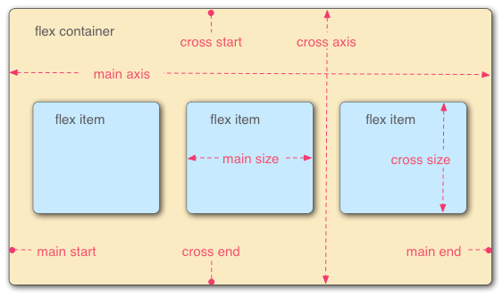<br/>
+ flex-direction
+ flex-wrap
+ flex-flow
+ justify-content 主轴对其方式
+ align-items 交叉轴对齐方式
+ align-content 多行轴线对齐

5.CSS中的三种布局模型<br/>
流动模型（Flow）、浮动模型（Float）、层模型（Layer）<br/>


6.BFC https://blog.csdn.net/dff1993/article/details/80394150<br/>
BFC 即 Block Formatting Contexts (块级格式化上下文)，它属于流动模型<br/>
具有BFC特性的元素可以看做是隔离了的独立容器，容器里面的元素不会在布局上影响到外面的元素<br/>

形成BFC的条件<br/>
+ body 根元素
+ 浮动元素：float 除 none 以外的值
+ 绝对定位元素：position (absolute、fixed)
+ display 为 inline-block、table-cells、flex
+ overflow 除了 visible 以外的值 (hidden、auto、scroll)

BFC常见作用<br/>
+ 阻止外边距折叠 
margin塌陷问题：在标准文档流中，块级标签之间竖直方向的margin会以大的为准，这就是margin的塌陷现象。
可以用overflow：hidden产生bfc来解决
+ 高度塌陷问题
在通常情况下父元素的高度会被子元素撑开，而在这里因为其子元素为浮动元素所以父元素发生了高度坍塌，上下边界重合，这时就可以用BFC来清除浮动了
+ 阻止元素被浮动元素覆盖
div浮动兄弟这该问题：由于左侧块级元素发生了浮动，所以和右侧未发生浮动的块级元素不在同一层内，所以会发生div遮挡问题。
可以给右侧元素添加 overflow: hidden，触发BFC来解决遮挡问题

7.适配
rem<br/>
html font-size= width/72    1个rem 10px

8.Doctype作用?严格模式与混杂模式如何区分？它们有何意义?<br/>
Doctype声明于文档最前面，告诉浏览器以何种方式来渲染页面，这里有两种模式，严格模式和混杂模式。
+ 严格模式的排版和JS 运作模式是 以该浏览器支持的最高标准运行。
+ 混杂模式，向后兼容，模拟老式浏览器，防止浏览器无法兼容页面。

9.link标签和import标签的区别
link属于html标签，而@import是css提供的<br/>
+ 页面被加载时，link会同时被加载，而@import引用的css会等到页面加载结束后加载。
+ link是html标签，因此没有兼容性，而@import只有IE5以上才能识别。
+ link方式样式的权重高于@import的。

10.CSS权重
+ !important: 无穷大
+ 内联样式: 1000
+ ID: 100
+ 类、伪类、属性: 10
+ 元素、伪元素: 1
+ 通配符: 0
```
style=""                    => 1000(一个行内样式)
#title{}                    => 100(一个ID选择器)
.root                       => 10(一个类)
[title]                     => 10(一个属性)
div                         => 1(一个元素)
*{}                         => 0(通配符)
div span {}                 => 1+1=2(两个元素)
div h1+span {}              => 1+1+1=2(三个元素)
div:first-child             => 1+10=11(一个元素，一个伪类)
div [title]                 => 1+10=11(一个元素，一个属性选择器)
body #title .root p {}      => 112(1+100+10+1，两个元素，一个Id选择器，一个类)
```

11.页面加载触发的事件<br/>
+ document的readystatechange事件
```javascript
document.onreadystatechange = function() { // 文档加载状态改变事件处理
    if (document.readyState === "loading") { // document加载中
        console.log(document.readyState);
    }
    if (document.readyState === "interactive") { // 互动文档加载完成，文档解析完成，但是如图像，样式表和框架等子资源仍在加载中
        console.log(document.readyState);
    }
    if (document.readyState === "complete") { // 文档和所有子资源加载完成，load事件即将被触发
        console.log(document.readyState);
    }
}
```

+ document的DOMContentLoaded事件
DOM树渲染完成时候触发DOMContentLoaded事件，此时可能外部资源还在加载。jQuery中的ready事件就是实现的这个事件。

+ window的load事件
当所有的资源全部加载完成后就会触发window的load事件


12.css3<br/>
13.兼容性问题<br/>
CSS HACK的方法<br/>
+ IE6 专用 _height: 100px;
+ IE7 专用 *+height: 100px;
+ IE6、IE7 共用 *height: 100px;
+ IE7、FF 共用 height: 100px !important; 
使用IE专用的条件注释 
```html
<!--其他浏览器 --> 
<link rel="stylesheet" type="text/css" href="css.css" /> 
 <!--[if IE 7]> 
 <!-- 适合于IE7 --> 
 <link rel="stylesheet" type="text/css" href="ie7.css" /> 
 <![endif]--> 
 <!--[if lte IE 6]> 
 <!-- 适合于IE6及以下 --> 
 <link rel="stylesheet" type="text/css" href="ie.css" /> 
 <![endif]--> 
```


# html5
+ 

# 优化


# 算法
1.快速排序
```javascript
function quickSort(arr, left, right) {
    varlen = arr.length,
        partitionIndex,
        left = typeofleft != 'number'? 0 : left,
        right = typeofright != 'number'? len - 1 : right;
 
    if(left < right) {
        partitionIndex = partition(arr, left, right);
        quickSort(arr, left, partitionIndex-1);
        quickSort(arr, partitionIndex+1, right);
    }
    returnarr;
}
 
function partition(arr, left ,right) {     // 分区操作
    varpivot = left,                      // 设定基准值（pivot）
        index = pivot + 1;
    for(vari = index; i <= right; i++) {
        if(arr[i] < arr[pivot]) {
            swap(arr, i, index);
            index++;
        }       
    }
    swap(arr, pivot, index - 1);
    returnindex-1;
}
 
function swap(arr, i, j) {
    vartemp = arr[i];
    arr[i] = arr[j];
    arr[j] = temp;
}
```


2.冒泡
```javascript
function bubbleSort(arr) {
    varlen = arr.length;
    for(vari = 0; i < len - 1; i++) {
        for(varj = 0; j < len - 1 - i; j++) {
            if(arr[j] > arr[j+1]) {        // 相邻元素两两对比
                vartemp = arr[j+1];        // 元素交换
                arr[j+1] = arr[j];
                arr[j] = temp;
            }
        }
    }
    returnarr;
}
```

3.选择
```javascript
function selectionSort(arr) {
    varlen = arr.length;
    varminIndex, temp;
    for(vari = 0; i < len - 1; i++) {
        minIndex = i;
        for(varj = i + 1; j < len; j++) {
            if(arr[j] < arr[minIndex]) {     // 寻找最小的数
                minIndex = j;                 // 将最小数的索引保存
            }
        }
        temp = arr[i];
        arr[i] = arr[minIndex];
        arr[minIndex] = temp;
    }
    returnarr;
} 
```

4.插入
```javascript
function insertionSort(arr) {
    varlen = arr.length;
    varpreIndex, current;
    for(vari = 1; i < len; i++) {
        preIndex = i - 1;
        current = arr[i];
        while(preIndex >= 0 && arr[preIndex] > current) {
            arr[preIndex + 1] = arr[preIndex];
            preIndex--;
        }
        arr[preIndex + 1] = current;
    }
    returnarr;
}
```

5.二叉树遍历
```javascript
var root = {  
   id: 1,  
   
    left: {
        id: 2,
        left: {
            id: 4,
        },
        right:{
            id:5
        }
    },
    right: {
        id: 3,
        left: {
            id: 6
        },
        right: {
            id: 7
        }
    }
}


// 先序
var res = []  

function DLR(root) {  

  if(root != null) {
      res.push(root.id)
      if(root.left) {
          DLR(root.left)
      }
      if(root.right) {
          DLR(root.right)
      }
  }
  return res
}  


// 中序
var res = []  

function LDR(root) {  

    if(root != null) {
        if(root.left) {
            LDR(root.left)
        }
        res.push(root.id)
        if(root.right) {
            LDR(root.right)
        }
    }
    return res
}  

//后序
var res = []  

function LRD(root) {  

    if(root != null) {
        if(root.left) {
            LRD(root.left)
        }
        if(root.right) {
            LRD(root.right)
        }
        res.push(root.id)
    }
    return res
}  
```

6.二叉树重建
根据二叉树的前序遍历{1,2,4,7,3,5,6,8}和中序遍历{4,7,2,1,5,3,8,6}，重新构建二叉树。
```javascript
function reConstructBinaryTree(pre, vin) {
    if (!pre || pre.length === 0) {
        return;
    }
    var treeNode = {
        root: pre[0]
    }
    for(var i = 0; i < pre.length; i++) {
        if (vin[i] === pre[0]) {
            // left递归体中的两个参数，是前序变量的左子树和终须变量的左子树
            treeNode.left = reConstructBinaryTree(pre.slice(1, i+1), vin.slice(0, i));
            // right递归体中的两个参数，是前序变量的右子树和终须变量的右子树
            // 因为第i个是根节点，需要跳过
            treeNode.right = reConstructBinaryTree(pre.slice(i+1),vin.slice(i+1));
        }
    }
    return treeNode;
    console.log(treeNode)
}

//如果给定中序遍历和后序遍历，同样可以重建二叉树
function reConstructBinaryTree(vin, pos) {
    if (!pos || pos.length === 0) {
        return;
    }
    var treeNode = {
        root: pos[pos.length-1]
    }
    for(var i = 0; i < pos.length; i++) {
        if (vin[i] === pos[pos.length-1]) {
            // left递归体中的两个参数，是前序变量的左子树和终须变量的左子树
            treeNode.left = reConstructBinaryTree(pre.slice(1, i+1), vin.slice(0, i));
            // right递归体中的两个参数，是前序变量的右子树和终须变量的右子树
            // 因为第i个是根节点，需要跳过
            treeNode.right = reConstructBinaryTree(pre.slice(i+1),vin.slice(i+1));
        }
    }
    return treeNode;
    console.log(treeNode)
}
```


# 项目问题
Q: geoserver 中文乱码最后解决办法 
A: 字体文件缺少

Q: webpack 配置 publicPath的理解
A: publicPath的使用说法适用于生产环境,
默认情况下，webpack-dev-server 会把打包后的文件放到项目的根目录下，文件名是在output配置中的filename. 
但是当有publicPath 配置的时候，就不一样了。
Webpack 会把所有的文件打包到publicPath指定的目录下，
就是相当于在项目根目录下创建了一个publicPath目录, 然后把打包成的文件放到了它里面，只不过我们看不到而已, 
文件名还是output配置中的filename。

Q: 打包之后文件过大
A: 后来采用的dllplugin

Q: source-map的配置与解决 生产环境
A:  nginx server allow

Q: 以前尝试过通过子组件修改父组件的数据，后来自己凌乱了，
A: 单向数据流

Q: 异步组件 加载失败 路径原因 webpack import 异步ajax请求
A: 不能动态解析加载

Q: slot传值


Q: 坐标系的理解，各个坐标系 之间的不同 
A:

Q: docker network
A: 


Q: Docker远程访问

Q: 前后端分离
rbac token 返回数据规范 请求封装 表单数据获取 分页

Q: 开发流程定制
gitlab 面板

Q: webpack
鸡肋 感觉 以后会有东西 替代它

Q: angular
模块分的很细 难以理解 有moudle  这个moudle需要配置吗？
注解 rsjx 很多东西 表面  只能用 如果看源码 可能还要付出更多的时间


