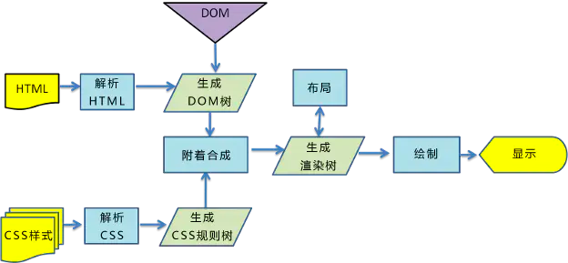

# 从url输入到页面展现的总体过程：
+ DNS解析
+ TCP连接（三次握手）
+ https
+ HTTP请求与响应
+ 浏览器解析渲染页面
+ 关闭连接（四次挥手）

#  DNS解析

域名系统DNS是互联网使用的命名系统，用来把域名转换为IP地址。
电脑里有网络设置 dns
+  浏览器先检查自身缓存中有没有被解析过的这个域名对应的ip地址，如果有，解析结束
+ 如果浏览器缓存中没有（专业点叫还没命中），浏览器会检查操作系统缓存中有没有对应的已解析过的结果。
而操作系统也有一个域名解析的过程。
在windows中可通过c盘里一个叫hosts的文件来设置，如果你在这里指定了一个域名对应的ip地址，那浏览器会首先使用这个ip地址
+ 如果至此还没有命中域名，才会真正的请求本地域名服务器（LDNS）来解析这个域名
+ 如果LDNS仍然没有命中，就直接跳到Root Server 域名服务器请求解析
+ 根域名服务器返回给LDNS一个所查询域的主域名服务器

## dns优化
+ DNS缓存： 
    + 浏览器缓存，系统缓存，路由器缓存，IPS服务器缓存，根域名服务器缓存，顶级域名服务器缓存，主域名服务器缓存。
    + 通过缓存直接读取域名相对应的IP，减去了繁琐的查找IP的步骤，大大加快访问速度。
    `<link rel="dns-prefetch" href="//test.com">`
+ DNS负载均衡：
    + 使用CDN进行负载均衡，利用DNS的重定向技术，同步服务器运行情况，然后根据该情况及时适当调整调度策略，从而使得负载均衡能力大大提高。

# tcp
TCP协议位于传输层，负责提供可靠的字节流服务
+ 字节流服务：为了方便传输，将大块数据分割成以报文段为单位的数据包进行管理。
+ 可靠的传输服务：将数据准确可靠地传输给对方

## tcp三次握手
+ 发送端首先发送一个带有SYN标志的数据包给接收端
+ 接收端收到后，回传一个带有SYN/ACK标志的数据包传达确认信息
+ 发送端再次回传一个带有ACK标志的数据包，握手结束

## https

通常，HTTP会直接和TCP进行通信，而加上这部分处理后，则演变为先和SSL/TLS通信，
再由SSL/TLS和TCP进行通信了，相当于加了一层SSL/TLS外壳的HTTP

### 第一次握手
+ 客户端发送Client Hello报文开始TLS/SSL通信。
报文中包含客户端支持的TLS/SSL的指定版本以及加密组件列表

### 第二次握手
+ 服务端支持TLS/SSL通信时，会返回Server Hello报文。里面同样包含支持的TLS/SSL的指定版本以及加密组件列表
+ 服务端发送Certificate报文，报文中包含公开密钥证书
+ 服务端发送Server Hello Done报文通知客户端，TLS/SSL初步握手协商结束

### 第三次握手
+ 客户端发送Client Key Exchange报文，报文中包含随机密码串，该报文使用第一次握手步骤3中的公开密钥进行加密
+ 客户端继续发送Change Cipher Spec报文，该报文负责告知后续通信的加密密码串方式
+ 客户端发送Finished报文，报文包含连接至今全部报文的整体校验值。本次握手是否成功，要以服务器能否正确解密该报文为判断标准

### 第四次握手
+ 服务端发送Change Cipher Spec报文
+ 服务端发送Finished报文，SSL/TLS通信隧道建立。后续开始发送HTTP请求

# HTTP请求
HTTP请求报文由请求行、请求头部、请求数据组成。
+ 请求行：由请求方法、URL、HTTP协议版本3个字段组成。如，GET /index.html HTTP/1.1。
+ 请求头：下面是一个 HTTP 请求的请求头。
+ 请求数据：不在GET方法中使用，而是在POST方法中使用。POST方法适用于需要客户填写表单的场合。与请求数据相关的最常使用的请求头是Content-Type和Content-Length。

 
响应报文
HTTP响应报文由状态行、响应报头、响应正文组成。

# 渲染
浏览器主要组件:
  

渲染引擎(Rendering Engine)的工作流程：其以HTML/JavaScript/CSS等文件作为输入，以可视化内容作为输出。具体而言就是如下五个步骤:
+ 解析HTML，生成DOM树，解析CSS，生成CSSOM树
+ 将DOM树和CSSOM树结合，生成渲染树(Render Tree)
+ Layout(回流):根据生成的渲染树，进行回流(Layout)，得到节点的几何信息（位置，大小）
+ Painting(重绘):根据渲染树以及回流得到的几何信息，得到节点的绝对像素
+ Display:将像素发送给GPU，展示在页面上。

  

reflow必将引起repaint，反之未必。
+ 当渲染树中元素的尺寸、结构、或某些属性发生改变时，发生reflow。
+ 当页面中元素样式的改变并不影响它在文档流中的位置时（例如：color、background-color、visibility等），发生repaint。
