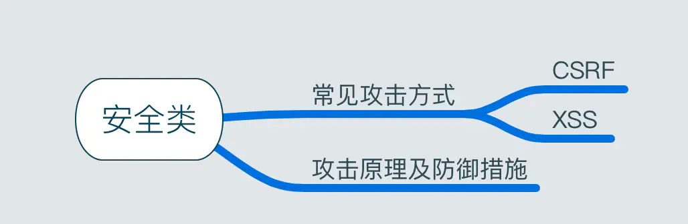

  
Q：常见的攻击方式有哪些？
+ CSRF：跨站请求伪造
+ XSS：跨站脚本攻击

Q：CSRF的原理及防御措施？
攻击原理： 
F是网站A的用户，且已登录，网站A对用户F进行身份认证后下发了cookie，保存在F浏览器中。 
F访问网站B，网站B存在引诱点击（往往是个链接，指向网站A的API接口，通常是GET类型），然后访问了A网站，浏览器会自动上传cookie。 
网站A对传来的cookie进行确认，是合法用户，则执行接口的动作  
前提： 
网站A某个接口存在漏洞  
用户在网站A已登录  

防御措施： 

Token验证：用户访问网站时，服务器会自动向本地存储token，访问接口时，需要回传token，否则无法通过验证  
Referer验证：服务器判断页面来源是否为站点下的页面，如果不是，则拦截  
隐藏令牌：与token类似，使用方式上的差别，更加隐蔽(比如放在http头部)  

Q：XSS的原理及防御措施？

攻击原理：向页面的合法渠道注入脚本（在脚本里执行想做的事情，不一定要登录） 
攻击方式： 

反射型：发出请求时，XSS代码出现在URL中，作为输入传给服务器，服务器解析后响应，XSS代码随响应内容传回浏览器，最后浏览器执行XSS代码，比如插入广告、执行恶性代码（img onerror）、引诱用户点击（按钮点击） 
存储型：提交的代码会存储在服务器端（数据库、内存、文件系统等），下次请求目标页面时不用再提交XSS代码。 

防御措施（让插入的脚本不可执行） 

编码：对用户输入的内容进行HTML Entity转义，例如</ body>，如果不转义，直接输出到页面上时，DOM结构就被破坏了。同时还要避免直接进行HTML Entity解码，否则，编码跟过滤就失去了意义。 
过滤： 

移除用户上传的DOM属性，如onerror等跟事件相关的属性  
移除用户上传的Style节点、Script节点、iframe节点、frame节点等 

校正：使用DOM Parse转换（类似的第三方库有domParse），校正不配对的DOM标签，防止用户输入的内容破坏掉我们页面的DOM结构。 