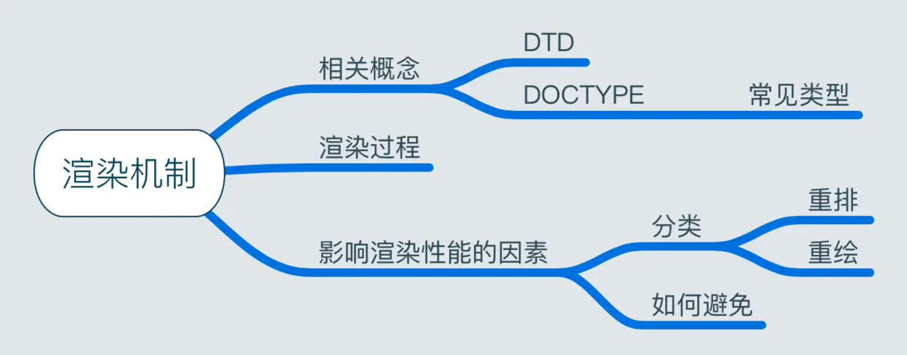

  

Q：DTD是什么？ 
文档类型定义，浏览器会使用它来判断文档类型，从而决定使用何种协议来解析

Q：DOCTYPE是什么？ 
文档类型声明，通知浏览器当前文档用的是哪个DTD

Q：常用的DOCTYPE的类型有哪些？ 
+ HTML5：
+ HTML4.01 Strict ：严格模式，包括所有的HTML元素和属性，但不包括展示性和弃用的元素，如font
+ HTML4.01 Transitional：传统模式，包含所有HTML元素和属性，包括展示性的和已弃用的

Q：浏览器渲染过程是怎样的？ 
+ HTML被解析成DOM Tree，CSS被解析成CSS Rule Tree
+ 在布局阶段，把DOM Tree和CSS Rule Tree经过整合生成Render Tree
+ 元素按照算出来的规则，把元素放到它该出现的位置，通过显卡画到屏幕上

Q：重排（Reflow）是什么？ 

定义：DOM中各个元素都有自己的盒子模型，需要浏览器根据样式进行计算，并根据计算结果将元素放到特定位置，这就是Reflow
触发Reflow的条件  
+ 增、删、改、移DOM
+ 修改CSS样式
+ Resize窗口
+ 页面滚动
+ 修改网页的默认字体

Q：重绘（Repaint）是什么？ 

定义：当各种盒子的位置、大小以及其他属性改变时，浏览器需要把这些元素都按照各自的特性绘制一遍，这个过程称为Repaint。
触发Repaint的条件： 
DOM改动
CSS改动

Q：如何减少重绘、避免重排？ 
本质上，就是合并修改。具体的措施有：
+ DOM层面：DocumentFragment本质上是一个占位符，真正插入页面的是它的所有子孙节点，所以，将需要变动的DOM节点先汇总到DocumentFragment，然后一次性插入，可以减少DOM操作的次数。
+ CSS层面：操作多个样式时，可以先汇总到一个类中，然后一次性修改