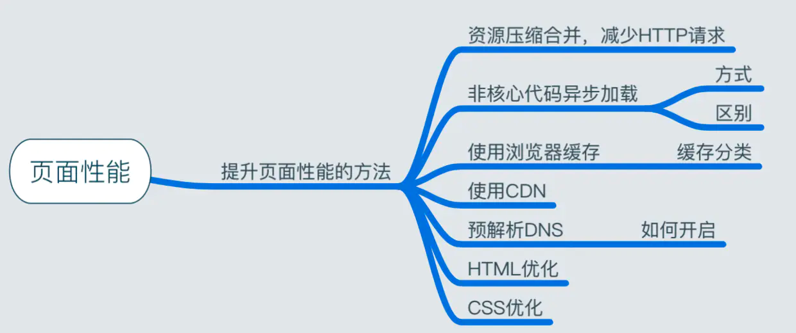

Q：提升页面性能的方法有哪些？ 

+ 资源压缩合并，减少HTTP请求
+ 非核心代码异步加载
+ 使用浏览器缓存
+ 使用CDN
+ 预解析DNS
+ HTML优化，如使用语义化标签，避免重定向等
+ CSS优化，如布局代码写前面，根据需求加载的网络字体，避免使用表达式

Q：异步加载的方式有哪些？ 
+ 动态脚本加载
+ defer
+ async

Q：defer、async的区别是什么？ 
+ defer是在HTML解析后才会执行的，如果有多个，按加载顺序依次执行
+ async是在加载完之后立即执行，如果是多个，执行顺序与加载顺序无关

Q：什么是浏览器缓存？ 
资源文件在电脑磁盘上的备份

Q：缓存的分类有哪些？（跟缓存相关的HTTP头部有哪些？） 
+ 强缓存
特点：不请求，直接使用缓存
相关的HTTP头部字段：
Expires：过期时间，是个绝对时间，下发的是服务器时间，比较用的是客户端的时间，所以会有偏差
Cache-Control：过期时间，是个相对时间，优先级高，以客户端的相对时间为准，浏览器拿到资源之后的多少时间内都不会再去服务器请求
+ 协商缓存
特点：浏览器不确定备份是否过期，需与服务器请求确认
相关的HTTP头部字段：
Last-Modified/If-Modified-Since：服务器下发时间，客户端请求时带上下发时间，服务器判断文件是否过期。存在的问题服务器下发的时间难以定义
Etag/If-None-Match：服务器下发hash值，客户端请求时带上hash值，服务器判断文件是否过期。优先级高

Q：什么是CND？ 
+ 特点：在不同的地点缓存内容，将用户的请求定向到最合适的缓存服务器上去获取内容。
+ 优点：解决Internet网络拥堵状况，提高用户访问网络的响应速度。

Q：预解析DNS  
+ 背景：DNS预解析会消耗前端的性能，优化建议是：减少DNS的请求次数，进行DNS预解析
+ 方式：是让具有此属性的域名自动在后台解析，从而减少用户的等待时间，提升用户体验

Q：如何开启DNS预解析？ 
<meta http-equiv = "x-dns-prefetch-control" content="on">
（强制打开a标签的DNS预解析，https下默认关闭）
<link rel="dns-prefetch" href="//host_name_to_prefetch.com"/>