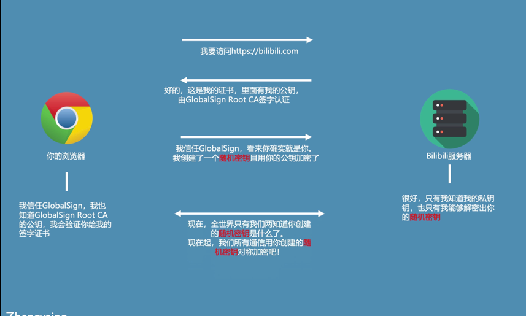

# 非对称加密的特点
任何经过A的公钥进行过加密的信息，只有A的私钥才能解密  
任何有公钥的人可以确认对方发送的信息是被私钥加密过的

客户端 采用https协议 去访问服务端

服务端 返回证书给客户端，证书里面有公钥 证书被Global Root CA签字认证过 ，

客户端 拥有Global Root CA的公钥，会验证签字的证书

客户端创建了一个随机密钥 用服务端发送的公钥进行加密了  发送给服务端 服务端可以利用自己的私钥去解密随机密钥

现在 只有这个客户端和服务器端知道这个随机密钥了

后续的通讯就是用这个生成的随机密钥进行对称加密

证书如何签证的？

服务器端 生成了公钥和密钥

CA 用私钥给 服务器端证书进行签证，任何拥有CA公钥的人就可以知道你的证书是被CA签证过的