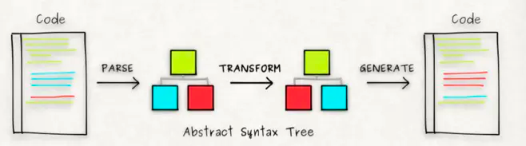
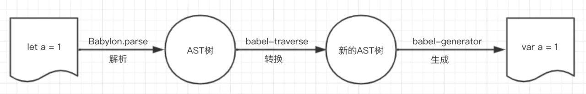

# babel运行原理
Babel是一个常用的工具，它的工作过程经过三个阶段，解析（parsing）、转换（transform）、生成（generate），如下图所示，在parse阶段，babel使用babylon库将源代码转换为AST，在transform阶段，利用各种插件进行代码转换，在generator阶段，再利用代码生成工具，将AST转换成代码。
 <br/>

 

## 解析
### 词法分析（Lexical Analysis）
词法分析阶段把字符串形式的代码转换为 令牌（tokens） 流。
你可以把令牌看作是一个扁平的语法片段数组：
```javascript
//code
let answer = 2 * 3;

//tokens
[
    {
        "type": "Keyword",
        "value": "var",
        "range": [
            0,
            3
        ]
    },
    {
        "type": "Identifier",
        "value": "answer",
        "range": [
            4,
            10
        ]
    },
    {
        "type": "Punctuator",
        "value": "=",
        "range": [
            11,
            12
        ]
    },
    {
        "type": "Numeric",
        "value": "2",
        "range": [
            13,
            14
        ]
    },
    {
        "type": "Punctuator",
        "value": "*",
        "range": [
            15,
            16
        ]
    },
    {
        "type": "Numeric",
        "value": "3",
        "range": [
            17,
            18
        ]
    },
    {
        "type": "Punctuator",
        "value": ";",
        "range": [
            18,
            19
        ]
    }
]

```

### 语法分析（Syntactic Analysis）
语法分析阶段会把一个令牌流转换成 AST 的形式 <br/>
code(字符串形式代码) -> tokens(令牌流) -> AST（抽象语法树）
```javascript

let answer = 2 * 3;

{
    "type": "Program",
    "body": [
        {
            "type": "VariableDeclaration",
            "declarations": [
                {
                    "type": "VariableDeclarator",
                    "id": {
                        "type": "Identifier",
                        "name": "answer"
                    },
                    "init": {
                        "type": "BinaryExpression",
                        "operator": "*",
                        "left": {
                            "type": "Literal",
                            "value": 2,
                            "raw": "2"
                        },
                        "right": {
                            "type": "Literal",
                            "value": 3,
                            "raw": "3"
                        }
                    }
                }
            ],
            "kind": "let"
        }
    ],
    "sourceType": "script"
}

```

常见的Javascript Parser有很多：

+ babylon：应用于bable
+ acorn：应用于webpack
+ espree：应用于eslint
