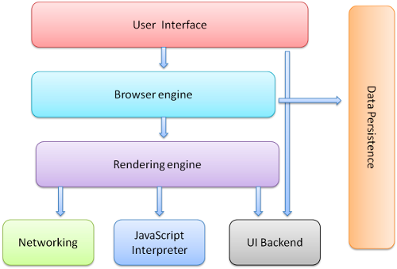
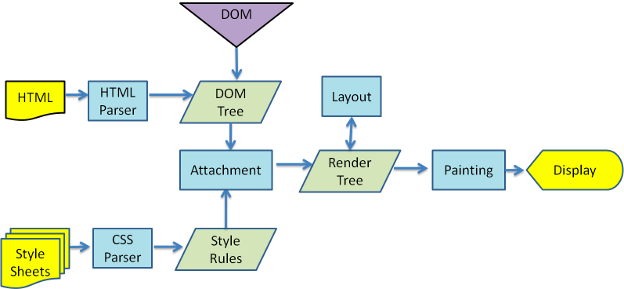
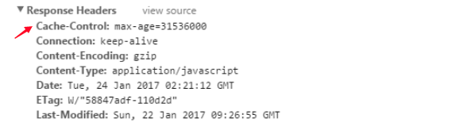
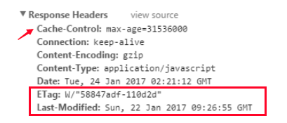
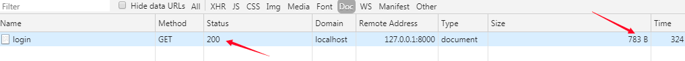
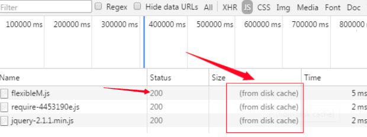
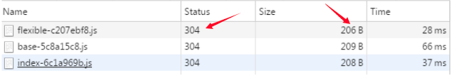
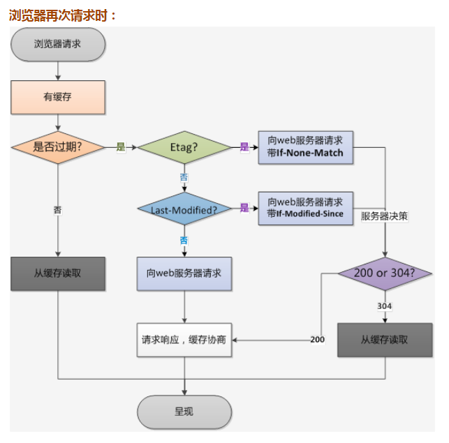
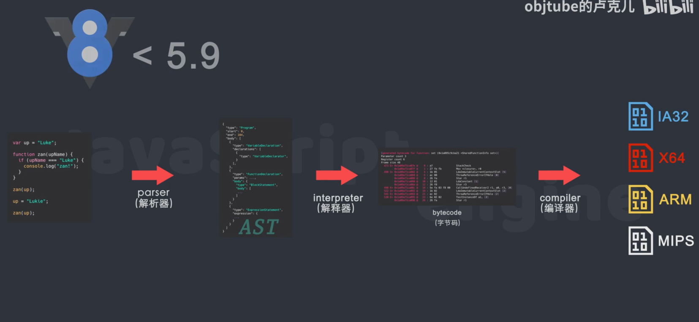

# 浏览器的主要功能
浏览器的主要功能就是向服务器发出请求，在浏览器窗口中展示您选择的网络资源。
这里所说的资源一般是指 HTML 文档，也可以是 PDF、图片或其他的类型。
资源的位置由用户使用 URI（统一资源标示符）指定。

# 浏览器的高层结构
+ 用户界面 - 包括地址栏、前进/后退按钮、书签菜单等。除了浏览器主窗口显示的您请求的页面外，其他显示的各个部分都属于用户界面。
+ 浏览器引擎 - 在用户界面和呈现引擎之间传送指令。
+ 呈现引擎 - 负责显示请求的内容。如果请求的内容是 HTML，它就负责解析 HTML 和 CSS 内容，并将解析后的内容显示在屏幕上。
+ 网络 - 用于网络调用，比如 HTTP 请求。其接口与平台无关，并为所有平台提供底层实现。
+ 用户界面后端 - 用于绘制基本的窗口小部件，比如组合框和窗口。其公开了与平台无关的通用接口，而在底层使用操作系统的用户界面方法。
+ JavaScript 解释器。用于解析和执行 JavaScript 代码。
+ 数据存储。这是持久层。浏览器需要在硬盘上保存各种数据，例如 Cookie。新的 HTML 规范 (HTML5) 定义了“网络数据库”，这是一个完整（但是轻便）的浏览器内数据库。

### 主流程
呈现引擎一开始会从网络层获取请求文档的内容，内容的大小一般限制在 8000 个块以内。
然后进行如下所示的基本流程：

# 缓存
## 强缓存
简单粗暴，如果资源没过期，就取缓存，如果过期了，则请求服务器  
如何判断资源是否过期呢，也就是说强缓存的规则怎么看？
  
主要是看 response headers 中的 Cache-Control 的值， 
图中的max-age = 31xxxxxxx，就是说在这些秒内，都直接使用缓存，超过了就继续请求服务器  
而和 Cache-Control 并列的，还有一个 Expires ，已经基本淘汰了，所以不用管  
+ Cache-Control 的几个取值含义：
+ private： 仅浏览器可以缓存
+ public： 浏览器和代理服务器都可以缓存（对于private和public，前端可以认为一样，不用深究）
+ max-age=xxx 过期时间（重要）
+ no-cache  不进行强缓存（重要）
+ no-store   不强缓存，也不协商缓存，基本不用，缓存越多才越好呢

所以，判断该资源是否命中强缓存，就看 response 中 Cache-Control 的值，如果有max-age=xxx秒，则命中强缓存。
如果Cache-Control的值是no-cache，说明没命中强缓存，走协商缓存。  

## 协商缓存
触发条件：
+ Cache-Control 的值为 no-cache （不强缓存）
+ 或者 max-age 过期了 （强缓存，但总有过期的时候）

这个图，虽然强缓存命中，但是也有 ETag 和 Last-Modified ，这两个就是协商缓存的相关规则。 
+ ETag：每个文件有一个，改动文件了就变了，可以看似md5
+ Last-Modified：文件的修改时间

协商缓存步骤总结：
+ 请求资源时，把用户本地该资源的 ETag 同时带到服务端，服务端和最新资源做对比。
+ 如果资源没更改，返回304，浏览器读取本地缓存。
+ 如果资源有更改，返回200，返回最新的资源。

## 缓存命中显示
从服务器获取新的资源  

命中强缓存，且资源没过期，直接读取本地缓存 

命中协商缓存，且资源未更改，读取本地缓存  

# 浏览器
运行时编译

# v8引擎
是一个接受javascript代码，编译代码然后执行c++程序，编译后的代码可以在多种操作系统，多种处理器上运行
编译和执行js代码，处理调用栈，内存分配，垃圾回收

运行时编译 JIT
  

# js运行原理
调用栈 先进 后出

