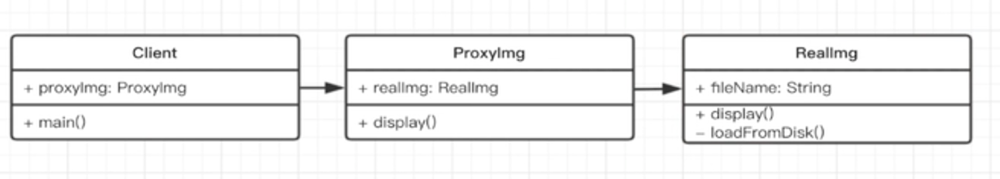

# UML类图
  <br/>
 
  <br/>
 
 <br/> 
+ 空心线表示继承关系
+ 实心线表示引用关系
+ 虚线空心表示实现关系

# 设计的一些准则
+ 小即是美
+ 让每个程序只做好一件事
+ 快速的建立原型
+ 舍弃高效率而取可移植性
+ 采用纯文本来存储数据
+ 充分利用软件的可复用性（杠杆效应）
+ 使用一些脚本来提高杠杆效应和可移植性（shell）
+ 避免强制性的用户界面
+ 让每个程序都称为过滤器
+ 允许用户指定一些环境
+ 尽量使内核代码小而轻
+ 使各部分和大于整体
+ 寻求90%的解决方案

# 五大设计原则
通过对上面设计准则的一些思考，一些前辈们总结出来的五条比较重要的设计原则（SOLID）<br/>
+ S-单一职责原则
    + 一个程序制作好一件事
    + 如果功能过于复杂就拆分，保持每个部分独立
+ O-开放封闭原则
    + 对扩展开放，对修改封闭
    + 增加需求时，扩展新代码，而非修改已有的代码
+ L-李氏置换原则
    + 子类覆盖父类
    + 父类能出现的地方子类都能出现
+ I-接口独立原则
    + 保持接口独立
    + 和单一职责一样，只不过将限制拓展到了接口层面
+ D-依赖倒置原则
    + 依赖接口编程
    + 依赖抽象而非依赖具体
    + 使用方只关心接口实现，而不用关心具体类的实现
    

# 模式介绍
+ 创建型  
    + 工厂模式  单例模式  原型模式
+ 结构型
    + 适配器模式  装饰器模式  代理模式  外观模式  桥接模式  组合模式 享元模式
+ 行为型
    + 策略模式  迭代器模式  观察者模式  模板方法模式  职责链模式  命令模式
    + 备忘录模式  中介者模式  状态模式  解释器模式  访问者模式


# 工厂模式

```javascript
class Person{
    constructor(name){
        this.name = name;
    }
    
    getName(){
        return this.name;
    }   
    
}

class creator {
    constructor(){}
    create(name){ 
        return new Person(name);
    }      
}
```

# 单例模式
```javascript
const singleton = function(name) {
  this.name = name;
}

singleton.prototype.getName = function() {
  console.log(this.name)
}

singleton.getInstance = function(name) {
    let instance = null;
    return function(){
        if (!instance) { // 关键语句
            instance = new singleton(name)
        }
          return this.instance
    } 
  
}
```

# 适配器模式
使用一个类为不同类方法提供统一的接口，从而达到适配的目的，所以核心思想也就是为了解决接口不兼容问题

```javascript
class Adaptee{
    specificRequest(){
        console.log('不好调用的过期接口')
    }
}

class Target{
    constructor(adaptee) {
        this.adaptee = adaptee
    }
    request(){
        this.adaptee.specificRequest()
    }
}

new Target(new Adaptee).request()
```


# 代理模式
可以给客户端提供无法直接访问到服务端的接口或者是需要处理的方法，这里注意的是，提供的方法一定要和服务端默认的方法名字是一样的。

```javascript
class CEO{
    getPhoneNo(){
        return '188-8888-8888'
    }
}
class Secretary{
    constructor(ceo){
        this.ceo = ceo
    }
    getPhoneNo(other){
        if(other === 'ceo'){
            return this.ceo.getPhoneNo()
        }
        return '010-888888'
    }
}
const sec = new Secretary(new CEO())
sec.getPhoneNo('ceo') // 188-8888-8888
sec.getPhoneNo()   // 010-888888


//--------
class MVVM{
    constructor(){
        this.data = {
            name: '花花',
            age: 18,
            sex: '女',
            _weight: 300
        }
    }
}

const mvvm = new Proxy(new MVVM(), {
    get(target, key){
        const data = target.data;
        if(key[0] === '_'){
            return '不告诉你'
        }else{
            // console.log(`获取了${key}`)
            return data[key]
        }
    },
    set(target, key, value){
        const data = target.data;
        if(key[0] === '_'){
            return '这个你不能设置哦~'
        }else{
            // console.log(`设置了${key}是${value}`)
            data[key] = value
        } 
    }
})
console.log(mvvm)
console.log(mvvm.name)
console.log(mvvm._weight)
mvvm.age = 81
mvvm._weight = 80
console.log(mvvm)
```

# 装饰器模式
就是为了和对象或者对象上的属性或者方法增加新的功能，并且不改变原有的结构和功能

```javascript
class Greeter {
    greeting;
    constructor(message) {
        this.greeting = message;
    }
    @log
    greet() {
        return "Hello, " + this.greeting;
    }
}

function log(target, name, descriptor) { 
    let oldValue = descriptor.value;
    descriptor.value = function () { 
        console.log(`里要打点${name}方法调用了${arguments}`)
        return oldValue.apply(this. arguments)
    }
    return descriptor;
}

//-------
@testDec
class A{}

function testDec(target){
    target.isDec = true
}

A.isDec // true

//-----
function mixins( ...list ){
    return function (target){
        Object.assign(target.prototype, ...list)
    }
}

const Foo = {
    foo() {console.log('foo')}
}

@mixins(Foo)
class B{}

new B().foo() // foo
```

# 观察者模式
观察者模式，有的称之为订阅发布模式.
一堆观察者或者订阅者去观察或者订阅一个主题，当这个主题变化时，就会通知所监听或者观察它订阅者

```javascript
class Subject{
  constructor(){
    this.observers = []
    this.state = 0
  }
  
  getState(){
    return this.state
  }
  setState(state){
    this.state = state;
    this.notifyAll();
  }
    
  notifyAll(){
    this.observers.forEach(observer => {
        observer.updata();
    })
  }
    
  arrtach(observe){
     this.observers.push(observe);
  }
  
}
class Observer{
  constructor(name,subject){
    this.name = name;
    this.subject = subject;
    this.subject.attach(this);
  }
  updata(){
    console.log(`观察者${this.name}观察到了，state的变化为${JSON.stringify(state)}`)
  }
}

const subject = new Subject;
const o1 = new Observer('o1',subject);
const o2 = new Observer('o2',subject);

subject.setState(1);
subject.setState(2);

subject.setState(1);
subject.setState(2);
```
